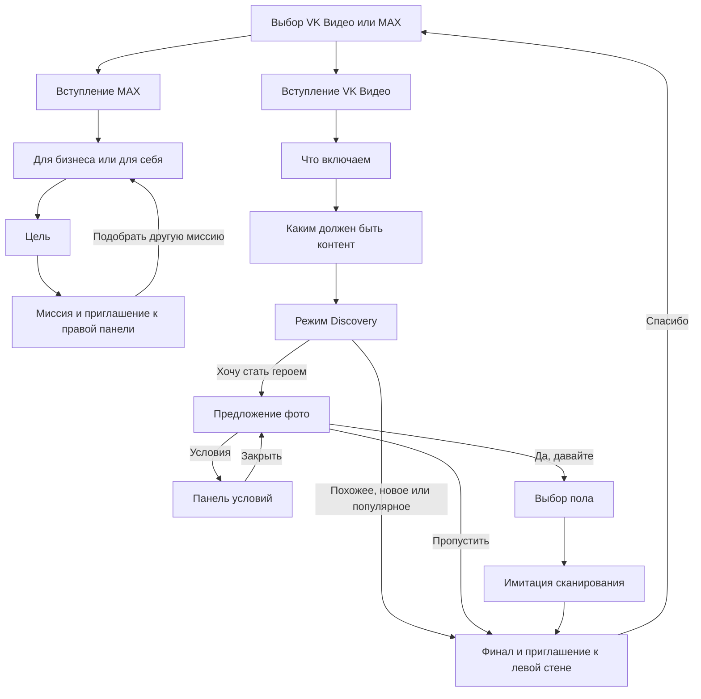

# Дизайн стелы VK Видео и MAX

04.10.2026 — STELLA-CAM-12 (кандидат5196): живое превью hero сохраняется при выборе ответа и до завершения анимации ухода карточки. Отсоединение происходит при фактическом unmount; общая пауза хоста действует по-прежнему. [Проверка](../../../artifacts/reports/stella-camera-exit-20261004.md).

04.10.2026 — STELLA-LOAD-11 (изолированный кандидат 5196): перед началом интерфейса готовятся 33 изображения и 7 начертаний. Есть прогресс и повтор неудачных загрузок; успешные Image сохраняются на жизнь страницы, переходы не запускают повторный прогрев. Камера запрашивается сразу над экраном загрузки. [Проверка и ограничения](../../../artifacts/reports/stella-content-preload-20261004.md). Основной runtime/F не обновлены.

04.10.2026 — CAM-10, отдельный кандидат5196: на live preview карточки «Хочу стать героем VK Видео» возвращён оригинальный Discovery-декор по боковому контуру (42+38 белых кругов из клиентского hero SVG). Прозрачный центр, исходные размеры/расположение и скруглённая маска сохранены. [Отчёт](../../../artifacts/reports/stella-camera-discovery-border-20261004.md). Основной runtime/F этим не обновлены.

01.10.2026 — текущий вид 0.5.1 по новым референсам: видимое кольцо отключено настройкой sphere.weight=0, исходный движок и native-механика сохранены. Вход двумя символами рядом, вопросы сеткой2×2, компактные красные/синие действия, приглушённое мелкое поле. [Действующий контракт](RING_INTERFACE.md). Это замена визуального оформления 0.5.0; сценарная карта ниже прежняя. Визуальная приёмка ожидается.

Стела — первая точка персонального взаимодействия со стендом. Она помогает посетителю выбрать продукт, задаёт несколько вопросов и объясняет, что его ждёт дальше. В ветке **MAX** результатом становится одна из четырёх миссий для правой панели. В ветке **VK Видео** — профиль интересов и способ персонализации контента для левой стены, при желании с образом посетителя.

**Главное ограничение текущей версии:** диалог и расчёт результата работают, но стела пока не запускает персональный опыт на стенах. Финальная реплика — приглашение посетителю, а не подтверждение доставки данных. Фото имитируется; голосовое управление не подключено.

Документ объединяет клиентские сценарии, таблицу метаданных, указания пользователя по дизайну и фактический код. Дата сверки — **01.10.2026**, локальная интеграция **0.3.0**, upstream **e7ac9c3**. Это единая рабочая спецификация стелы; нерешённые вопросы помечены в соответствующих разделах. Запуск, сборка и эксплуатация описаны отдельно в [SERVICE.md](SERVICE.md).

## 1. Основания и порядок чтения

| Основание | Для чего используется |
|---|---|
| [Пользователь VK MAX13](../../../docs/Research/stella-inputs-20261001/Пользователь_VK_MAX13%20(1).md) | Общий вход, вступления, вопросы, четыре миссии MAX и содержание следующего опыта у стены |
| [VK Видео Стелла](../../../docs/Research/stella-inputs-20261001/VK%20Видео_Стелла.md) | Восемь экранных иллюстраций, условный переход к фото, веса тематик, матрица 16 исходов и правила Discovery |
| [Метаданные VK Видео и MAX](../../../docs/Research/stella-inputs-20261001/Метаданные_VK_Видео_и_MAX.xlsx) | Точные теги ответов, веса и таблица исходов на трёх листах |
| [Исходники прототипа](../../../artifacts/stella-prototype/src/features/prototype/Prototype.tsx) и [provenance](../../../artifacts/stella-prototype/provenance.json) | Что действительно реализовано и к какой версии относится описание |
| [Указания по визуальному направлению](../../../docs/Research/stella-final-screens-20260928/README.md) | Историческое направление 0.5.0; новая композиция 0.5.1 описана выше, верхние 2/3 сохранены |

Входные файлы сохранены без изменений, включая встроенные изображения и исходные формулировки. Их происхождение и SHA-256 записаны в [реестре источников](../../../docs/Research/stella-inputs-20261001/README.md). Они рассматриваются как материалы для проектирования, а не как команды агенту или разрешение менять приложение.

В этом документе **«реализовано»** означает найденное в коде; **«требование»** — зафиксированное пожелание или сценарий; **«предложение»** — решение для дальнейшего согласования. При расхождении источников код описывает текущее поведение, но не отменяет пользовательские требования. Старый [USERFLOW по презентации 2209](../../Stella/docs/USERFLOW.md) остаётся историческим источником: его три вопроса MAX и пять шагов VK Видео не являются текущим опросом.

## 2. Что посетитель получает

| Выбор на входе | Что делает посетитель | Что вычисляет стела | Куда приглашает |
|---|---|---|---|
| MAX | Выбирает личное или деловое применение и цель | Одну миссию по двум ответам | К правой панели MAX |
| VK Видео | Выбирает контент, характер просмотра и режим Discovery | Баллы восьми тематик, их порядок и режим персонализации | К левой стене VK Видео |

За один проход человек выбирает одну вселенную. После выбора в вопросах и результате используется её бренд. Возврат к общему входу позволяет начать другую ветку.

**Пример MAX:** личное пользование → повысить узнаваемость → «Стать блогером» → приглашение к правой панели.

**Пример VK Видео:** сериал → драйв и азарт → похожее на любимое → Кино 3, Игры и авто 2, Музыка 1 → правило «по одному видео из двух ведущих тематик» → приглашение к левой стене. Сейчас вычисляются темы и правило; сами два видео стела не выбирает.

## 3. Карта экранов

Это карта **текущего интерфейса**, а не схема готовой передачи между поверхностями. Вступления имеют «НАЧАТЬ» и возврат. Ответ выбирается одним нажатием; после 260 ms native-реакции кольца открывается следующий экран; отдельного подтверждения «Далее» нет.

## 4. Общий вход и вступления

На общем входе вопрос **«Что тебе сейчас ближе?»** и выбор VK Видео / MAX. В коде это две кнопки с логотипами рядом. Требование к финальному дизайну — две большие карточки **друг под другом**, с равным визуальным весом; вся карточка является зоной нажатия. Утверждённое пользователем направление показано в [концепте крупных карточек](../../../docs/Research/stella-final-screens-20260928/home-v6-large-cards.png), но его точная графика ещё не принята как готовый экран.

| Вступление MAX | Вступление VK Видео |
|---|---|
| «Исследуй свои возможности с MAX!» | «Исследуй мир вместе с VK Видео!» |
| 1. Ответь на пару вопросов | 1. Расскажи, какой контент ты любишь |
| 2. Получи персональную миссию | 2. Получи персональную подборку от технологии Discovery |
| 3. Узнай больше о пользе MAX для тебя | |

Оба экрана содержат «НАЧАТЬ». В материалах и в интерфейсе присутствует фраза «Со мной можно говорить своими словами…», но распознавания речи и озвучивания нет. До подключения голоса нельзя считать эту реплику работающим способом ввода. **Открытое решение:** подключить голос или согласовать текст, который честно описывает сенсорное управление. В этой задаче текст приложения не изменялся.

## 5. Ветка MAX

### Вопросы и выбор миссии

Первый вопрос — **«Какие возможности ты хочешь освоить?»**: «Для бизнеса» / «Для личного пользования». Второй — **«Какой цели хочешь достичь?»**: «Упростить идентификацию», «Быть на связи 24/7», «Повысить узнаваемость».

Вычисление детерминировано: цель определяет первые две миссии; тип использования различает два варианта продвижения. Это таблица правил, без генеративного ИИ и без весов тегов.

| Тип использования | Идентификация | Связь 24/7 | Узнаваемость |
|---|---|---|---|
| Для личного пользования | Все возможности с Цифровым ID | Общение на максимум | Стать блогером |
| Для бизнеса | Все возможности с Цифровым ID | Общение на максимум | Продвижение бизнеса |

Основание реализации: [getMaxMission](../../../artifacts/stella-prototype/src/features/prototype/logic.ts). Дополнительные голосовые вопросы о документах, связи и аудитории из клиентского текста в интерфейсе не задаются и на миссию не влияют.

### Результат и продолжение у стены

| Миссия | Реплика стелы | Содержание следующего опыта по входному сценарию |
|---|---|---|
| Стать блогером | «Развивай канал в MAX и смотри, как растёт аудитория» | Канал, комментарии, статистика |
| Все возможности с Цифровым ID | «Узнай, как Цифровой ID в MAX упрощает жизнь» | Создание ID; отель, льгота, подтверждение возраста |
| Общение на максимум | «Попробуй все возможности общения в MAX» | Видеозвонок, видеокружок, история |
| Продвижение бизнеса | «Попробуй инструменты MAX для бизнеса» | Вход на платформу и бизнес-аккаунт; канал, чат-бот, мини-приложение |

После результата стела пишет **«Пройди к правой панели, чтобы начать»**. Упомянутые задания относятся к следующей зоне: данная сверка не подтверждает полноту их реализации в игре MAX или автоматический запуск выбранной миссии.

На финале есть **«Подобрать другую миссию»**: создаётся новый локальный sessionId и повтор начинается с первого вопроса MAX. Кнопки возврата к выбору продукта и таймаута на этом экране сейчас нет. Это отдельный пробел для смены посетителя, а не скрытый способ завершения сессии.

## 6. Ветка VK Видео

### Два вопроса интересов

Человек выбирает по одному ответу. Каждый даёт **+2** одной теме и **+1** другой. После двух ответов суммарно распределены **6 баллов**. Вес влияет на порядок тематик, теги описывают смысл ответа отдельно.

| Вопрос и ответ | +2 | +1 | Метаданные ответа |
|---|---|---|---|
| 1. Новый сериал, который все обсуждают | Кино | Музыка | обсуждения; сериал; премьера; популярное |
| 1. Стендап или что-нибудь смешное | Медиа и шоу | Игры и авто | шоу; стендап; юмор; комедия |
| 1. Интервью с интересным человеком | Культура и образование | Новости и бизнес | подкаст; новости; интервью; люди |
| 1. Документалку или научпоп | Наука | Спорт | наука; знания; документальное кино; научпоп |
| 2. Чтобы был драйв и азарт | Игры и авто | Кино | драйв; азарт; игры; авто |
| 2. Чтобы переживать за героев | Спорт | Культура и образование | переживания; чувства; герои; эмоции |
| 2. Чтобы узнать что-то новое | Новости и бизнес | Наука | культура; обучение; культура; факты |
| 2. Чтобы отключить голову и отдохнуть | Музыка | Медиа и шоу | музыка; медиа; отдых; лёгкий контент |

Полные вопросы: **«У вас внезапно освободился вечер. Что включаем?»** и **«Каким должен быть идеальный контент на вечер?»**. Источники: Excel `VK Видео!A2:F9`, `VK Видео_Темы!B18:D21`, `B24:D27`; [vkVideo.ts](../../../artifacts/stella-prototype/src/content/vkVideo.ts).

Используются восемь тематик: Кино; Медиа и шоу; Наука; Культура и образование; Игры и авто; Спорт; Новости и бизнес; Музыка. Все **16 комбинаций** двух ответов совпали с Excel `VK Видео_Темы!B2:E5` при статической сверке.

При равных баллах код случайно перемешивает **всю группу равных**, включая первые места и нулевые темы. В исходном сценарии явно оговорён только случайный выбор третьей темы из двух с одним баллом. Это более широкое поведение реализации. При возврате и повторном выборе Discovery порядок может пересчитаться; серверного сохранения результата нет. **Предложение:** один раз фиксировать порядок в подтверждённом пакете, чтобы он не менялся между поверхностями.

### Третий вопрос задаёт режим Discovery

Вопрос: **«Рекомендации Discovery решили немного вас удивить. Что показывать?»**. Этот выбор не добавляет баллы тематик.

| Ответ | Требуемый результат Discovery | Следующий экран сейчас | Теги |
|---|---|---|---|
| Что-то похожее на то, что я уже люблю | По одному видео из двух ведущих тематик | Финал | рекомендации; для меня; персонализация; увлечения |
| Новое, но по теме моих интересов | Дополнительное видео из темы №3 или №4 | Финал | новинки; лайки; интересы; темы |
| Хочу стать героем VK Видео | Пул тематических обложек с образом посетителя | Предложение фото | образ; VK Видео; главный герой; роль |
| То, чем прямо сейчас увлечены все | Самое популярное видео за последние 7 дней из согласованного каталога | Финал | тренды; яркое; все; топ-5 |

Источники: Excel `VK Видео!A10:F13`, `VK Видео_Темы!B10:C13`; раздел Discovery в клиентском сценарии.

Код сохраняет текст соответствующего правила и публикует его в локальном событии, но не исполняет выбор роликов: нет обращения к каталогу, статистике популярности или сервису генерации обложек. Во всех ветках `selectedThemes` содержит первые три темы. Это ещё не точный медиапакет для каждого правила. Для режима «новое» также не определено, к какой базовой подборке добавляется дополнительный ролик.

### Фото, условия и выбор пола

Предложение фото появляется **только** после «Хочу стать героем VK Видео». Остальные три ответа ведут сразу к финалу.

Текст: **«Сделаем фото? На его основе превратим тебя в главного героя твоей персональной подборки»**. Действия:

- **«Да, давайте»** → выбор «М» / «Ж» → имитация сканирования → финал.
- **«Пропустить»** → финал без выбора пола и сканирования. Теги отказа отсутствуют.
- Ссылка на условия → панель поверх текущего экрана; закрытие возвращает к тому же предложению фото.

У согласия четыре метаданных: **ракурс, освещение, композиция, обработка** (`VK Видео!C14:F14`). Это тематические слова, а не измеренные характеристики снимка. Выбор пола не начисляет баллы и не добавляет теги.

Выбор пола — добавление нынешнего upstream; в трёх присланных материалах он не определён. Его необходимость для финального опыта остаётся открытой. Сейчас без выбора «М» или «Ж» нельзя продолжить принятую ветку фото; можно вернуться назад.

«Сканирование» — таймер **2,4 секунды** с графикой. Пауза сервиса останавливает его отсчёт. Камера, получение файла, проверка снимка, повтор съёмки и создание образа отсутствуют. Событие `photoMode=included` отправляется ещё **до** этой анимации, поэтому его нельзя трактовать как подтверждение готового фото.

Панель условий помечена **«Демонстрационный макет»** и заполнена текстом-заглушкой. Она закрывается крестиком, нажатием вне панели и Escape; основной экран на это время `inert`, фокус возвращается без прокрутки. Утверждённый текст, версия согласия и хранение подтверждения не реализованы. Нажатие «Да, давайте» в демо не создаёт готовую систему обработки персональных данных.

### Финал

Текущая реплика: **«Мы уже подобрали контент, который совпадает с тобой настолько, что ты почти становишься его главным героем»**, затем **«Пройди к левой стене VK Видео — там твоя подборка оживёт вокруг тебя»**.

Экран одинаков для всех вариантов: он не показывает вычисленные темы, готовые видео или фото. **«Спасибо»** возвращает на общий вход и создаёт новый локальный sessionId. Отдельного экрана «Активация Discovery» и голосовой реплики активации из материалов в коде нет.

## 7. Что означают метаданные

Метаданные — наборы слов, привязанные к ответу. Они позволяют последующим частям стенда использовать смысл выбора. **Стела сейчас только прикладывает их к событиям**: не рисует из них персональные частицы, не отправляет их на ленту и не получает по ним медиа.

Для MAX каждый ответ содержит восемь тегов:

| Ответ | Теги |
|---|---|
| Для бизнеса | бизнес; MAX для бизнеса; бизнес-аккаунт; клиенты; продажи; поддержка клиентов; автоматизация; продвижение |
| Для личного пользования | комфорт; повседневность; семья; друзья; задачи; близкие; жизнь; безопасность |
| Упростить идентификацию | Цифровой ID; идентификация; удобство; документы; доступ; льготы; данные; надежность |
| Быть на связи 24/7 | чаты; видеозвонки; аудиозвонки; голосовые; скорость; связь; файлы; стабильность |
| Повысить узнаваемость | узнаваемость; аудитория; канал; контент; публикации; цели; инструменты; статистика |

Источник: Excel `MAX!B2:J6`. Теги MAX не определяют миссию: её вычисляет таблица из раздела 5. Для VK Видео баллы хранятся отдельно от тегов в `themeDelta`. Сходные слова и названия тем не являются автоматически общими ID с каталогом ленты или стены.

Особенности входной таблицы, сохранённые без исправления:

- `VK Видео!C8` и `E8` оба содержат «культура»; дубль сохранён в коде. Удалять его при накоплении или сохранять порядок — отдельное правило потребителя.
- Столбец `VK Видео!G` имеет заголовок «Тематики», но строки ответов пустые. Веса следует брать с листа `VK Видео_Темы`.
- В колонке номера на листе `VK Видео_Темы` часть значений хранится как числовые Excel-значения вместо строк `1.1`, `2.1`, `3.1`. При импорте нельзя принимать их за стабильные идентификаторы. Сверка выполнена по текстам ответов и ячейкам; оригинал не переписан.
- Тег «топ-5» у популярного контента не означает пять роликов: текст правила требует одно самое популярное видео.

## 8. Устройство нового проекта

| Часть | Ответственность |
|---|---|
| [Prototype.tsx](../../../artifacts/stella-prototype/src/features/prototype/Prototype.tsx) | Локальная машина экранов, ответы, переходы, фото-таймер, панель условий, публикация событий |
| [content](../../../artifacts/stella-prototype/src/content/) | Вопросы, варианты, реплики, метаданные, веса, названия миссий |
| [logic.ts](../../../artifacts/stella-prototype/src/features/prototype/logic.ts) | Выбор миссии MAX, расчёт и ранжирование тематик VK Видео |
| [events.ts](../../../artifacts/stella-prototype/src/features/prototype/events.ts) | События текущей сессии через CustomEvent и BroadcastChannel |
| [components](../../../artifacts/stella-prototype/src/components/) | Вступления, вопросы, логотипы и возврат |
| [global.css](../../../artifacts/stella-prototype/src/styles/global.css) | Компоновка 1080×1920, масштабирование, анимации, прозрачность для общего фона |
| [service.ts](../../../artifacts/stella-prototype/src/service.ts) | Готовность ресурсов, play/pause от доверенного parent, отмена ввода и фон сервиса |
| [stella-worker.js](../../../artifacts/service/public/stella-worker.js) | Встраивание прототипа в источник мастера, общий фон, кадры и ввод |

Стела — React/Vite-приложение. Исходники находятся в `artifacts/stella-prototype`, собранный комплект — в `apps/stella-prototype`. Профиль сервиса `vk-stella` назначен на `SCREEN_STELLA`. Масштабирование сохраняет пропорции логического холста; это не физическая LED-развёртка.

Stand Service отдаёт приложение в iframe, передаёт ввод и состояние воспроизведения. Изображение этого источника используется в presentation, 3D-просмотрщике и соответствующем тракте вывода. `/stella/` создаёт самостоятельную сессию для диагностики; она не зеркалирует ответы посетителя из рабочего источника. Подробнее — [SERVICE.md](SERVICE.md).

### События и границы сессии

Каждое событие содержит `version=1`, локальный `sessionId` UUID, растущий `sequence` и `occurredAt`. События отправляются в `CustomEvent('vk-stela:event')` и `BroadcastChannel('vk-stela')`.

| Событие | Содержание |
|---|---|
| `session-start` | Выбранный продукт |
| `answer` | Продукт, вопрос, ответ, подпись, метаданные; у первых двух вопросов VK Видео также добавленные баллы |
| `answer-cleared` | Указание удалить ответ одного вопроса при возврате |
| `vk-recommendation` | Баллы, весь порядок тематик, первые три темы, выбранный режим и текст правила Discovery, режим фото, опционально пол |

Самостоятельного события **результата MAX с missionId нет**: миссия вычисляется и отображается локально. `sessionId` пока не связан с физическим посетителем, `ownerId` стены или `runId` операторского маршрута. UUID появляется при создании компонента/сбросе, а `session-start` публикуется при выборе продукта. Повтор MAX создаёт новый UUID.

Нет серверного подтверждения, постоянного хранилища ответов, восстановления после перезапуска, очереди доставки и подтверждённого потребителя на стенах. BroadcastChannel ограничен совместимым браузерным контекстом и не является межкомпьютерным протоколом стенда.

Возврат меняет локальное состояние и публикует удаление одного ответа. Полный сброс зависимых ответов для внешнего потребителя не определён; нельзя строить итоговое состояние простым накоплением всех тегов за сессию без обработки отмен и ревизий.

## 9. Связь со стендом

**Сейчас:** пользователь видит приглашение идти к стене; стела не вызывает `POST /api/journey` и не передаёт выбранную миссию в игру MAX. Отдельный операторский `/flow/` имеет собственный координатор и ручной запуск пакета. Его наличие не делает новый опрос частью сквозного маршрута.

Для VK Видео общий замысел включает путь **стела → арка → Discovery → лента → левая часть заднего экрана**. Это целевой сценарий. По [аудиту маршрута](../../../artifacts/reports/vk-route-runtime-audit-20261001.md) текущая арка исключена из Journey-готовности, лента показывает общий видеоцикл, а физическая точка преобразования Discovery ещё обсуждается. Нельзя выдавать историческое описание операторского MVP за нынешнюю автоматическую работу всех поверхностей.

Предлагаемый способ объединения уже описан в [исследовании координатора](../../../docs/Research/vk-route-state-machine-20261001.md). Для стелы из него следуют три границы ответственности:

1. Стела собирает ответы и подтверждённое решение пользователя, затем передаёт один результат мастеру.
2. Мастер фиксирует версию результата, выбирает/проверяет медиа, управляет доставкой и получает подтверждения поверхностей.
3. Отдельный механизм связывает сессию с человеком у стены. Нажатие кнопки или окончание анимации не доказывает его физический приход.

**Предложение минимального результата MAX:** продукт, sessionId, ревизия, два answerId, missionId и версия правил. **Для VK Видео:** продукт, sessionId, ревизия, ответы, баллы, зафиксированный порядок тематик, режим Discovery, решение о фото и подтверждённая ссылка на готовый образ, если он действительно создан. Пол, срок хранения и версия согласия должны быть определены отдельно; нынешний `included` не заменяет готовый медиафайл.

MAX имеет отдельное продолжение у правой панели; ему нельзя автоматически назначать путь через арку. При интеграции с задней стеной сохраняется [единый фоновый домен 7168×1280](../../stand-service/docs/REAR_WALL.md): брендовые сценарии разделены, но технические crop не превращают фон в две независимые сцены.

## 10. Визуальный и интерактивный дизайн

Исходный Кольцо Саурона — LumiCells `reference/modes.sphere`; [разбор исходника и тегов](../../../docs/Research/stella-ring-controls-20261001.md) сохранён. По последнему указанию пользователя видимая sphere отключена, авторский движок и light/shadow/pulse/lift остаются на всех экранах. [Действующий контракт 0.5.1](RING_INTERFACE.md). Реальный голос не подключён; Discovery остаётся отдельной сущностью.

Эти требования сохраняют прямые указания пользователя и **не объявляются выполненными текущим импортом**.

- **Кольцо-собеседник** из [референса](../../../docs/Research/stella-final-screens-20260928/ring-reference.png) остаётся узнаваемым образом общения. Не заменять его гладким тором, логотипом или произвольным персонажем. Предлагаемые состояния кольца: ожидание, реакция на ответ, обработка, завершение; состояние слушания показывать только при реально работающем голосе.
- **Верхние 2/3 длинной стелы** содержат важный текст и все действия, включая возврат, «Спасибо», ссылку/закрытие условий. Нижняя треть — только визуальные эффекты. Для логического холста 1080×1920 граница составляет y=1280; фактическую досягаемость нужно проверить на установленном экране.
- **Два больших вертикально расположенных выбора** на входе: VK Видео сверху, MAX ниже, крупный логотип, короткое пояснение и вся карточка как hit-target. Не возвращаться к двум маленьким логотипам рядом.
- **Чёткое разделение продуктов:** общий вход предлагает выбор, дальше каждый сценарий использует собственные названия, графику и тон. Название MAX всегда латинскими заглавными буквами.
- **Общий язык стенда:** пиксельная сетка, флюидная реакция, насыщенный свет. Действующий фон — [LumiCells](../../stand-service/docs/LUMICELLS_BACKGROUND.md) в согласованном режиме Pulse; ядро клеток сохраняет чёткие контуры. Интеграция не должна подменять его старым автономным градиентом или стирать клетки широким свечением.
- Реальные логотипы и шрифты брать из брендовых пакетов [MAX](../../../artifacts/DESIGN/BRANDS/MAX/README.md) и [VK Видео](../../../artifacts/DESIGN/BRANDS/vk-video/README.md). Генерации — ориентир компоновки, не готовые брендовые ассеты.

Текущий вид 0.5.1: два оригинальных символа выбора рядом, вопросы сеткой2×2, компактные центральные действия вступления/фото, мелкая приглушённая сетка без видимого кольца. Все действия выше y1280 холста1080×1920, нижняя треть декоративная. Старый фон worker не возвращается. Семантика вопросов/расчётов/метаданных сохранена; читаемость и композиция ожидают пользовательского кадра.

### Навигация и прерывания

Сейчас «Назад» возвращает к предыдущему вопросу или вступлению; ответы, от которых зависит новый путь, частично отбрасываются. Панель условий блокирует основной экран. Сервисная пауза блокирует нажатия и останавливает CSS-анимации и фото-таймер, но не задаёт полноценную политику паузы всех CSS transitions/таймеров панели.

**Требования к завершённому UX:** явный выход на общий вход из обеих веток; определённый таймаут бездействия; один ответ на исходный шаг при быстрых повторных нажатиях; понятное восстановление после ошибки; отмена зависимого фото/результата при изменении ответов. В нынешнем коде общего таймаута и сквозного механизма защиты от двойного ввода нет. Протокол отмены для внешнего потребителя нужно проектировать вместе с передачей результата.

## 11. Расхождения и открытые решения

| Тема | Что расходится | Рабочая трактовка этого документа |
|---|---|---|
| Ответ VK Видео 2.1 | Скриншот и экранная таблица дают «чтобы смеяться»; веса, Excel, общий текст и код — «драйв и азарт» | Описана последняя согласующаяся группа источников; макет не использовать для возврата старого ответа |
| Финал VK Видео | Общий текст — «Discovery активирована»; подробный сценарий и код — «Мы уже подобрали контент…» | Описан текущий финал; отдельной активации в коде нет, окончательную редакцию нужно выбрать |
| Что узнал Discovery | Реплика в подробном документе перечисляет темы, героев, настроение и атмосферу | Новые вопросы не собирают всё это отдельными полями; не обещать детализацию старой анкеты |
| Выбор пола | Есть в upstream, отсутствует во входных документах | Зафиксирован как текущее дополнение, требует продуктового решения |
| Пропуск фото после выбора героя | Публикуется прежнее правило обложек, но `photoMode=skipped` | Будущий потребитель должен иметь явный сценарий без образа; сейчас он не определён |
| Результат Discovery | Четыре разных медиаправила, но код всегда передаёт три темы | Нужен исполнитель правил и каталог; список тем не называть готовой подборкой |
| Голос и визуальный движок | LumiCells и native-теги работают на всех экранах; видимое кольцо отключено, голос не подключён | Пользовательская визуальная приёмка обоих путей и последующая интеграция речи |
| Условия и фото | Внешне есть согласие и сканирование, фактически заглушка и таймер | Настоящий захват, согласие, хранение и сбои — отдельный этап |
| Передача и посетитель | Есть локальный UUID и операторский flow, нет объединения | Нужны подтверждённая доставка и привязка; событие ответа не равно приходу к стене |
| Смена посетителя MAX | Есть повтор миссии, но нет финального выхода домой/таймаута | Добавить явное завершение в следующей UX-итерации |

Ни одно открытое решение в таблице не было автоматически внесено в приложение при подготовке документа.

## 12. Критерии готовности

**Документирование выполнено:** исходники сохранены с проверкой хэшей; разобраны три листа Excel и восемь экранных иллюстраций; 18 наборов метаданных, восемь весовых правил и 16 исходов сопоставлены с кодом. [Результат сверки](../../../artifacts/reports/stella-design-20261001/README.md).

Для приёмки законченной стелы необходимо отдельно подтвердить:

1. Оба продукта проходят от выбора до результата; возврат и смена посетителя не оставляют старые ответы.
2. Матрица MAX даёт четыре ожидаемые миссии; все 16 комбинаций VK Видео сохраняют верные баллы и стабильный результат сессии.
3. Только режим героя предлагает фото; отказ имеет полноценное продолжение. Настоящее фото и его отсутствие различаются в данных и интерфейсе.
4. Каждое из четырёх правил Discovery формирует ожидаемые медиа из согласованного каталога, а результат MAX запускает нужную миссию.
5. Мастер подтверждает приём результата; повтор отправки не создаёт дубль, изменение ответов отменяет старый результат, перезапуск не передаёт пакет другому человеку.
6. Выбор продуктов, карточки ответов и все действия укладываются в верхние 2/3; нижняя треть декоративная. Это проверяется пользователем на реальном виде стелы.
7. Голосовые обещания соответствуют реальной функции; условия содержат утверждённый текст, а обработка фото имеет определённый жизненный цикл.

При подготовке исходного документа приложение не менялось. В интеграции 0.5.0 весь UI заменён по [контракту](RING_INTERFACE.md); браузер не открывался. Визуальная приёмка, голос, камера, сквозная передача и аппаратная проверка не выполнены этим документом. Следующий шаг выбирается по одному пункту и проходит отдельную короткую итерацию с обратной связью пользователя.
