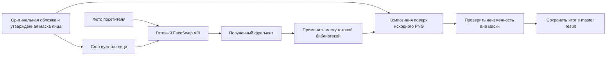

# Неподвижный фон обложки и альтернативный FaceSwap API

04.10.2026. Последнее уточнение пользователя имеет приоритет: **фон вообще не меняется; сгенерированный образ встраивается отдельным слоем**. Исследование API и проект архитектуры, без реализации/платных вызовов.

## Исправление предыдущего предложения

Возвращённую AI целую обложку нельзя использовать как конечный результат: image-to-image способен менять декорации, надпись, цвет и композицию. Предыдущий prompt «сохрани фон» этого не гарантирует. Он больше не является достаточным production-подходом.

Два возможных механизма имеют общий принцип: исходная основа хранится отдельно и входит в результат напрямую. При генерации полного образа используется утверждённый background без прежнего героя, новый персонаж поступает отдельным слоем. При **FaceSwap** основой остаётся уже готовая клиентская обложка с телом/костюмом/позой; изменяется только разрешённая область лица. Удалять героя или надпись для FaceSwap не требуется.

FaceSwap даёт посетителю лицо героя шаблона, но оставляет тело, причёску и костюм исходного персонажа. Он не заменяет задачу генерации полного персонального образа. Поэтому это альтернативный режим, а не скрытая смена требований исходной задачи.

## Кандидаты API

Сверка публичных страниц на04.10.2026. Доступ с нашими реквизитами, счёт/оплата и качество на клиентских материалах ещё не проверены. Локальный Polza-key не подтверждает доступ к другим провайдерам.

| Кандидат | Готовый механизм и ограничения | Опубликованная стоимость | Применимость |
|---|---|---|---|
|[Segmind HyperSwap](https://www.segmind.com/models/hyperswap-image-faceswap-by-facefusion-labs)|Face-only identity transfer, без enhancement; PNG; выбирает наиболее заметное лицо, без явного face-index|[$0.10 за генерацию](https://www.segmind.com/models/hyperswap-image-faceswap-by-facefusion-labs/pricing)|Первый технический кандидат для одного заранее подготовленного face-crop|
|[PiAPI FaceSwap](https://app.piapi.ai/docs/faceswap-api/create-task)|Два входа, async; выбирает крупнейшее лицо; обе стороны входов должны быть меньше2048|Документация$0.01, [product page](https://app.piapi.ai/faceswap-api)$0.02 — расхождение не устранено|Кандидат для сравнения качества/цены на crop; целую2688×1520 обложку отправлять нельзя|
|[AKOOL Pro/Plus](https://docs.akool.com/ai-tools-suite/faceswap/faceswap-plus)|Plus задаёт соответствия лиц с bbox; можно выключить enhancement|[4credits/image](https://akool.com/api-pricing); стоимость кредита в$ зависит от договора|Кандидат для явного выбора цели и нескольких лиц/отражения|
|[Magic Hour Face Swap Photo](https://docs.magichour.ai/api-reference/image-projects/face-swap-photo)|ФотоAPI, all-faces/individual-faces и mapping; размер результата зависит от подписки|[10credits/image](https://docs.magichour.ai/api-reference/models); денежная цена зависит от способа оплаты|Дополнительный кандидат для первого сравнения на готовом шаблоне/crop|

Ни в одном изученном контракте не найдено обещание «все пиксели вне лица остаются исходными». Названия lossless/PNG относятся не автоматически к отсутствию изменений фона.

### Segmind HyperSwap

Пример будущего input, не выполненный запрос:

```json
{
  "source_image": "<фото посетителя>",
  "target_image": "<подготовленный crop лица в обложке>",
  "model_name": "hyperswap_1c",
  "output_format": "png",
  "output_quality": 95
}
```

[API](https://www.segmind.com/models/hyperswap-image-faceswap-by-facefusion-labs/api): sync `POST https://api.segmind.com/v1/hyperswap-image-faceswap-by-facefusion-labs`; async `/v2/hyperswap-image-faceswap-by-facefusion-labs` возвращает request_id; status/result доступны через `/v2/requests/{id}/status` и `/v2/requests/{id}`. Результат живёт1час, поэтому backend обязан сохранить его в собственное хранилище.

Максимальные размеры полного кадра в изученной схеме не указаны. Ориентир~15s на сайте — не SLA и не замер нашей задачи. [Описание модели](https://www.segmind.com/models/hyperswap-image-faceswap-by-facefusion-labs) рекомендует источник минимум512px, видимое лицо и близкий к фронтальному ракурс. Несколько целевых лиц предлагается обрабатывать отдельно.

### PiAPI

`POST https://api.piapi.ai/api/v1/task`, header `X-API-Key`, `model:"Qubico/image-toolkit"`, `task_type:"face-swap"`, `input:{target_image:<обложка/crop>,swap_image:<фото>}`. URL/base64. Готовность — [GET task](https://app.piapi.ai/docs/faceswap-api/get-task). Применяемый API-ID документирован; ревизия внутреннего custom-model не опубликована.

Отдельный [multi-face-swap](https://app.piapi.ai/docs/multi-face-swap/create-task) принимает `swap_faces_index`/`target_faces_index`. Порядок детекции не гарантирован как простой left-to-right при диагональном расположении. Его автоматически найденные индексы нельзя считать постоянными scene-ID. Для наших фиксированных шаблонов crop одного нужного лица проще и надёжнее.

### AKOOL

[Pro v4](https://docs.akool.com/ai-tools-suite/faceswap/image-faceswap-v4): `POST /api/open/v4/faceswap/faceswapByImage`, `sourceImage`, `targetImage`, `model_name:"akool_faceswap_image_hq"`, `face_enhance:false`. Пакет пар изображений не тождественен выбору нескольких лиц внутри одной обложки.

[Plus](https://docs.akool.com/ai-tools-suite/faceswap/faceswap-plus): `POST /api/open/v4/faceswap/faceswapPlusByImage`, `source_url`, `target_url`, `face_mapping[]`, `single_face_mode:false`, `face_enhance:false`. Bbox в mapping — `[x1,y1,x2,y2]`; [детектор](https://docs.akool.com/ai-tools-suite/face-detection/detect-faces) выдаёт `[x,y,width,height]`, нужна явная конверсия. `model_style:"lossless"` не означает доказанную пиксельную неизменность окружения. [Получение результата](https://docs.akool.com/ai-tools-suite/faceswap/get-result) использует task-ID; provider хранит результат7дней.

## Архитектура сохранения основы

### Добавление Magic Hour по ссылке пользователя

Проверена [photo-страница](https://magichour.ai/products/face-swap?mode=photo). Есть REST `POST https://api.magichour.ai/v1/face-swap-photo`, BearerAPIkey, `assets` с входами и face mapping. Возвращает imageID и credits_charged; [GET image details](https://docs.magichour.ai/api-reference/image-projects/get-image-details) даёт status/download. SDK умеет ожидать завершение; обычный POST не является готовымPNG. Примеры all-faces заменяют все найденные лица; для конкретного героя выбирать individual-faces или crop. Схема mask/patch-output в просмотренной документации не подтверждена.

Цена10кредитов подтверждена endpoint/model-cost docs. [Пакет4000credits/$10](https://docs.magichour.ai/billing/overview) даёт арифметический ориентир **$0.025/photo**; это не универсальная цена всех планов. Маркетинговое «от$0.009» не фиксирует цену нашего аккаунта. Публичная pricing-страница и billing-docs расходятся в цене некоторых крупных пакетов: реальный checkout не проверялся.

[FaceSwap endpoint](https://docs.magichour.ai/api-reference/image-projects/face-swap-photo) прямо связывает размеры выхода с подпиской. [Resolution guide](https://docs.magichour.ai/billing/resolution-limits) отличает named resolutions новых инструментов от longest-edge старых: нельзя обещать2688×1520, исходя только из слова4K в тарифе. Для crop-пайплайна достаточно качественного patch, но фактические размеры/геометрию нужно проверить.

Бесплатный photo-webtool заявляет5обработок/день без регистрации; это allowance страницы, не бесплатная productionAPIквота. [Права](https://help.magichour.ai/en/articles/12613246-commercial-use-watermarks-and-your-rights): paid plans и credit packs включают commercial use; pack сам по себе не добавляет higher-resolution entitlement.

Magic Hour — подходящий кандидат для сравнения с HyperSwap. Оценка1–5сек на [API product page](https://magichour.ai/api/face-swap) является заявлением поставщика, не нашим замером. Ни качество на21клиентском шаблоне, ни пиксельная неизменность API не проверены. Оригинал/маска/compositor остаются обязательными для строгого fixed-background; accounts/uploads/генерация не запускались.



**Основу не заменяем provider-output.** У каждого шаблона заранее фиксируются native-size2688×1520, original SHA, координаты crop и разрешённая alpha-mask. Маска включает всю разрешённую границу сглаживания и не касается заголовка/фона/волос/ушей, если они должны остаться исходными. Матовая область и crop — разные сущности: прямоугольный crop может содержать декорации, поэтому накладывать весь прямоугольник нельзя.

Backend передаёт провайдеру crop с одним нужным лицом и фото посетителя. После возврата проверяет размер/ориентацию; иной размер/кадрирование не допускает молчаливую вставку. Если provider обязательно масштабирует patch, нужен проверенный transform, закреплённый в recipe. На оригинальной основе запрещены глобальные resize/upscale, enhancement, фильтры и преобразование палитры. Коррекцию света/монохрома, когда она необходима, применять только к face patch.

Сборка должна использовать существующий compositor, например **sharp/libvips**, а не новый алгоритм смешивания. [Официальный composite](https://sharp.pixelplumbing.com/api-composite/) поддерживает alpha, `dest-in`, `over` и точные top/left. Это непосредственно готовый механизм маскирования и наложения. [Лицензия sharp](https://github.com/lovell/sharp/blob/main/LICENSE):Apache2.0; notices libvips/бинарных зависимостей сохраняются. [Текущий каталог версий](https://sharp.pixelplumbing.com/changelog/) указывает v0.35.5; библиотека здесь не установлена и production-версия не выбрана.

Проверяемый инвариант: для каждого пикселя, где утверждённая mask alpha=0, декодированныйRGBA результата **равен** декодированномуRGBA оригинала. Сравнивать байты всего PNG нельзя: контейнер/сжатие меняются. Все входные клиентские PNG RGB, без embeddedICC и прозрачности; финал сохраняется losslessPNG2688×1520. При появлении ICC в будущих входах политика обработки цвета должна быть согласована до включения; нельзя незаметно пересчитать фон в другой colorspace.

Если контроль внешних пикселей или размещения провален, результат не публикуется. Инвариант — критерий будущей реализации; здесь он ещё не проверялся на настоящем provider-output. Надпись остаётся непосредственно в оригинале, выделять/перегенерировать её для FaceSwap не нужно.

## Сложные клиентские сцены

- **Драма:** видимое лицо находится в зеркале; затылок/тело посетителя в исходнике остаются от актёра. В наших просмотренных drama-референсах нельзя обещать два видимых фронтальных лица. Запотевание и сердце — часть сцены: обычный face swap может затереть их внутри face-mask. Нужны защищённые foreground-детали/слой зеркала либо визуально утверждённый участок вставки. Если в другом варианте видны лицо и отражение, нужны две цели одного посетителя.
- **Сайфай:** лицо героя остаётся монохромным; цветной цифровой мир не трогаем. Применять монохром только к вставке, не ко всей картинке.
- **Фэнтези:** уши и белые волосы принадлежат жанровому образу. Маска лица не должна захватывать их. Автоматический full-head swap противоречит этой задаче.
- **История/мюзикл/приключения:** поворот головы, головной убор, тени и волосы требуют отдельной проверки сходства. Маска может сохранить реквизит, но не гарантирует качественную адаптацию лица.
- **Боевой/детективный/комедийный шаблон:** первый тест выбрать с хорошо видимым одиночным лицом. Материалы со стилизованными/мелкими второстепенными лицами не доверять правилу «крупнейшее» без crop.

## Реальный опыт и ограничения лицензий

[AKOOL/Qatar Airways](https://akool.com/resources/face-swap-powered-ai-adventure) — опубликованный самим поставщиком пример персонализации готового рекламного фильма лицом зрителя. Он подтверждает применимость направления, не измеряет качество на наших жанрах и не даёт SLA.

[sharp issue1676](https://github.com/lovell/sharp/issues/1676) документирует белую кайму при antialiased dest-in; исторический issue закрыт в milestone0.23.0. Это основание проверять alpha-edge/premultiplication в выбранной версии, а не утверждение, что актуальная версия сломана. [Документация colours](https://github.com/lovell/sharp/blob/main/lib/index.d.ts) показывает автоматическую обработку colorspace: сохранность фона проверяется после реального кодирования/декодирования.

[Segmind V3](https://www.segmind.com/models/faceswap-v3) отмечен как unavailable, хотя его API-страницы остаются: не брать историческийendpoint как подтверждение доступности. [Segmind V5](https://www.segmind.com/models/faceswap-v5) автоматически выбирает face/full-head; для сохранения волос/ушей менее подходящий вариант, чем HyperSwap.

Hosted-сервисы регулируются договорами [Segmind](https://www.segmind.com/terms), [AKOOL](https://akool.com/terms-of-service), [PiAPI](https://app.piapi.ai/terms-and-conditions); их product API не равен лицензии на локальные веса. Коммерческие права конкретного плана и возможность включить сервис в Стеллу надо подтвердить до production. Ни один клиентский договор/счёт в этой задаче не читался.

Для локальной альтернативы [InsightFace](https://github.com/deepinsight/insightface) имеетMIT-код, но опубликованные pretrained-модели ограничены noncommercial research; коммерческая лицензияInSwapper запрашивается отдельно. Не переносить публичную модель на коммерческий стенд только на основанииMIT репозитория. Детальные лицензионные права HyperSwap weights здесь не установлены; модель не скачивалась, самостоятельный deploy не предлагается.

## Рекомендация следующего малого шага

Первый кандидат для **исследовательского сравнения качества** — Segmind HyperSwap1c, потому что явно face-only и позволяетPNG. PiAPI — второй кандидат для сравнения цены/качества после уточнения расхождения тарифов; AKOOLPlus — для задач с явным mapping. Это техническая рекомендация по схеме, а не результат измерения качества.

Сначала подготовить один recipe оригинального боевика: source SHA, native-size, crop одного лица, alpha-mask и защищённые зоны. Готовым compositor проверить локальную сборку на изолированной заглушке; это ещё не FaceSwap-качество. Затем один реальный платный FaceSwap-вызов на согласованной фотографии: сходство, край маски, ракурс/свет, **0 изменённых пикселей вне маски**. API-ключи, подписки и платные вызовы не создавались/не запускались в этом исследовании.

Для полноценно генерируемого образа остаётся тот же жёсткий принцип неподвижной основы, но нужен отдельный character/alpha/foreground pipeline. Обычный двухреференсный Seedream output целиком не удовлетворяет уточнённому требованию.

Итог через master: templateId/templateVersion/originalHash + referenceAssetId + crop/mask версии + provider/jobID + compositor version → один сохранённыйassetRef. F и его contracts не изменялись. Отдельная самостоятельно работающая очередь FaceSwap в UI не нужна.

[Фактический scope проверки](../../../artifacts/reports/cover-faceswap-research-20261004.md), [исходный реестр21обложки](archive-inventory.json).
