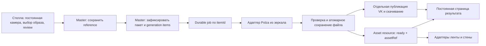

# Стелла: перенос фото и генерации из AI Mirror в сценарий F

04.10.2026. Исследование кода, контрактов и истории поставок; не реализация и не запуск генерации. [Фактический аудит и SHA источников](../../artifacts/reports/stella-ai-mirror-audit-20261004.md).

## Вывод

Пользовательский процесс AI Mirror пригоден для переноса: явный вариант образа → камера → отсчёт → просмотр/пересъёмка → подтверждение → генерация → сохранение → выдача. Но мастер F должен оставаться единственным владельцем сессии, пакета и генерационных заданий. Копировать сервер зеркала целиком и запускать рядом второй сценарный backend не требуется.

В F уже приняты ранний постоянный результат, неизменяемый пакет и изменяемые статусы ресурсов. Нет реальной загрузки снимка, выбора пола, production provider и публичной выдачи. Более того, текущая граница фиксации пакета явно отклоняет непустой referenceAssetId. Подключение невозможно одной заменой URL в Стелле.

## 1. Как работает зеркало

Основной исследованный источник: `D:/job/production/RESTRUCTURA/BEELINE-2026/BFM-AIMIRROR/app`, версия0.7.16. Node backend, Electron44.2.0, обычный browser renderer. Выбор masculine/feminine на сервере нормализуется в male/female; автоматического определения пола по лицу нет. Стиль выбирается из realistic/pop_art/comic/liza_alert; server-side promptSets содержат отдельные male/female prompts и стилевые references.

Выбор стиля запускает отсчёт. Кадр берётся из уже открытого видео, сохраняется в JPEG quality0.9 и показывается для пересъёмки/подтверждения. Существующий camera.js повернут под физическую камеру зеркала: 90° и отражение. Эту матрицу нельзя переносить в Стеллу без сверки ориентации. Output задаётся config, базовый canvas1080×1920. В зеркале после снимка камера останавливается; в Стелле сохраняем прямое указание пользователя: захват работает постоянно, экранные preview только подключаются к нему.

Реальная локальная интеграция одна: Polza, `bytedance/seedream-5-lite`, async image-to-image. Модель получает **фото посетителя + стилевой reference + серверный prompt**. Это генерация по референсу, не обучение персональной модели. FLUX.2 и PhotoMaker в папке research — исследовательские варианты, готовых переключаемых adapters в app нет.

До отправки сохраняются operationId, неизменяемые входы и параметры. Клиент хранит jobId в sessionStorage; потерянный ответ/reload возобновляют опрос того же задания. Локальная durable-ветка использует node:sqlite WAL/FULL. Готовый файл скачивается, проверяется по формату/размерам и записывается через temporary+rename в `APP_RUNTIME_DIRECTORY/generated` (default app/.runtime/generated). Только после сохранения операция становится ready.

Публикация независима от генерации: локальный результат может быть готов, пока QR ещё создаётся. Отдельный result-service1.2.1 принимает файл, кладёт в private S3 namespace `ai-mirror/YYYY/MM/DD/<uuid>`, возвращает tokenized `/photo/:token`, QR и expiresAt; есть выдача изображения и download. TTL по умолчанию600с, уборка публичной копии поминутная. Локальный generated-каталог этим не очищается.

### Ограничения, которые не наследуем автоматически

- Durable worker зеркала допускает до3POST на0/20/40с при неизвестном providerId. Это может означать несколько платных генераций. `user=aim:operation:attempt` — корреляция для поиска истории, не гарантия дедупликации провайдера.
- Входы удаляются из активной SQLite через30мин, но очистка WAL/backup и локальных результатов этим не доказана.
- Ключ публикации подавляет последовательные повторы; check→upload→manifest не доказывает атомарность конкурентных публикаций.
- OwnerToken выдаётся, но generation API не проверяет его. Trusted-local routes нельзя превращать во внешний master API без проверки владения сессией.
- Нельзя использовать Beeline endpoint, S3-префикс, промпты, рамки и retention как defaults VK.
- История поставок расходится:09-12 описана установка без durable worker; поздний overlay09-14 уже импортирует его, но не содержит сам модуль. Локальная реализация подтверждена; фактическая установленная версия зеркала не проверялась. PRODUCTION — зависимые от baseline updates, не самодостаточный дистрибутив.

## 2. Что уже есть на F

Источник `F:/project/VK_DigitalProducts_Stand`. По верхнему TODO04.10 применён WAVE-07; последняя визуальная/physical приёмка открыта. Новые VK admissions: `admit_stella_vk_v4` → существующий `vk_quiz_session_v3`. Старые durable workflow тела сохраняются.

| Участок | Фактическое состояние |
|---|---|
| Квиз и согласие на фото | Есть strict commands, revision, receipts и server view |
| Съёмка | Только camera + capture_unavailable/photo_skip; upload отсутствует |
| Пол/вариант образа | Поля и команды в Stella contract отсутствуют |
| Фото в модели пакета | Есть accepted+referenceAssetId; однако реальная Stella freeze-граница сейчас это отвергает |
| План контента | Immutable package, стабильные itemId, themeId, instance, recipeId/version |
| Задания/готовность | asset_resources с revision и job/attempt; пока technical providers |
| Результат | Постоянный HTML `/vkshare/result/{packageId}` и JSON `/api/results/{packageId}` |
| Медиа на result | Только явно разрешённые SVG fixture и review MP4; произвольный generated JPEG/PNG ещё не отображается |
| Лента/стена | Позиции пакета есть; actual media overlay ещё не подключён |
| Телефон/публичный QR | Loopback127.0.0.1, публичный хостинг ещё не реализован |

API ресурса `/api/assets/commands` сейчас принимает только diagnostic fixture provider и защищён local-instance/origin проверками. Это не готовый callback endpoint Polza.

Политика пакета изменяемая: сейчас2видео на каждую рекомендованную тему и1generation по top1, recipe fixture-portrait@1. Эти числа нельзя зашивать в UI или в генератор. Нет accepted-photo — generation-позиции не создаются.

## 3. Куда должен попадать результат

Логическая адресация:

```text
visitId → sessionId → packageId → itemId → jobId / attemptId → assetRef
```

Один общий generatedPhoto на сессию недостаточен: политика может заказать несколько изображений одной темы. Каждый результат относится к своей заранее созданной позиции; состав пакета после фиксации не переписывается.

Сейчас `content_packages` и `asset_resources` находятся в `${LOCAL_MASTER_DATA}/registry.sqlite`; workflow state — в `${LOCAL_MASTER_DATA}/master.sqlite`. Назначенный data-dir по документам F: `artifacts/workspace/runtime/local-master`. Это реальное хранение метаданных; **каталог production фото/генераций ещё не реализован**. `media-fixtures` содержит технический MP4 и не является подходящим местом для посетительских снимков.

Предлагаемое размещение, пока не принято и не создано:

```text
${LOCAL_MASTER_DATA}/media/references/<referenceAssetId>.<ext>
${LOCAL_MASTER_DATA}/media/generated/<assetId>.<ext>
```

Сервер выдаёт opaque ID; клиент не назначает пути. Сохранение файла атомарное, SHA/MIME/размеры фиксируются в записи. Публикация в private объектное хранилище VK — отдельный adapter, destination и сроки выбираются интегратором. Входной reference не входит в публичную проекцию.

Витрина результата — существующий `/vkshare/result/{packageId}`, доступный сразу после фиксации плана: сначала выбранный контент и ожидающие позиции, затем готовые изображения. JSON опрашивается каждые2с; URL не меняется при позднем завершении, перезапуске или уходе пакета со стены. Для телефона нужна публичная HTTPS-проекция/маршрутизация и доступ по непрогнозируемому share token. Не публикуем административный local-master целиком.

## 4. Архитектура переноса



### Стелла

Сохраняет нынешние визуал/Discovery/постоянную камеру. После согласия посетитель явно выбирает мужской/женский образ, затем снимается, видит **тот же кадр**, который будет отправлен, может переснять или подтвердить. Порядок «выбор образа перед съёмкой» повторяет Mirror; стиль в VK обычно выводится из рецепта/темы мастерского пакета, а не из четырёх Beeline-карточек. Наличие дополнительного выбора стиля — отдельное продуктовое решение, не подразумевается автоматически.

Текущий vk-gender в D существует в типах/обработчике, но обычный accept ведёт сразу vk-camera; capture лишь меняет screen на scanning, без извлечения/сохранения пикселей. Это необходимо заменить реальной capture/review веткой. Камера denied/missing не подменяется демонстрационным портретом. Back/пересъёмка увеличивают revision, отменяют старые callbacks и не могут подтвердить чужой кадр.

### Master F и контракты

Новая версия протокола дополняет пользовательские команды выбора образа/подтверждения снимка, входное хранилище reference и freeze для accepted-photo. **Названия новых endpoint/команд ещё не утверждены.** Текущий строгий контракт расширяется версионно, не обходится произвольными полями старого POST.

До фиксации: разрешена пересъёмка с новой photoRevision. После: снимок, вариант образа, recipe/provider/model/prompt versions и contentHash закреплены. UI отправляет commandId/expectedRevision, обрабатывает receipt/неизвестный исход. Master проверяет session+visit+station generation, статус reference и принадлежность снимка. Новая durable версия сосуществует со старыми сессиями; исторические тела не переписываются.

### Генератор

Reuse из зеркала: сборка model input, серверные разрешённые prompts, разбор ответов, опрос media/history, скачивание/проверка/атомарная запись. Workflow/очередь/владение заданиями — готовый DBOS в F. Не переносим второй самостоятельный SQLite/session backend зеркала и не пишем новый самодельный retry scheduler.

Каждая позиция получает неизменяемый operationId/jobId и попытку. Неизвестный POST → unknown/reconcile того же запроса, без скрытой новой покупки. До первого платного вызова политика должна явно определять допустимость повторной отправки и верхнюю границу стоимости. Нынешнее пользовательское отключение AI сохраняется. DBOS восстановление само по себе не гарантирует единственное списание внешнего провайдера.

Результат сначала скачивается и сохраняется локально; после проверки mediaType/размеров/SHA и актуальности job/attempt resource становится ready. Ответ от старой photoRevision/сессии не заполняет новую позицию. Publication failure не возвращает job к генерации. JSON-проекция отдаёт typed assetRef с разрешённым resourcePath, а не произвольный provider URL.

### Экран, реальные файлы и публикация — три разных готовности

Завершение7сек Discovery означает окончание экранной презентации. Оно не означает готовность AI и не задаёт deadline модели. По действующему сценарию F лента может продолжаться с ожидающей позицией; позже тот же itemId заполняется на result/ленте/стене. Для этого нужно дописать typed image resource handlers на всех трёх потребителях. Сейчас только result имеет технический resource overlay.

QR ведёт на постоянный результат, а не прямо на краткоживущий URL провайдера. Нельзя переносить TTL600с зеркала без согласования: страница VK должна жить независимо от показа стены. Хранение reference, generated asset и публичной копии — три отдельные политики с согласованным удалением и поведением expired.

## 5. Короткие этапы реализации

1. **D, без AI:** явный выбор образа, реальная съёмка из существующего потока, review/пересъёмка и неизменяемый capture descriptor. Проверить ориентацию, Back, быстрые нажатия, запрет отправки пустого кадра. Предпросмотр не останавливает камеру. Это первый небольшой пользовательский срез.
2. **F через интегратора:** versioned reference ingress/receipt, storage/retention и accepted-photo freeze; новый пакет с generation-позициями. Проверить reload, повтор upload/command, чужую session, смену photoRevision, продолжение старых workflow.
3. **Без AI на изолированных данных:** готовый sample result проходит по штатному resource adapter в постоянный result и затем в ленту/стену. Проверить поздний ready, duplicate/stale response, unavailable file и restart.
4. **Provider adapter:** перенос Polza механизмов Mirror в backend-owned job, сначала fixture transport. Реальный платный вызов только после явного разрешения включить AI; качество личности/позы и сроки нельзя подтвердить заглушками.
5. **Публикация:** VK destination, публичная HTTPS-result страница, token/download/TTL; проверка с телефона вне loopback. Изменение S3/доменов выполняется только после назначения конкретной цели.

Нельзя считать весь путь готовым после одной успешной картинки или фиксированного animation_complete. Передача каждого среза содержит source SHA, версии контрактов, результаты проверки и отдельный статус применения F.

## 6. Готовые технологии, версии и источники

- Mirror0.7.16 / result-service1.2.1: клиентский private проект; отдельного LICENSE у собственного кода не найдено. Это не основание переиспользовать Beeline artwork/маршруты в VK. Технический перенос пользователь разрешил; графику и рецепты VK выбираем отдельно.
- AWS SDK client-s3: declared^3.887.0, установлен3.1131.0, Apache-2.0; qrcode1.5.4 MIT. F уже использует qrcode-generator2.0.4 MIT: второй QR-пакет для Стеллы не нужен.
- [Polza Media create](https://polza.ai/docs/api-reference/media/create), [status](https://polza.ai/docs/api-reference/media/status), [history](https://polza.ai/docs/api-reference/history/generations): асинхронный ввод images и поиск/опрос существующего задания. Документация не доказывает idempotent billing по user; доступ модели с текущими реквизитами здесь не проверялся.
- [DBOS Python steps](https://docs.dbos.dev/python/tutorials/step-tutorial), [architecture](https://docs.dbos.dev/architecture): повтор незавершённого step после сбоя возможен; внешние side effects должны быть идемпотентными. В lock F закреплены DBOS3.2.0, FastAPI0.142.2, Pydantic2.13.5, SQLAlchemy2.1.3; зависимости ради переноса не обновляем.
- Реальный описанный опыт: Mirror worklog09-12, DOCS16 и исследование09-11 фиксируют потерянные подтверждения и multiple-charge риск; местный research09-15 сообщает77–82с до изображения. Эти замеры относятся к прежнему зеркалу, не являются SLA VK или замером текущей модели.

Открытые решения интегратора: VK reference/generated storage, публичный origin/token, retention, production recipes и политика допустимых платных повторов. Они не блокируют первый локальный capture/review срез; без них нельзя объявлять production-путь готовым.
