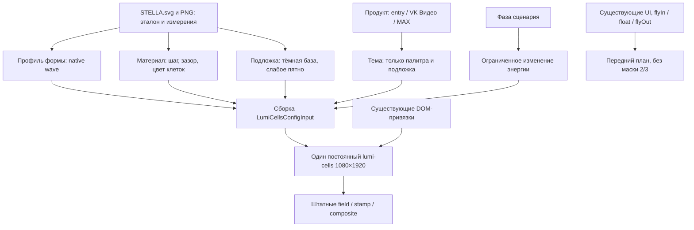

# Стелла: аудит и новая архитектура фона

## Актуализация после интеграции Discovery — 03.10.2026

Основной фон всё ещё использует исходный upstream LumiCells; три его файла и оба референса побайтно совпадают с первым аудитом. Предложение ниже **не внедрено**. [Актуальный технический аудит и таблица состояния](../../artifacts/reports/stella-background-audit-20261003/README.md).

Новая существенная вводная: проектная версия LumiCells уже подключена отдельно к WhiteEntity через `lumicells-project`, с CUBES geometry/variation и externalMask. Поэтому отсутствие карты формы ниже — ограничение текущего upstream-фона, а не всего проекта. Возможность переноса фонового поля на готовый проектный backend теперь следует проверить отдельно, если native wave не даст нужную композицию. Это ещё не выбранная архитектура: потребуются проверка импорта авторской карты размеров/opacity, тем, shadow/pulse и жизненного цикла. Нельзя считать маску присутствия Discovery точной картой STELLA.svg.

Обновлённый порядок решения: один образец формы и контраста на home → сравнение native ROI с эталоном → отзыв пользователя → только затем остальные темы и взаимодействия. Ветка wave ниже остаётся готовым механизмом-кандидатом, без обещания художественного совпадения; ассетный запасной путь сохраняется. Новый собственный генератор/шейдер не планируется. Последующие исправления логотипа, splash, силуэта и кнопок относятся к UI/Discovery и не являются исправлениями основного фона.

Исследовательские источники и версии ниже сохранены; в этой актуализации проверен локальный код, а не свежесть внешних main-веток. Нового внедрения, нагрузочного тестирования или публикации не было.

---

## Первоначальное архитектурное предложение

03.10.2026. Статус: **архитектурное предложение, без изменения приложения**. Последний локальный вариант отвергнут пользователем; браузерная сверка подтверждает расхождение. [Аудит с фактическими снимками](../../artifacts/reports/stella-background-audit-20261003/README.md).

## Решение

Сохранить существующий LumiCells и механику тегов. Перестроить управление фоном вокруг **формы непрерывной полосы клеток**, а не вокруг цветного пятна. Первый кандидат — готовый режим `wave` с интерференцией из закреплённого LumiCells; `flow` перестаёт определять композицию. Разделить параметры формы, материала, подложки и состояния сценария. Это разделение ответственности внутри одного существующего рендера, не четыре новых canvas.

Подтверждено, что `wave` создаёт непрерывные изгибающиеся гребни. **Не подтверждено**, что его настройками можно воспроизвести именно силуэт STELLA.svg. У штатного API нет входа для авторской карты формы/размеров клеток. Поэтому первая реализация должна быть одним проверяемым образцом формы; до его приёмки не переносить профиль на всю Стеллу. Если форма не подходит, не писать собственный shader: использовать исходный художественный ассет как альтернативу с явно обозначенной потерей динамического поведения сетки.

## Что задано референсом

Канонические материалы: [STELLA.svg](../../artifacts/DESIGN/UI/stela/STELLA.svg), [STELLA.png](../../artifacts/DESIGN/UI/stela/STELLA.png), 1080×1920. Это новый фон; расположение продуктов по прежнему согласованному STELLA-2 сохраняется.

- Тёмная основа `#02032F`; основной рисунок — синие клетки, большая непрерывная вертикальная полоса с плавным изгибом.
- 4590 цветных клеток: 4498 `#046EFF`, 92 `#0077FF`. Меняются и размеры, и прозрачность. Это не одинаковые квадраты, проявленные одним шумовым порогом.
- Типичный шаг около 21.5 px. В выборке по центрам клеток `#046EFF`, X380–700/Y800–1400: 402 клетки, медиана тела 12.71 px, диапазон 8.63–15.13 px. Метод отличается от предыдущей выборки по атрибутам x/y; цифры не подменяют друг друга.
- SVG использует группу клеток с opacity 0.21 и пространственную alpha-маску, отдельный слабый световой слой opacity 0.07, градиентную основу и затемняющий слой. Цвет `#01FFFF` в stop не означает яркую заливку этим цветом на экране.
- Маска рисунка в самом SVG допустима. Запрет пользователя касается обрезания интерфейса и летящих тегов на границе 2/3, а не авторской прозрачности декоративного фона.

## Почему предыдущие настройки не сработали

1. `flow.weight=0.15`, `brightness=0.28`, `gamma=1.2` ослабляют сигнал до встроенного gate. В `field.ts` после gamma/brightness/flicker/sparsity стоит `I *= smoothstep(0.015, 0.09, I)`. Для условного значения flow=1 без остальных множителей: 0.02874 перед gate → 0.00254 после него. Это аналитическая иллюстрация, не замер конкретной GPU-клетки. Ослабление brightness здесь нелинейно стирает сетку.
2. `floor=0.035` не даёт равномерного постоянного минимума: dead-видимость зависит от envelope/presence и дополнительно умножается на `min(dead*4,1)`. Повышать только floor вслепую неправильно.
3. `sparsity` ещё прореживает слабое поле. `flow` — пороговый многомасштабный шум; его острова не задают требуемую продольную композицию.
4. Spot прибавляется отдельно в `composite.ts`, затем всё проходит tonemap и sRGB. Значение strength 0.18 не равно CSS opacity 18%. Подложка остаётся заметной, когда клетки уже погашены.
5. В native stamp один общий размер тела. Переменный размер SVG-клеток настройкой count/gap не воспроизводится. Более того, 1080/50=21.6 — лишь расчётный шаг: geometry округляет device pitch до 22 px. Прежняя запись о 21.6/10.8 не учитывала округление; фактические тело/зазор при gap0.5 — приблизительно 11/11 px в native 1080.
6. Цвета брендов уже разделены; проблема не решается повторным перекрашиванием home в фиолетовый. `vignette` влияет на подложку/дымку, а не формирует видимость клеток.

## Исследованные готовые решения

| Решение, версия, лицензия | Подтверждённый механизм | Ограничение для Стеллы | Решение |
|---|---|---|---|
| [supsad/lumicells](https://github.com/supsad/lumicells), 0.1.0, commit `1007717d72cfd9d768d4b9a3f7fc80a126e49c51`, UNLICENSED; отдельное разрешение владельца для проекта уже зафиксировано | Готовые wave/interference, stamp, palette, spot, shadow, pulse, переходы, пауза и reduced motion | Общий размер клетки; нет штатной текстуры авторского поля. `flow` не гарантирует полосу. Прозрачность canvas внутри host не поддерживает простой overlay поверх SVG | Основной кандидат, без форка шейдеров |
| [motiondivision/motion](https://github.com/motiondivision/motion), установленная 13.5.0, MIT | Готовые последовательности, opacity/transform и управление анимациями; уже используется в проекте | Не генератор клеточного поля. Тысячи отдельных анимаций SVG — другая нагрузка; аппаратное ускорение не гарантируется для всех свойств | Сохранить для UI; возможен для нескольких слоёв ассетного варианта |
| [pixijs/pixijs](https://github.com/pixijs/pixijs), исследована ветка документации 8.x и лицензия тега 8.21.0, MIT | Загрузка SVG как texture/Sprite либо Graphics, готовые маски | Новый renderer/lifecycle. Graphics-парсер не равен браузерному SVG; поддержка градиентов/filters требует проверки версии. Сам по себе не создаёт нужную полосу | Сейчас не добавлять; для готового фонового изображения браузера достаточно |
| Нативный браузерный SVG/PNG + существующий Motion | Исходный авторский рисунок без процедурной реконструкции; анимация нескольких слоёв/их прозрачности | Точное статическое изображение возможно; живые локальные shadow/pulse LumiCells не воздействуют на этот ассет. Трансформация всей картинки не равна живому полю | Запасной путь, если соответствие рисунку окажется важнее динамической сетки |

### Документация и реальный опыт

- LumiCells: [локальная официальная документация](lumicells-20260930/upstream/lumicells-1007717d72cfd9d768d4b9a3f7fc80a126e49c51/README.md), [wave](lumicells-20260930/upstream/lumicells-1007717d72cfd9d768d4b9a3f7fc80a126e49c51/src/core/engine/glsl/modes/wave.ts), [field](lumicells-20260930/upstream/lumicells-1007717d72cfd9d768d4b9a3f7fc80a126e49c51/src/core/engine/passes/field.ts), [composite](lumicells-20260930/upstream/lumicells-1007717d72cfd9d768d4b9a3f7fc80a126e49c51/src/core/engine/passes/composite.ts), [schema](lumicells-20260930/upstream/lumicells-1007717d72cfd9d768d4b9a3f7fc80a126e49c51/src/schema/schema.ts). Публичная веб-страница репозитория не была получена поисковым инструментом; выводы основаны на закреплённом локальном исходнике. Свежесть main не утверждается.
- Реальный опыт LumiCells — [интеграция в Стеллу и неудачная итерация](../../artifacts/reports/stella-background-iteration-20261003/README.md), пользовательские скриншоты и новый браузерный аудит. Это прямое подтверждение ограничения текущей настройки, а не общий дефект библиотеки.
- Motion: [animate](https://motion.dev/docs/animate), [performance](https://motion.dev/docs/performance). Для нескольких декоративных слоёв подходят opacity и целый transform. Документация не обещает одинаковое ускорение всех SVG/CSS-свойств. [Аудит в репозитории](https://github.com/motiondivision/motion/blob/main/plans/PERFORMANCE_AUDIT.md) содержит разбор JS/WAAPI путей; это вторичный, в том числе агентский анализ текущей main, не доказательство производительности установленной 13.5.0. Поэтому не используем его вместо проверки интеграции.
- Pixi: [официальные два пути SVG](https://pixijs.com/8.x/guides/components/assets/svg), [лицензия 8.21.0](https://github.com/pixijs/pixijs/blob/v8.21.0/LICENSE). Texture сохраняет готовую картинку, Graphics разбирает геометрию. [Issue #12136](https://github.com/pixijs/pixijs/issues/12136) описывает неверный radialGradient в 8.19.0; issue закрыт связанной правкой, поэтому это не заявление о неисправности 8.21.0. Но перенос сложного SVG нельзя считать точным по факту успешного парсинга.
- [Pixi issue #10849](https://github.com/pixijs/pixijs/issues/10849): автор описывает расхождение alpha в цепочке SVG → ImageBitmap → OffscreenCanvas и неполное воспроизведение вне проекта. Это риск конкретного тракта, не доказанный баг нашего Chromium и не причина текущего дефекта Стеллы. Для альтернативы предпочтительнее прямой исходный PNG без этой цепочки.
- Нативный вариант: [SVG as an image](https://developer.mozilla.org/en-US/docs/Web/SVG/Guides/SVG_as_an_image). У `` нет доступа к внутренним элементам SVG для управления ими из страницы; анимировать отдельно клетки так нельзя. Для слоёв нужны отдельные ассеты или inline SVG, а не обещание управления любым SVG через Motion.

## Предлагаемая архитектура одного постоянного фона

Это составление конфигурации для готовой библиотеки. Новый генератор поля, sampler, spring solver, RAF или shader не разрабатывается.

### Контракты слоёв

1. **Форма.** Штатный `wave`, небольшой frequency, почти вертикальные гребни (направление изменения поперёк полотна), умеренная interference. `flow`, sphere, rain, ripple и прочие активные режимы явно исключаются из кандидата. Sparsity 0 на первой проверке, чтобы форма не превращалась в острова. Форма постоянна между вопросами; новая фаза не пересоздаёт renderer и не сбрасывает время.
2. **Материал.** Чёткое тело, softness 0; шаг/зазор подбираются с учётом округления device pitch. На первом проходе halo/bloom/haze 0: сначала нужно увидеть клетки. Яркость формы держать выше native gate; затем снижать итоговую светлоту цветом материала, сверяясь с PNG. Не пытаться сделать тёмный синий через почти нулевой сигнал поля. Конкретная итоговая палитра определяется видимым результатом после tonemap, а не копированием hex из SVG.
3. **Подложка.** Отдельные native background/spot-параметры. Сначала база без пятна, после принятия поля — слабое пятно в нижней части. Не связывать spot strength с brightness клеток. Числа из предыдущих попыток не объявлять калиброванными.
4. **Темы.** Entry — navy/blue с приглушённым холодным cyan снизу; VK Видео — синий; MAX — фиолетовый. Темы не меняют count, gap, геометрию поля, его seed или clock. Product splash и текущая механика выбора сохраняются. Новые тона MAX отдельно сверяются с его макетом, а не получаются hue-rotate стартового изображения.
5. **Взаимодействие.** Существующие shadow-influences и CSS-тень карточки сохраняются. Pulse проверяется отдельно: он добавляет энергию и может временно поднять сетку около кнопки. Если виден пиксельный ореол, корректировать штатный pulse отдельно; не возвращать постоянную light-подложку.
6. **Сценарий.** Entry/intro/question не меняют амплитуду фона на каждом ответе. Processing/result могут использовать ограниченную штатную modulation только после приёмки спокойного профиля. Значения 1.22/1.08/0.75 из текущего адаптера не переносить автоматически в откалиброванный профиль.
7. **Геометрия вывода.** Полный фон 1080×1920; UI-компоновка в верхних 2/3 не вводит scissor/overflow для тегов. Проверять 1080×1920 и реальную уменьшенную вкладку отдельно: pixel snapping меняет шаг в preview. DPR-политику не менять в этой итерации без отдельного результата проверки.
8. **Жизненный цикл.** Один текущий Web Component; используем его переходы, pause/resume/reducedMotion/dispose. Ошибка рендера должна иметь явно выбранный статический fallback из исходного PNG; его подключение ещё не реализовано. Не добавлять скрытый второй активный WebGL-рендер.

### Карта будущих изменений

Профили формы/материала/тем можно выделить в существующем `artifacts/stella-prototype/src/components/`; их сборка остаётся в `ring-scene-config.ts`. `RingScene.tsx` сохраняет постоянный host. `ring-home-config.ts` перестаёт быть неявным набором всех художественных и сценарных параметров одновременно. Vendor LumiCells, AnswerFlight, Choreographer, вопросы/рекомендации и раскладка кнопок не требуют изменения для первого кандидата. Новых папок в корне и новых runtime-сервисов нет.

## Проверка и короткие шаги внедрения

1. **Только форма и клетки на home:** один native wave-кандидат без светового пятна и bloom. Снять одинаковые ROI с эталоном при native размере; пользователь принимает непрерывность полосы, читаемость тела и зазора. Предлагаемая стартовая область поиска, не готовый пресет: frequency 0.2–0.45, angle около 0°, interference 0.15–0.4, sharpness 0–0.2, speed 0–0.03. Weight около 1, gamma около 1; проверять видимость отдельно от затемнения палитры.
2. После отзыва добавить только подложку entry, сравнить нижнее пятно и тёмные углы.
3. После отзыва перенести профиль формы в темы VK Видео/MAX и проверить переход без сброса поля.
4. После отзыва проверить вопрос → ответ → вылет → следующие карточки, тени/pulse и отсутствие обрезки; затем остальные фазы.

Приёмка: непрерывный рисунок виден сверху, в середине и снизу; зазоры темнее тел; нет яркого плоского cyan-пятна; углы тёмные; нет дождя/lift/видимого кольца; кнопки отбрасывают мягкую тень; динамика не вызывает исчезновения основной полосы. Native ROI и preview обязательны, но не заменяют пользовательскую художественную оценку. Числовой процент совпадения/SSIM между движущимся полем и статичным эталоном не использовать.

## Пробел и альтернативный путь

**Точное воспроизведение авторской карты размеров и opacity через штатный LumiCells не найдено.** Нельзя обещать его добавлением Pixi или Motion: они не импортируют эту карту в LumiCells. Также нельзя просто положить PNG под «прозрачный» canvas: composite задаёт alpha=1 внутри host; прозрачные края относятся только к overflow glow.

Если native wave-кандидат не выдерживает визуальную приёмку, пересмотреть решение в пользу оригинального SVG/PNG-фона с несколькими авторскими слоями и готовой Motion-анимацией opacity/transform. Это честный переход к ассетному фону: механика полётов UI остаётся, но реакция отдельных фоновых клеток на shadow/pulse не сохраняется автоматически. Такой вариант нельзя включать молча или маскировать под сохранение всех возможностей LumiCells. Собственный image-field shader в план не включён.

Финал прошлого этапа на Selectel и резерв исходников сохраняются. Подготовка этой архитектуры не запускает внедрение, публикацию, обновление Git или мастер-проекта.
