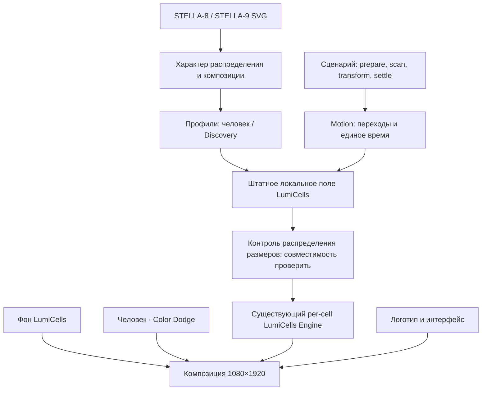

# Discovery для Стеллы: архитектура правдоподобной белой сущности

**Статус реализации после исследования, 03.10.2026:** первый native per-cell adapter подключён; [отчёт и ограничения](../../artifacts/reports/stella-discovery-native-20261003/README.md). Ниже исходный архитектурный план; утверждения «не реализовано» относятся к моменту исследования. Баланс размеров, GPU и следующие сценарные этапы ещё не подтверждены.

03.10.2026. Статус: архитектурное предложение, не реализованная функция. **Последующее уточнение пользователя:** точные диаметры SVG копировать не требуется. Цель — правдоподобное распределение и независимое движение, а не покадровая геометрическая копия. Основание — прямое требование пользователя сохранить LumiCells и индивидуальные размеры точек, исходные SVG и [технический аудит](../../artifacts/reports/stella-discovery-architecture-audit-20261003/README.md).

## Решение

Discovery нужно строить как отдельный слой данных клеток на LumiCells: у каждой клетки постоянный ID и положение, а её собственный диаметр определяется локальным непрерывным полем. Поле сохраняет пространственную выразительность исходника, но распределение размеров следует последнему требованию о балансе; локальные участки оживают с разными фазами. Один общий множитель диаметра исключается.

Предпочтительный backend — уже существующий per-cell путь **проектной адаптации LumiCells/CUBES с белым morph**, а не исходный Web Component с общим stamp. Выбор условный: сначала он должен показать одновременно маленькие, средние, крупные и переходные круги в сопоставимом количестве, с разной динамикой у соседей и без потери мелких деталей. Если этот контроль не проходит, готового совместимого решения для полного требования пока нет. Не компенсировать пробел новым самописным шейдером или молчаливой заменой LumiCells.

Ни приложение, ни SVG, ни шейдеры этим исследованием не изменены. Существующий демонстрационный сценарий и рекомендации остаются источником бизнес-состояния. Реальная камера/персонализация — отдельная интеграция, не побочный эффект обновления графики.

## Что означает правдоподобность

В STELLA-9 обнаружено 249 точек диаметром 0.17–59.04px при медиане 8.91px. Около 69% меньше 15px, около 8% — от 30px. STELLA-8 содержит 286 точек диаметром 0.11–32.41px, медиана 4.43px. [Точные координаты и статистика](../../artifacts/reports/stella-discovery-svg-20261003/README.md).

Правдоподобный образ определяется распределением размеров и пространственными связями: маленькие, средние, крупные и промежуточные размеры представлены сбалансированно; соседние точки реагируют связанно, но не одинаково. Геометрия не заменяется прозрачностью. Движение не должно превращать сущность в одинаковые пульсирующие кружки, сплошной шар или случайный снег.

SVG статичны: независимые фазы, скорость и причинность движения — предлагаемая художественная интерпретация, требующая пользовательского кадра/оценки. Ни один статичный источник не доказывает физическую симуляцию или исходную хореографию.

## Уточнение: сбалансированный спектр размеров, 03.10.2026

**Последнее требование заменяет прежнее «много мелких, редкие крупные».** Маленьких, средних, больших и промежуточных кругов должно быть примерно поровну по всему диапазону. Размеры непрерывны: это не три или пять фиксированных диаметров. Статистика SVG выше остаётся историческим измерением, а не целевым распределением.

Начальный диагностический ориентир — пять равных интервалов нормированного **диаметра**, примерно по 20% видимых кругов в каждом: маленькие, малые-средние, средние, средние-большие, большие. Это предложенная операционализация слова «примерно», не жёсткая покадровая квота пользователя. Нижняя граница геометрического диапазона — 0; верхняя Dmax подбирается визуально. Полностью нулевые клетки учитываются отдельно по следующему уточнению. Равенство количества не означает равенство белой площади: большие круги занимают больше места, поэтому общий размер и плотность регулируются отдельно от пропорций.

Разделить три задачи: композиционное поле определяет, где находится сущность и где остаётся воздух; распределение диаметра определяет представленность размеров; непрерывное время создаёт независимые изменения. Нельзя просто умножить все диаметры на общую маску или синус: это снова сдвинет спектр к одному размеру. Проверять распределение после всех множителей, порогов и сглаживания, среди реально видимых кругов. Нулевые и невидимые клетки не должны искусственно улучшать статистику размеров; доля пустоты учитывается отдельно. Переходные края активных областей входят в диагностику конечных размеров, а общие фазы входа/выхода оцениваются отдельно от установившегося движения.

### Что уже есть и чего ещё нет

В существующем [FieldPass](../../artifacts/ribbon/vendor/lumicells/src/core/engine/passes/field.ts) есть непрерывный `detail`, постоянный псевдослучайный `tileB` для каждой клетки и `sizeVariation = clamp(base + detailWeight * detail + tileWeight * (tileB - 0.5), min, max)`. Настройки доступны через [packCubesArt](../../artifacts/ribbon/cubes-art.js). Это готовый механизм индивидуальной вариации. Однако последующие mask/energy, cubesEase и ограничение максимума меняют итоговое распределение. Сильный clamp может дать множество одинаковых минимальных или максимальных кругов. Поэтому наличие шума не считается доказательством баланса.

Первый кандидат — подобрать штатные transfer/variation/geometry без изменения движка и проверить итоговые размеры. Если настройки не дают устойчивого баланса, не обещать, что достаточно «усилить шум»: потребуется отдельное преобразование распределения на готовом механизме, совместимость которого пока не проверена.

### Исследованный кандидат для преобразования распределения

[D3 quantile](https://d3js.org/d3-scale/quantile) использует выборку для разбиения по квантилям, но выдаёт дискретные значения: напрямую для диаметра не подходит. Готовые [quantileSorted в d3-array](https://d3js.org/d3-array/summarize#quantileSorted) и [кусочно-линейная scaleLinear](https://d3js.org/d3-scale/linear) дают кандидата для непрерывного отображения квантилей исходного поля в равномерную шкалу диаметра. Расчёт квантилей и интерполяцию выполняют библиотеки; собственный аналог этих алгоритмов не нужен.

Применимые исследованные версии: [d3-array 3.2.4](https://github.com/d3/d3-array/blob/v3.2.4/package.json) и [d3-scale 4.0.2](https://github.com/d3/d3-scale/blob/v4.0.2/package.json), обе ISC по metadata пакетов. Не установлены. Документация и примеры подтверждают механизм шкал, но не интеграцию с GPU LumiCells. Практические ограничения отражены в [истории исправлений d3-scale](https://github.com/d3/d3-scale/releases), включая clamp у составных шкал; историю старых исправлений не считать дефектом выбранной версии.

Предлагается калибровать отображение по нескольким фазам поля заранее и сохранять его неизменным на время показа. Пересортировка живых кругов и перерасчёт квантилей каждый кадр запрещены: положение по рангу и зависимость от соседей могут вызывать скачки. При совпадающих квантилях нельзя создавать неоднозначные узлы шкалы; большое количество совпадений означает, что само исходное поле/его clamp нужно исправить. Фиксированное отображение даёт лишь приблизительный баланс на новых фазах — это необходимо проверить, а не гарантировать математически для каждого кадра.

**Открытый архитектурный пробел:** текущий публичный API LumiCells не предоставляет готовую стадию D3-преобразования GPU-поля. Получение образцов, передача через существующий клеточный atlas и сохранение непрерывной динамики требуют отдельной проверки. Не добавлять синхронный GPU readback в каждый кадр и не подменять движок самописным шейдером. До подтверждения этого пути D3 остаётся кандидатом калибровки, а не принятой runtime-зависимостью.

### Критерии следующей небольшой проверки

- На нескольких фиксированных фазах видны все пять интервалов в сопоставимом количестве; отсутствует постоянный провал одного диапазона или пик на clamp-пределе. Доли показывать фактически, без выдуманного допуска PASS.
- Внутри каждого интервала размеры различаются; нет нескольких повторяющихся шаблонов.
- Одновременно одни круги растут, другие уменьшаются; изменение размера не пересаживает их на новые клетки и не меняет seed.
- Пространственная композиция сохраняет воздух, без длинных рядов одинаковых соседей и слипшихся крупных дисков. Равномерная гистограмма сама по себе этого не доказывает.
- Показать пользователю фактический локальный результат; архитектурная правка документа не означает готовность графики.

## Уточнение: полный ноль и пустые области, 03.10.2026

**Диапазон геометрического диаметра — от 0 до Dmax**, максимального круга, допустимого выбранным шагом и композицией. Положительного минимального диаметра нет. Точный Dmax в пикселях не фиксируется по SVG. На краях активных областей круги непрерывно уменьшаются до нуля и так же вырастают из него.

Внутри поля нужны протяжённые участки с диаметром **ровно 0**, а не только почти невидимые точки или случайные одиночные пропуски. У непрерывного случайного значения точное попадание в ноль само по себе не обеспечивает такие области; композиционное поле должно иметь устойчивую нулевую зону и плавный выход из неё. Пустоты медленно меняют форму вместе с локальным полем, без переключения seed и покадрового случайного удаления клеток.

Баланс размеров относится к активной части поля. Долю нулевых клеток считать отдельно как долю пустого пространства; пользователь пока не задал её процент. При калибровке квантилей нули исключаются из выборки положительных размеров и остаются нулями после преобразования. Иначе балансировщик либо заполнит пустоты, либо примет массу нулей за достаточное количество маленьких кругов. В активной части сохраняется непрерывный спектр от сколь угодно малого положительного диаметра до Dmax; субпиксельная видимость зависит от масштаба вывода.

Сначала задаются области присутствия и переходы к нулю, затем проверяется распределение **конечных** положительных диаметров. Плавная граница тоже входит в итоговую диагностику, поскольку она может создавать избыток маленьких кругов. Нельзя обещать баланс только по исходному шуму до применения маски. Размер пустот, доля занятых клеток и распределение положительных размеров — отдельные настройки профиля.

Подтверждённая опора в существующем [CubesPass](../../artifacts/ribbon/vendor/lumicells/src/core/engine/passes/cubes.ts): ветка `cubeMask` ограничивает размер снизу нулём и умножает его на energy. Ветка без `cubeMask` содержит положительный минимум `max(0.02, ...)` и для этого требования не подходит. Существующий [FieldPass](../../artifacts/ribbon/vendor/lumicells/src/core/engine/passes/field.ts) применяет пороговое преобразование `cubesEase`; это кандидат получения нулевых областей. Его интеграция и плавность границы в Стелле пока не проверены. Новый генератор маски этим уточнением не проектируется.

При d=0 слой сущности не рисует тело и не создаёт собственное свечение этой клетки; фон остаётся видимым. Рассеянный свет соседних кругов не означает ненулевой размер пустой клетки. Не подменять уменьшение геометрии одним fade opacity. Отдельно проверить существующие alpha/discard и bloom: они могут скрывать очень маленький круг раньше геометрического нуля или давать свет в области без тел.

Критерии первой проверки дополнены: в одном кадре одновременно есть крупные круги, непрерывный спектр меньших и несколько связных пустых областей; на их границах нет резкого появления дисков фиксированного размера. При движении области пустоты сохраняются, но плавно изменяются; никакого заполнения всей решётки минимальными точками. Это критерии будущей реализации, не подтверждение текущей картинки.

## Исследованные готовые решения

| Решение и версия | Подтверждённый механизм | Ограничение для Стеллы | Вывод |
|---|---|---|---|
| LumiCells 0.1.0, upstream 1007717 | Круглый stamp, field, smoothing, glow, общий ticker, lifecycle | Один размер тела на всю сетку; конфиг не даёт индивидуальный диаметр | Сохранить фон, отказаться от его использования как готового per-cell backend |
| Проектная адаптация LumiCells, срез SHA в аудите | CubesPass: размер каждого инстанса из fieldB; morph: белый плоский диск; внешний atlas | Низкоуровневый API; регулярная решётка, nonlinear transfer, LOD и связь с масками | Приоритетный кандидат, проверить до интеграции |
| Ribbon EntityRenderer, текущий локальный код, Three r180 | Perlin, индивидуальный диаметр и AA, внутри/вне маски | Пользователь прямо заменил его на LumiCells | Контрольный источник понимания, не возвращать в runtime |
| Ribbon DiscoveryBubbles, текущий локальный код | Атлас масок/диаметров; независимые клетки внутри плашек | Three-renderer и форма текстового бабла, не автономный слой LumiCells | Повторно не переносить как внешний renderer |
| Three.js r180, InstancedMesh | Готовый per-instance transform/scale, батч геометрии | Сам по себе не даёт рисунок Discovery; отдельный renderer нарушает выбранный движок | Только сравнительный запасной вариант при изменении требования |
| PixiJS 8.9.0, ParticleContainer | Индивидуальные position/scale/color, dynamic properties | Другой renderer; нужна отдельная хореография, есть нюансы inherited alpha | Не выбирать для текущей реализации |
| Motion 13.5.0, уже установлен | Готовые числовые keyframes/timeline, easing, pause/play/stop | Не рендерит клетки и не восстанавливает их координаты | Оркестрация переходов и этапов, не формальная замена механизма рендера |

LumiCells upstream помечен UNLICENSED; [явное разрешение пользователя](../../artifacts/ribbon/vendor/lumicells/permission.json) разрешает его полное использование в проекте. Проектные дополнения — внутренний код. Three и Motion — MIT. PixiJS заявляет MIT в своём публичном проекте; файл лицензии выбранного тега не удалось получить в этом проходе, поэтому перед любой установкой лицензию дистрибутива нужно отдельно проверить. Pixi в рамках решения не устанавливается.

Подтверждение практикой: [проектный morph-отчёт](../../artifacts/reports/td-cell-morph-20261002.md) подтверждает техническую доставку существующего механизма, но оставляет визуальную оценку открытой. [Исторический аудит размера CUBES](../../artifacts/reports/lumicells-cubes-size-audit-20261001/README.md) показывает конкретный риск исчезновения индивидуальных размеров при малом шаге. Поэтому одного наличия кода недостаточно для обещания готовой интеграции.

Внешний описанный опыт: [Pixi issue 12127](https://github.com/pixijs/pixijs/issues/12127) содержит воспроизведение потери родительской alpha у ParticleContainer в 8.19.0; issue закрыт ссылкой на исправление, точная версия релиза исправления здесь не установлена. Этот дефект не приписывается автоматически 8.9.0, но доказывает необходимость проверки композиции. [Motion issue 3336](https://github.com/motiondivision/motion/issues/3336) сообщает о callback после stop; жизненный цикл адаптера должен отклонять устаревшие callbacks независимо от наличия бага в установленной версии.

## Слои и поток данных

**Reference data.** Существующие координаты/диаметры и SHA остаются материалом анализа и визуального сравнения, но не обязательным runtime JSON. Рабочий профиль хранит seed, шаг сетки, настройки исходного пространственного шума, пределы размеров и композицию состояния. Не требуются 249/286 точек и соответствие ID исходным paths. Не подменять характер рисунка равномерным orb.

**Cell state.** ID клетки определяется постоянным индексом решётки; центр не прыгает при изменении шума. Диаметр берётся из локального physical-поля и sizeVariation существующего FieldPass/CubesPass; белая круглая форма — morph=1. Один clock меняет пространственное поле, поэтому соседи могут быть связаны, но не обязаны иметь одинаковые значения. Brightness/visibility сохраняются отдельными понятиями. Формулу частиц, новый генератор шума и сотни DOM/Motion-треков писать не требуется.

**Visual state.** `runId`, `seed`, `phase`, `localTime`, `playing`, `reducedMotion`, `ready`, `error`. Один session/run ID и clock на весь переход. Перестроение React не пересоздаёт поле. Backend предоставляет prepare/ready, render-at-time, pause, cancel и dispose; точные имена API адаптера фиксируются при интеграции, а не выдаются за существующий upstream API.

**LumiCells adapter.** Приоритетно использовать существующие Controller/Engine и CubesPass проектной ветки напрямую. Не импортировать весь SurfaceField/мастер/TD; данные для externalMask готовить локально. Morph=1 удерживает белую круглую форму, physical управляет диаметром. Для белого материала выключить подъём/пружину конфигурацией cubeArt. Процедурный sizeVariation, broad/medium/detail noise и локальная фаза уже есть в движке и теперь являются основой живого разброса. maskR не равен диаметру из-за cubesEase и других множителей; после уточнения пользователя обратная калибровка под каждый SVG-диаметр не нужна. Внешняя маска остаётся необязательной для художественной формы, а морф-канал должен стабильно давать белые круги. Отдельно проверить, что настройка halo/яркости не начинает масштабировать все тела.

Не встраивать самописный альтернативный fragment под названием «LumiCells». Если существующий backend не позволяет получить независимый размер и требуемую композицию, вернуть результат проверки и пересмотреть backend/требование; не переходить к реализации большого собственного движка.

## Индивидуальное движение

Сначала контрольный кадр на фиксированном seed/time: рядом есть непрерывный спектр размеров без преобладания одного масштаба. Затем включается движение уже существующего локального поля LumiCells/CUBES, а не глобальная анимация gap. В коде этого пути есть широкое/среднее/детальное шумовые поля, постоянная вариация от индекса клетки и временная фаза; их совместимость с белым morph нужно проверить в первой итерации.

Предлагаемый образ: области активности плавно перемещаются; крупный узел усиливается с соседями, затем ослабевает, пока в другом участке уже возникает следующий. Не обязательно вручную назначать время каждой точке: согласованность даёт пространственное поле. Разброс должен оставаться широким, но точные проценты и диаметры SVG не являются приёмочными порогами.

Начальный диапазон спокойного локального изменения 1.5–3 с — художественная гипотеза, не установленная скорость SVG. Позиции центров в первой версии фиксированы. Настоящие 3D-траектории/перспективу/вращение не добавлять без отдельного визуального основания. Motion управляет переходами профилей и прозрачностью человека, но не общим размером кругов.

## Переходы и жизненный цикл

| Фаза | Предлагаемое поведение |
|---|---|
| Prepare | Загрузить данные и подготовить GPU до начала видимого отсчёта; камера не является сигналом GPU-ready |
| Scan | Показать человека через Color Dodge и более тонкую структуру STELLA-8; один слой точек |
| Transform | Согласованно ослабить человека и перейти к пространству Discovery, избегая reset и общей вспышки |
| Settle | Поле с характером STELLA-9 продолжает локальную жизнь; этап завершается по timeline completion |
| Final | Согласованно убрать поле и показать QR; отменённые callbacks предыдущего run не переключают экран |

286 и 249 точек исходника не требуется сопоставлять. Для процедурного решения сохраняется одна решётка/seed/clock: стадия человека даёт более тонкое поле вокруг силуэта, Discovery — более широкую композицию со сбалансированным спектром размеров. Профили меняются непрерывно из текущего состояния; изображение человека гасится согласованно. До реализации проверить, поддерживает ли выбранный адаптер такой переход без сброса; смена seed или создание второго случайного рисунка на каждом этапе запрещены.

При пропуске фото — Prepare→Settle без вспышки человека. При паузе замораживаются и timeline, и поле; resume продолжает время. Reduced motion — статичная композиция плюс короткий спокойный переход. При потере контекста явно остановить визуальный этап; не считать невидимые 2400ms успешным показом. Ограниченное восстановление и fallback должны отдавать статус, не создавать бесконечно новые контексты.

Рекомендации не вычисляются графикой. Существующее vk-recommendation сохранить как событие выбора. Для синхронизации со стеной в будущем нужен отдельный completion/ready-контракт с runId; не переименовывать уже используемое событие и не выдавать BroadcastChannel за подтверждённую доставку на другой компьютер.

## Композиция, качество, стоимость

Логическое полотно 1080×1920, единый scale без растяжения кругов. Декоративный слой полный по высоте; правило 2/3 относится к UI. Поле не наследует transform/opacity контейнеров смены вопросов. Color Dodge человека работает с реальным фоном, screen белого поля убирает чёрную подложку. Логотип и кнопки рисуются выше эффектов; безопасная область логотипа задаётся композицией данных, не общей обрезкой поля.

Растеризовать чёткое тело и AA до слабого glow. Малые точки не следует искусственно увеличивать до нескольких пикселей: при уменьшенном окне субпиксельная площадь закономерно влияет на покрытие. Проверять и логический 1080×1920 кадр, и пользовательский размер окна. Простое поднятие bloom скрывает ошибки радиуса.

Целевой бюджет: один дополнительный слой/контекст поверх существующего фона, сотни клеток, никаких DOM-узлов/renderer на каждую точку; передавать компактные параметры и при необходимости клеточную маску. Число проходов/точная память определяются выбранным backend. Один полноразмерный RGBA16F target 1080×1920 занимает около 15.82 MiB без дополнительного буфера/выравнивания; несколько таких targets нельзя считать бесплатными. Маски должны оставаться клеточными, полное разрешение — только там, где требуется финальное сглаживание.

Не снижать разрешение без проверки: в существующем CUBES малый device pitch может переключить renderer на stamp и снова уничтожить индивидуальные диаметры. Цель плавности — оценивать на рабочем устройстве; гарантии 60 FPS сейчас нет. Нагрузочные проверки отдельно по AGENTS, аудит не является разрешением на них.

## Проверяемые этапы реализации

1. **Совместимость backend — следующий небольшой шаг.** Изолированный слой существующего LumiCells per-cell backend: morph=1, фиксированный seed, широкое распределение размеров, без лишних подъёмов. На одном кадре одновременно видны сопоставимые количества маленьких, средних, крупных и переходных кругов. Проверить AA, float/RGBA8 и малый device pitch. Если backend теряет независимый размер, зафиксировать пробел и пересмотреть способ интеграции.
2. **Распределение и композиция.** Сверить оба состояния с SVG по характеру: размеры сбалансированы по последнему требованию пользователя, есть связные области нулевого диаметра с плавными краями, нет заполненного шара, нижняя часть не обрезана. Частоты размеров исходного SVG больше не являются целью. Точные диаметры, количество и координатное соответствие paths не являются обязательными. Гистограммы — диагностика, не замена пользовательской оценки.
3. **Индивидуальная жизнь.** Включить штатную временную эволюцию поля; при фиксированных центрах одновременно часть кругов растёт, часть уменьшается, часть почти неподвижна. Один и тот же seed/time воспроизводит рисунок. Общий gap постоянен. После визуального отзыва закрепить профиль.
4. **Сценарий.** Scan/Transform/Settle, photo skip, pause/reduced motion, cancel/restart и late-ready. Один run, без remount/reset и без завершения до первого видимого кадра.
5. **Доставка.** Локальная 5175 → пользовательский отзыв. Затем, только в отдельной запрошенной итерации, runtime/Selectel/мастер. Техническая сборка, визуальная сверка и приёмка пользователя — отдельные статусы.

Каждый этап — один небольшой проверяемый результат с обратной связью перед следующим. Первый этап не требует переделки всего приложения.

## Источники

- [LumiCells README фиксированной ревизии](lumicells-20260930/upstream/lumicells-1007717d72cfd9d768d4b9a3f7fc80a126e49c51/README.md); [существующее исследование](lumicells-20260930/README.md).
- [Проектный CubesPass](../../artifacts/ribbon/vendor/lumicells/src/core/engine/passes/cubes.ts), [FieldPass](../../artifacts/ribbon/vendor/lumicells/src/core/engine/passes/field.ts), [morph](../../artifacts/ribbon/vendor/lumicells/src/core/engine/passes/td-morph.ts), [интеграция](../../artifacts/ribbon/lumicells-background.js). SHA проверенного среза — в аудите.
- [Three InstancedMesh](https://threejs.org/docs/pages/InstancedMesh.html), [лицензия r180](https://github.com/mrdoob/three.js/blob/r180/LICENSE).
- [Pixi ParticleContainer 8.9.0](https://pixijs.download/v8.9.0/docs/scene.ParticleContainer.html), [руководство 8.x](https://pixijs.com/8.x/guides/components/scene-objects/particle-container), [репозиторий](https://github.com/pixijs/pixijs). Не установлен.
- [Motion animate](https://motion.dev/docs/animate), установленная 13.5.0; описанные issues приведены в сравнении выше. Текущая веб-документация не заменяет проверку установленной версии.

Полного готового решения, которое уже сочетает нужный характер поля, независимые диаметры, переход человека и публичный API LumiCells, в исследованных источниках не подтверждено. Архитектура задаёт путь сборки из существующих механизмов и явный барьер проверки совместимости, а не обещает, что вопрос решается несколькими настройками.
