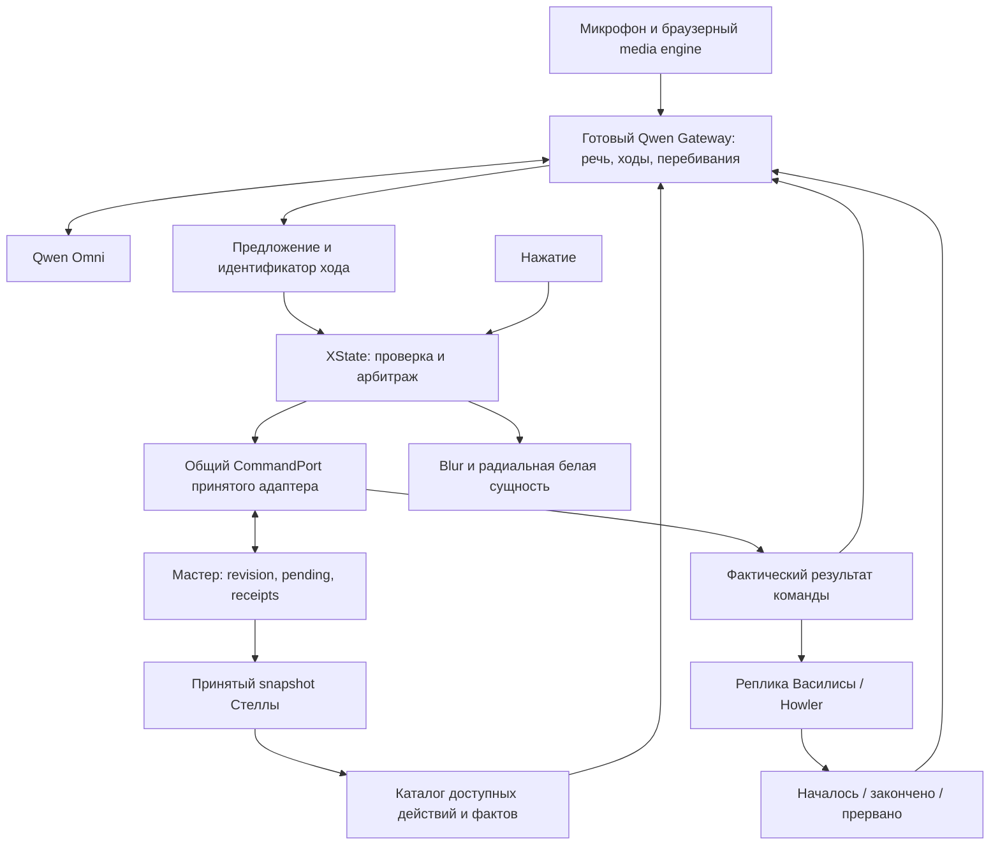

# Стелла: архитектура надёжного живого разговора

**Обновление IMPL-06, 04.10.2026:** [external playback квалифицирован на уровне patched Gateway presentation class + Howler](../../artifacts/reports/stella-live-dialogue-slice3-20261004.md) с настоящим локальным WAV в browser fixture. Identity/order/TTL/reentrancy/late callbacks и completion-only history проверены offline. Wire/router и active ownership полного Gateway ещё не реализованы; нижние формулировки о необходимости расширения runtime относятся к исходному аудиту. По новому требованию главный экран всегда молчит, первую реплику произносит пользователь. AI=false.

04.10.2026 · STELLA-LIVE-ARCH-03 · архитектурное предложение после реального разговора.

**Решение:** модель понимает речь и предлагает действие; готовый разговорный runtime управляет репликами и перебиваниями; приложение проверяет предложение и исполняет его через тот же интерфейс команд, что и нажатие. Только фактический результат команды разрешает фразу об успехе. Анимация показывает состояние разговора, но не определяет момент выполнения команды.

**Текущий статус, 04.10.2026:** архитектура реализована частично в изолированном кандидате5196. [Второй срез](../../artifacts/reports/stella-live-dialogue-slice2-20261004.md) подключил XState 5.33.2/MIT к управлению вводом, отделил выполнение действия от рампы и исправил повтор прерванной Howler-подсказки. В отдельном provider-кандидате Qwen Gateway 2.0.1 добавлены text-only policy и исправление Omni `tool_choice`; полный Gateway не подключён. AI остаётся выключенным (`AI_REQUESTS_ENABLED=false`), платных обращений, записи микрофона и изменений F не было. Предыдущее [исследование](stella-omni-voice-control-20261004.md) сохраняется как история; решения этого документа учитывают [последний разговор](../../artifacts/reports/stella-last-conversation-20261004.md) и актуальные контракты мастера. Описанные ниже целевые возможности не считаются готовыми без отдельного подтверждения в отчёте.

**Уточнение квалификации Gateway:** одной text-only настройки недостаточно для Василисы. Upstream освобождает response context без provider audio при `response.done`; поздний playback receipt Howler теряет связанный контекст. Необходимо расширить существующий presentation runtime режимом внешнего renderer, с явными cancel/end/error и ограниченным временем хранения. Это следующий независимый срез; он пока не реализован. [Исходники, патч, лицензия, 10 offline-проверок и ограничения](../../artifacts/workspace/tasks/stella-voice-v1/artifacts/stella-prototype/voice/gateway-qualification/README.md). Текущий `executing` в XState означает отменяемый локальный RingCue до dispatch, а не отмену уже принятой master-команды.

## 1. Что сломалось и что именно нужно заменить

В последней реальной сессии было пять ответов Omni и ни одного перехода. Три команды содержали `vk_video`/`max`, тогда как парсер ожидал `choose_vk_video`/`choose_max`. Невалидные вызовы не получали отрицательного результата. Одна реплика утверждала, что VK Видео уже открыт, хотя экран оставался стартовым. После ошибок запускалось длинное приветствие. Между готовым решением модели и ответом интерфейса исчезновение сущности добавляло около1,67с; сама модель после остановки речи отвечала за328–350мс. Это измерения одного разговора, не SLA.

Дополнительная сверка `omni-realtime.ts`: новая речь при незавершённом ходе приводит к `overlapping_turns_ambiguous` и закрытию соединения. Следовательно, нынешний адаптер не является системой полноценного перебивания. Перестановка таймеров или улучшенный промпт недостаточны.

Надёжность здесь означает четыре независимо проверяемых свойства:

1. Устаревшая, повторная или неподтверждённая команда не меняет экран.
2. Пользователь может перебить речь; начатая серверная команда при этом не теряется.
3. Озвученное состояние соответствует принятому состоянию Стеллы.
4. Любое ожидание заканчивается результатом либо понятным восстановлением, а расходы можно остановить на сервере.

## 2. Готовые механизмы и выбор

| Компонент | Подтверждено источниками | Решение для Стеллы |
|---|---|---|
| **Qwen Audio Agent / Gateway2.0.1**, Apache-2.0 | Omni adapter, управление разговором, client actions, актуальность хода, подтверждения воспроизведения, восстановление клиента. X-Omni использует эти механизмы | Предпочтительный кандидат на **разговорный runtime** полноценной версии. Сначала проверка совместимости; не копировать его внутренние механизмы в самописный аналог |
| **XState5**, MIT | Состояния/guards, actors, таймеры, остановка дочерних акторов, AbortSignal promise actor | Прикладная координация: разрешение действий, ожидание мастера, права ввода, визуальная проекция. Не второй владелец речевого turn lifecycle |
| **Native WebRTC Qwen** | Официальный медиатранспорт, применён в текущем кандидате | Сохранить прежний кандидат для сравнения/узкого исправления. Сам по себе не решает корреляцию перебиваний и историю услышанного |
| **Howler2.2.4**, MIT | Уже играет локальные записи Василисы, сообщает play/end/stop/error | Сохранить; связать фактическое воспроизведение с разговорным runtime |
| **LiveKit Agents Python1.8.4**, Apache-2.0 | Готовый разговорный runtime, механизмы interruptions/playout | В проверенной realtime-матрице нет готового Qwen Omni adapter. Не выбирать через написание нового provider с нуля |
| **Pipecat1.12.0**, BSD-2-Clause | Voice pipelines, turn/interrupt mechanisms; обычный Qwen LLM service | Наличие Qwen LLM не доказывает Omni Realtime. Сейчас не основной путь |

Источники: [X-Omni2.0.1](https://github.com/QwenAudio/qwen-audio-agent/blob/a73bcbc2e1278bf664df38bdd169ffba1fb2451f/examples/x-omni/README.md), [Gateway contract](https://qwenaudio.github.io/qwen-audio-agent/contract), [XState actors](https://stately.ai/docs/actors), [promise actors](https://stately.ai/docs/promise-actors), [Howler](https://github.com/goldfire/howler.js/tree/v2.2.4), [LiveKit realtime](https://docs.livekit.io/agents/models/realtime/), [Pipecat services](https://docs.pipecat.ai/api-reference/server/services/supported-services).

**Фиксация источника Gateway:** тег `v2.0.1` → `a73bcbc2e1278bf664df38bdd169ffba1fb2451f`; `main` на момент проверки → `f6dd0e3703d58e4941159c1be89447f3fcb5063a`. Через публичный GitHub сверены полные trees и файлы тега: X-Omni уже входит в2.0.1. [Регистрация tools/client actions](https://github.com/QwenAudio/qwen-audio-agent/blob/a73bcbc2e1278bf664df38bdd169ffba1fb2451f/examples/x-omni/gateway.mjs), [client action port](https://github.com/QwenAudio/qwen-audio-agent/blob/a73bcbc2e1278bf664df38bdd169ffba1fb2451f/server/src/client/client-action-port.mjs) подтверждают готовые механизмы, включая AbortSignal. Это уточняет прежнюю оценку, рассматривавшую только отдельный WebRTC extension. Исходный тег выбран кандидатом; интеграция пакета пока не проверена.

Версии XState5.33.2 и `@xstate/react`6.1.0 прочитаны из текущих manifest; React19 входит в peer range. Это **не проверка установки опубликованного пакета**. Для внедрения закрепить registry version, lockfile, лицензию и источник. [Core manifest](https://raw.githubusercontent.com/statelyai/xstate/main/packages/core/package.json), [React manifest](https://raw.githubusercontent.com/statelyai/xstate/main/packages/xstate-react/package.json). Версии альтернатив сверялись по [LiveKit releases](https://github.com/livekit/agents/releases) и [Pipecat releases](https://github.com/pipecat-ai/pipecat/releases).

### Почему не ограничиться XState поверх старого адаптера

Это минимальный путь исправить выбор бренда, отрицательные результаты и UI-задержку. Но XState не добавляет провайдеру отсутствующую связь audio item → response, не восстанавливает услышанную историю и не является медиадвижком. Для запроса **живого разговора** предпочтительнее проверить готовый Gateway, который уже владеет соответствующим механизмом. XState остаётся на стороне приложения и принимает события Gateway, а не самостоятельно назначает параллельные речевые ходы.

У Gateway есть существенные условия допуска:

- X-Omni заявляет реальную проверку **Plus**; Flash использует тот же adapter, но отдельно не квалифицирован этим примером.
- Его WebRTC — **браузер → Gateway**; Gateway → Qwen использует WebSocket. Это другая топология, чем нынешний прямой WebRTC с SDP proxy.
- Требования [package.json2.0.1](https://github.com/QwenAudio/qwen-audio-agent/blob/a73bcbc2e1278bf664df38bdd169ffba1fb2451f/package.json): Node `^22.22.2 || ^24.15.0 || >=26`. Нынешний Node25.9 не подходит. Нужен отдельный поддерживаемый runtime, без замены Node других приложений.
- Не подтверждена нужная нам комбинация: text-only Omni, внешняя Василиса/Howler, корректные playback receipts, инструменты Стеллы без coding-agent. Она обязательна для допуска.
- При внедрении проверить exported API/capabilities установленного артефакта против закреплённого тега; не приписывать ему более поздние изменения `main`. Сохранить provenance и lockfile. Browser tests upstream с синтетическим media не доказывают работу на наших Windows/микрофоне/колонках.

Если Gateway не проходит эти условия, решение возвращается на выбор готового runtime/режима. Не объявлять полноценный barge-in реализованным за счёт собственного недоказанного transport lifecycle.

## 3. Границы архитектуры

### Уточнение после чтения закреплённого кода2.0.1

При начале STELLA-LIVE-IMPL-04 qualification gate **не пройден**. В [dashscope.mjs](https://github.com/QwenAudio/qwen-audio-agent/blob/a73bcbc2e1278bf664df38bdd169ffba1fb2451f/server/src/voice/providers/dashscope.mjs) модальности выводятся из возможностей модели и включают audio; public override на text-only в проверенном пути отсутствует. `buildResultInjection`/`buildPermissionInjection` используют неподдерживаемый Omni `tool_choice`. В [presentation runtime](https://github.com/QwenAudio/qwen-audio-agent/blob/a73bcbc2e1278bf664df38bdd169ffba1fb2451f/server/src/voice/realtime-presentation-runtime.mjs) текстовый response без provider audio теряет context на done, поэтому последующие внешние Howler receipts не принимаются как ожидается. Нужны поддерживаемые provider capability и external playback изменения самого готового runtime, с mock-интеграцией; простой config не решает проблему. Альтернативный выходной голос требует отдельного продуктового решения, автоматически его не подменять.

Для изолированной будущей проверки: `AGENT_PROTOCOL=none`, `createGatewayApplication({memoryProvider:null,frontendMemory:null})`, `QWEN_AUDIO_MEMORY_AUTO=off`, без vision/MCP/OpenAPI sources. `QWEN_AUDIO_MEMORY_PROVIDER=none` невалиден. [Memory module](https://github.com/QwenAudio/qwen-audio-agent/blob/a73bcbc2e1278bf664df38bdd169ffba1fb2451f/server/src/memory/module.mjs), [config](https://github.com/QwenAudio/qwen-audio-agent/blob/a73bcbc2e1278bf664df38bdd169ffba1fb2451f/server/src/core/config.mjs). Auto-memory по умолчанию может обращаться к отдельной модели после разговора. Никакой live-запуск в рамках квалификации не выполнялся.

Готовый [tool handler](https://github.com/QwenAudio/qwen-audio-agent/blob/a73bcbc2e1278bf664df38bdd169ffba1fb2451f/server/src/frontend/tools/tool-call-handler.mjs) уже проверяет stale и возвращает superseded, поддерживает ограничения loop и suppression follow-up. Эти механизмы сохраняют ценность выбора Gateway; собственный дублирующий lifecycle не создаётся. Первый независимый offline шаг catalog/tool-results реализован отдельно: [проверка](../../artifacts/reports/stella-live-dialogue-slice1-20261004.md). Выбор Gateway остаётся условным до устранения указанных несовместимостей.



| Владелец | Владеет | Не владеет |
|---|---|---|
| Gateway | Provider lifecycle, turn/currentness, interruption, нормализованные события речи | Ответами квиза и переходами мастера |
| Catalog adapter | Список действий/вариантов, подписи, словарь брендов, ограниченные факты текущего экрана | Новым квизом, расчётом результата, новым transport |
| XState application actors | Проверкой предложения, правом ввода, локальной отменой, playback/visual состояниями | Истиной о принятой сервером команде |
| CommandPort | Общим вызовом touch/voice, привязкой к snapshot, возвратом принятого результата | Вторым независимым командным протоколом |
| Принятый master adapter | Pending, revision, idempotency, receipt/reconciliation | Интерпретацией свободной речи |
| Narration adapter | Выбором/воспроизведением фразы по результату и учётом услышанного | Самовольным переводом анкеты дальше |

Gateway — сервис голоса, **не второй мастер**. Camera/video/search/memory/coding capabilities примера не включать автоматически. Для этой задачи нужен минимальный набор речевого взаимодействия и инструментов приложения.

## 4. Контракт намерения и команды

Каталог строится из одного текущего snapshot. Из него получаются tools schema, контекст модели, разрешённые semantic IDs и UI-сопоставление. Не держать отдельный ручной enum в промпте, парсере и кнопках.

На старте достаточно `choose_brand({brand:"vk_video"|"max"})`; в вопросе — `choose_option({option_id:...})`; также отдельные доступные `back`, `repeat`, `explain_current`, `clarify`. Это **предлагаемая модель инструментов**, не новая версия API F. Adapter переводит её в существующие команды. При миграции допустимы только явные точные алиасы известных технических ID. Нельзя автоматически выбирать MAX по любой строке, похожей на «Marks», или VK Видео по «пока видео». ASR не является самостоятельной командой.

AI не генерирует commandId, revision, admission, следующий экран, теги/веса, очередь MAX или системный `presentation_complete`. Согласие на фото — отдельное действие только на соответствующем экране; неопределённая реплика не считается согласием.

Проверка в момент решения и повторно перед dispatch:

`schema → allowed action → current turn → station/session/generation → snapshot revision/question → no unresolved pending → dispatch`.

Образец **внутреннего** конверта, создаваемого приложением:

```json
{
  "turnId": "turn-17",
  "providerCallId": "call-4",
  "catalogVersion": "catalog-sha256",
  "source": "voice",
  "action": {"kind": "choose_option", "optionId": "option-from-snapshot"},
  "fence": {"sessionId": "session-from-master", "revision": 12, "screen": "question", "questionId": "q2"}
}
```

CommandPort дополнительно проверяет актуальные protocol/instanceKey/station generation. Поля конверта не становятся непроверенными параметрами серверного API.

Каждый распознанный `call_id` получает учтённый результат: `executed`, `rejected`, `cancelled`, `failed` или `pending_reconciliation`. Вместе с ним — reasonCode, action/command ID, фактические screen/revision. Неизвестный исход нельзя записывать как failed/executed. Если соединение оборвалось, результат сохраняется локально как недоставленный; новая сессия получает свежий контекст, а не слепое повторение старого provider call.

Для дубля возвращается прежний результат, действие повторно не исполняется. Смешанный ответ «текст + tool» разбирается по отдельным outputs. Каждый call учитывается; более одного изменяющего состояние действия в ходе не исполняются последовательно без новой проверки/уточнения. Текст сам экран не меняет.

## 5. Протокол Omni: реальные ограничения

В официальном разделе Omni Realtime **нет поддержки `tool_choice` и `parallel_tool_calls`**. Промпт «всегда используй инструмент» не является гарантией. Tool result передаётся через `conversation.item.create` с `function_call_output`; последующий ответ требует `response.create`. Поэтому результат и продолжение — разные операции. [Function Calling](https://www.alibabacloud.com/help/en/model-studio/qwen-function-calling).

В [client events](https://www.alibabacloud.com/help/en/model-studio/client-events) описаны text-only, semantic/server VAD и `response.cancel`; cancel без активной генерации может дать ошибку. Документированных `conversation.item.truncate/delete` для этого Omni-контракта не найдено. ASR-модель фиксирована; настройка языка `ru` внутри этой конфигурации не подтверждена. Не переносить параметры OpenAI Realtime по сходству имён.

У прямого WebRTC ручные turns не поддержаны; микрофон включается после подтверждения session config. [WebRTC](https://www.alibabacloud.com/help/en/model-studio/realtime-webrtc-access), [overview](https://help.aliyun.com/en/model-studio/realtime). В [server events](https://www.alibabacloud.com/help/en/model-studio/server-events) speech events содержат audio item ID, но для `response.created` не подтверждена прямая ссылка на исходный audio item. ASR delta `text/stash` нельзя обрабатывать как обычный append-only transcript.

Следствия проекта: один владелец continuation; максимум одна попытка исправления невалидного формата, затем локальное короткое уточнение. Не запускать второй ответ, когда Gateway уже создал его. Число API-вызовов учитывать явно. Эхо session config проверять до ввода: modality, инструменты, модель/VAD и привязка текущего каталога. При недоказанной корреляции ответ карантинируется, а не относится к последнему ходу по времени.

## 6. Разговор и перебивания

У прикладного actor параллельно существуют **диалог**, **команда**, **озвучка**, **презентация**. Не сводить их в одну переменную `busy` и один callback `onHidden`.

| Событие | Поведение |
|---|---|
| Человек начал говорить | Остановить текущую локальную реплику; принять новый turn от runtime; заблокировать выбор; начать blur/проявление сущности |
| Речь завершилась | Удерживать сущность, ждать предложение в рамках deadline; по ASR delta не нажимать кнопки |
| Новая речь до отправки команды | Отменить старое локальное предложение/ожидание, исключить поздний ответ; продолжить соединение через штатное перебивание runtime |
| Команда уже сохранена/отправлена | Перебивание останавливает звук, но не очищает pending. Разрешить исход команды, перечитать snapshot, затем обработать новое намерение |
| Команда принята | Отобразить snapshot и передать tool result; выбрать соответствующую реплику; параллельно запустить исчезновение сущности |
| Команда отклонена | Отрицательный tool result и короткое уточнение по актуальному экрану; не повторять приветствие |
| Ответ только текстом | Не исполнять; проверять допустимость разговорной реплики. Заявление об открытом экране без receipt не озвучивать |
| Нет ответа / разрыв | Закрыть речевое ожидание; сохранить master pending, если он есть; показать восстановление. Не переподключаться бесконечно и не повторять оплату молча |
| Stop / AI pause / новый посетитель | Остановить медиапередачу и звук, запретить новые provider sessions, инвалидировать старые ходы. Серверные pending разрешать отдельно |

Отмена XState actor предотвращает применение его позднего результата; она **не откатывает HTTP-команду, которую мастер уже принял**. AbortSignal передаётся поддерживающим его операциям; подписки и Howler callbacks снимаются явно и идемпотентно. Этот нюанс есть и в реальном [XState issue5433](https://github.com/statelyai/xstate/issues/5433).

История содержит отдельно `generated`, `playback_started`, `played`, `interrupted`, длительность воспроизведения. Без word alignment частично сыгранный WAV отмечается частичным, но не угадывается точная последняя услышанная фраза. После перебивания модель получает свежие факты экрана и факт прерванной озвучки. Подтверждения Gateway сами по себе не доказывают удаление непрослушанного текста из provider history: этот случай входит в квалификацию. Если синхронизация невозможна, применять предусмотренное runtime восстановление с минимальным проверенным контекстом; не обещать бесшовную память.

## 7. Как сделать общение естественным и сохранить Василису

Человек может говорить свободно; допустимые действия определяет текущий экран. Стелла отвечает по смыслу, затем возвращает к ближайшему выбору:

| Ситуация | Пример поведения |
|---|---|
| «Давай начнём» на старте | «Выбери бренд: VK Видео или MAX» |
| «ВКонтакте» | Предложение VK Видео, проверка и переход; дальнейшая реплика только по новому принятому экрану |
| «А чем они отличаются?» | Короткое объяснение из утверждённой карточки фактов + предложение выбрать |
| «Не VK, давай MAX» | Одно намерение MAX; не два последовательных нажатия по ключевым словам |
| «Не знаю» в вопросе | Коротко пояснить варианты, не выбирать за человека |
| Посторонний вопрос | Кратко обозначить доступную помощь и вернуть к текущему вопросу, без длинного приветствия |
| «Назад», «повтори», «отмени» | Проверить, доступно ли действие сейчас; отмена pending не симулируется |

Надёжный первый режим — свободный вход + контролируемые короткие ответы Василисы. `clarify`, `retry`, `explain`, `repeat`, `success` — разные cue IDs. Нынешних19WAV недостаточно для всех уточнений: нужен утверждённый каталог реплик; не генерировать его платно в этом исследовании. По одному ходу звучит один владелец ответа: либо экранная подсказка, либо диалоговая реплика, без наложения.

Произвольный ответ голосом Василисы требует отдельного TTS-тракта: утверждённые факты/результат → ограниченный текст → TTS → Howler/готовый player. Клон TTS не считается голосом Omni автоматически. Прямой speech-to-speech в другом голосе также не является сохранением Василисы. Динамический TTS — следующий квалифицируемый режим с собственной задержкой, отменой и бюджетом; до него не заявлять неограниченную свободную устную беседу.

«Подойти и сказать без касания» требует отдельно выбранного запуска. Возможны уже разрешённый микрофон с локальным wake/VAD или активная операторская voice-сессия. Постоянно отправлять весь звук в платную Omni ради ожидания команды не следует. Готовый локальный wake/VAD ещё не выбран; это открытый подпроект, не существующая функция. После reload браузерные разрешения/autoplay проверяются отдельно; абсолютный hands-free старт без условий не обещается.

## 8. Сущность, blur и блокировка

Сохранить persistent logo/background/WhiteEntity и существующую радиальную рампу из центра. Перерисовка состояния не должна перемонтировать оболочку.

`inputLocked = listening || thinking || validating || unresolvedCommand || unsafePresentation`.

Во время речи и ожидания AI кнопки действительно недоступны и через pointer, и через клавиатуру/программный dispatch. При получении результата исчезновение начинается сразу; бизнес-команда не ждёт окончания erase. Если визуальный переход ещё не допускает нажатия, остаётся отдельный короткий presentation lock. Новый голосовой turn во время erase разворачивает проявление из текущего значения без скачка. Длительность ramp не определяет семантическое состояние.

Операторская остановка голоса доступна отдельно от заблокированных пользовательских кнопок. При обычном ручном действии вне блокировки тот же арбитр отменяет речевое предложение и вызывает общий CommandPort. Одновременный voice/touch не создаёт две команды.

Проектные цели для будущей проверки, **не текущие измерения**: реакция UI/остановка локального звука ≤100мс от полученного speech-start; дополнительное ожидание бизнес-dispatch из-за ramp —0мс. Полная задержка ответа измеряется отдельно от VAD, модели, receipt, TTS и презентации, с p50/p95 на фактическом оборудовании.

## 9. Совместимость с текущим мастером F

Сверены `stella_models.py`, `stella_api.py`, `stella_domain.py`, `panel-client.mjs`, `max_models.py`, `max_api.py`, `max_workflows.py` в `F:/project/VK_DigitalProducts_Stand/artifacts/local-master/`. Это read-only снимок состояния04.10.2026, не разрешение менять F.

- VK: `stella-vk-v1`, quiz version `stella-vk-20261003-9d801d1ec85c`, result schema2. Новый admission уже использует `admit_stella_vk_v3`, `content-entities-v1`, `stella-early-plan-v1`; прежнее описание «только кандидат» устарело.
- MAX: `stella-max-v1`, definition `max-stella-quiz/version=1`. Квиз существует. `technical-max-v1` относится к игровому месту, не заменяет его.
- Станция `stella-main`, visit/session/generation, revision и command receipts принадлежат мастеру.
- VK actions/options уже несут команду; MAX берёт action kinds и варианты из своего snapshot/definition. Адаптация разная, пользовательский разговор общий.

Существующий `panel-client.mjs` сохраняет pending до POST, проверяет instanceKey, использует commandId и expectedRevision, умеет receipt lookup. `202`, timeout и отсутствие receipt пока не означают отказ. При `accepted:null`, `needsReconciliation`, смене instanceKey или конфликте ID новое действие не отправляется. Повтор допустим с прежним ID и тем же payload по существующему протоколу, а не новым AI-вызовом.

WAVE-02 уже имеет отдельного владельца touch-first адаптера:
`artifacts/workspace/tests/parallel-wave2/stella-candidate/src/features/master/` (`MasterSlice.tsx`, `slice-client.mjs`, `presentation.ts`, vendor panel-client). Сейчас это ограниченный первый VK-ответ. **Не дублировать его transport/admission/state в voice-кандидате.** Передача — требования к будущему общему CommandPort и самостоятельный intent/provider adapter. Standalone может иметь локальную реализацию порта, но она не доказывает master integration.

`presentation_complete` VK отправляется только после фактического соответствующего представления snapshot. MAX такого kind не имеет. Ни AI, ни общий narration end не могут подменять эти подтверждения. Фото `capture_unavailable`/skip не озвучивается как успешно полученный снимок.

## 10. Расходы и наблюдаемость

Сейчас compile-time pause в candidate5196 блокирует создание сессии на клиенте и сервере. Для эксплуатации требуется отдельная серверная политика: disabled по умолчанию, одна активная conversation на станцию, лимит времени/ответов, не более одного repair, запрет автоматического reconnect после Stop/лимита/ошибки авторизации. Изменение политики закрывает **существующие** provider connections. Прямой SDP proxy не может гарантированно остановить уже установленный browser→provider media; это дополнительный аргумент в пользу серверного Gateway.

Временные стартовые лимиты для согласования: одна сессия,120с maximum lifetime,24с deadline ответа, один repair. Их нельзя выдавать за рассчитанный денежный потолок. Usage приходит после работы; для денежной оценки нужны актуальная тарифная модель и учёт всех соединений/TTS/автоответов. Точный биллинг сверяется у провайдера. При паузе ручная Стелла, WAV и журнал остаются доступны.

Сохранить Pino/Dexie из [исследования журнала](stella-diagnostics-20261004.md). Сквозная цепочка:
`visit/session → connection → turn/audioItem → response/call → command → master receipt → screen revision → playback`.

Писать proposal, schema/catalog hash, validation reason, command pending/receipt/reconciliation, отмену и её инициатора, фактические экраны, generated/played текст, VAD/model/action/playback latency, usage. Полную безопасную tools schema сохранять отдельной версионированной записью, чтобы depth truncation не скрывал enum.

Различать **ACK журнала**, **result инструмента**, **receipt мастера**, **presentation receipt**, **playback receipt**. Ни один не заменяет другой. Объяснение решения — наблюдаемые аргументы/проверки/result, а не выдуманная внутренняя цепочка рассуждений модели. Raw audio по умолчанию не хранить; для акустического исследования нужна отдельная явная запись с ограниченным хранением. Текущий журнал без аудио не позволяет доказать, что «Marks» было ошибкой именно распознавания.

## 11. Реальный опыт и риски готовых решений

| Источник | Описанный случай | Проверка у нас |
|---|---|---|
| [LiveKit3019](https://github.com/livekit/agents/issues/3019) | Разные правила interruptions при thinking/speaking; поздний transcript запускает лишнюю реакцию | Новая речь и поздние события не порождают второго владельца хода |
| [LiveKit6424](https://github.com/livekit/agents/issues/6424) | Неуслышанный ответ остаётся в контексте realtime-модели | Generated и played раздельно; никакой уверенности, что пользователь слышал прерванную инструкцию |
| [Qwen334](https://github.com/QwenAudio/qwen-audio-agent/issues/334) | Принятый voice config не гарантировал ответ после speech_stopped | Квалификация exact model/config, а не только session.updated |
| [Pipecat2791](https://github.com/pipecat-ai/pipecat/issues/2791) | Проблемы контекста после interruption в STT/LLM/TTS цепочке | Проверять восстановление реплики; не переносить вывод как доказательство Omni-совместимости |
| [Qwen TUI notes](https://github.com/QwenAudio/qwen-audio-agent/blob/main/docs/getting-started/tui.md) | Full-duplex без AEC провоцирует ложные перебивания от колонок | Проверка на реальном стенде, а не только в наушниках |

Это первичные сообщения авторов/пользователей репозиториев. Они подтверждают классы рисков, а не наличие каждого дефекта в выбранной версии Стеллы. Browser echoCancellation/noiseSuppression — настройки, не гарантия качества в шумном зале.

## 12. План коротких проверяемых итераций

**A. Offline контракт — первый рекомендуемый шаг.** Не меняя транспорт и не включая AI, единый catalog/нормализация/tool-results, раздельные причины ответа. Проиграть пять записанных provider outputs. Три известные технические aliases больше не теряются на enum; false-success текст не озвучивается; отменённое уточнение не возобновляется. Это тест протокола, не доказательство правильного понимания речи: аудиозаписи нет.

**B. Квалификация готового Gateway.** Отдельный checkout/version/Node/порт и mock provider. Проверить text-only, внешний Howler, receipts, caller cancellation, late/duplicate events, отключение всех лишних возможностей. Не редактировать текущую живую сборку. Критерий: готовый runtime действительно владеет turn lifecycle; нет самописного параллельного аналога. При провале — остановка выбора стека, пересмотр подхода.

**C. Прикладные XState actors и небольшой видимый сценарий.** Один стартовый экран: уточнение → выбор бренда → перебивание → назад. Общий gate touch/voice, ramp независимо от commit, persistent оболочка. Mock speech без платного AI; короткая браузерная проверка и пользовательская оценка.

**D. CommandPort мастера.** После принятия нужного WAVE-02 интерфейса подключить один VK-ответ к существующему adapter; проверить revision conflict, lost ACK/reload и изменение экрана во время речи на изолированных данных. MAX и остальные шаги подключать последующими срезами, учитывая разные kinds.

**E. Ограниченная живая проверка.** Только после нового разрешения включить AI: конкретная модель, маленький заданный бюджет, русская речь, короткие названия, отрицание, шум и перебивания на реальном микрофоне/колонках. Отдельно user acceptance темпа/Василисы. Успешный mock не закрывает эту проверку.

Минимальная матрица приёмки:

| Сценарий | Обязательный результат |
|---|---|
| Дублированный call/response | Одна бизнес-команда, прежний результат для дубля |
| Поздний ответ старого хода/посетителя | Ноль действий; причина видна в журнале |
| Speech start до dispatch | Старое предложение отменено без разрыва нормального разговора |
| Speech start после POST | Pending сохранён, повтор/замена только после reconciliation |
| Touch одновременно с voice | Не более одной принятой команды |
| Timeout после фактически принятой команды | Receipt восстанавливает успех, новый commandId не создаётся |
| Model text «открыл», receipt отсутствует | Нет ложного успешного ответа |
| Прерванная локальная реплика | Звук остановлен; нет позднего автопродолжения/ошибочного played |
| AI pause/reload/потеря связи | Нет новых платных соединений; доступен ручной сценарий с учётом pending |
| Длительный erase/ошибка renderer | Нет зависшего диалога или двойного действия из callback |

Перед переносом: exact SHA кода/lockfile, версии контрактов, capability/config snapshot, лицензии, defaults/миграции и отчёт в `artifacts/reports/`. Интегратор F принимает компонент отдельно; этот документ не объявляет его установленным.

## 13. Итог исследования и открытые вопросы

Архитектурные границы определены: готовый conversational runtime, XState для приложения, единый каталог действий, существующий командный адаптер/receipts с предлагаемым общим CommandPort, управляемая Василиса, независимая рампа и сквозной журнал. Источник Gateway закреплён; его установка и совместимость внешнего голоса ещё требуют квалификации. Always-listening wake path и свободный динамический TTS также не реализованы. Первое исправление можно доказать на сохранённом разговоре без расходов на AI.

Проверка документа: сопоставлены фактический журнал, voice-кандидат5196, актуальные F-контракты и первичные публичные источники; проведены независимые проверки протокола, готовых runtimes и master boundary. Новая реализация не тестировалась, потому что не создавалась. Художественная и речевая приёмка остаются открытыми.

## 14. Уточнение после STELLA-REV-07, 04.10.2026

CAM-09: повторно сверена [MDN getUserMedia](https://developer.mozilla.org/en-US/docs/Web/API/MediaDevices/getUserMedia): NotAllowedError означает отказ политики/пользователя/контекста, а prompt может остаться без ответа. Поэтому используется глобальное объяснение и явный retry из пользовательского жеста; принудительно сбросить разрешения браузера из страницы нельзя. Готовый native API сохранён; singleflight учитывает неотменяемый pending promise и BFCache. [Проверка](../../artifacts/reports/stella-camera-notice-20261004.md).

Последующее CAM-08: пользователь прямо изменил lifecycle — камера должна запрашиваться с запуска и работать постоянно. Поэтому тот же нативный getUserMedia теперь принадлежит React provider приложения; карточки лишь используют общий stream, hidden/host pause не вызывают stop. Освобождение оставлено для page exit/unmount/ended; поздний результат и StrictMode проверены. Новый camera engine или пакет не добавляется. [Фактическая проверка](../../artifacts/reports/stella-camera-session-20261004.md).

Исторический статус выше относится к моменту исследования. Теперь в candidate5196 выполнены offline-срезы1–3 и [REV-07](../../artifacts/reports/stella-revision7-20261004.md): XState actor распространён на зарегистрированные экранные кнопки, actual pinned presentation class связан с переходом и Howler. Это in-process qualification, не работающий сетевой Gateway/Omni. Сводная таблица A–E и границы проверки находятся в отчёте.

Исследованы публичные exports полного qwen-audio-agent: gateway-application/createGatewayApplication, realtime-provider, gateway-client-sdk/GatewayClient, upstream mock-provider fixture. Возможность подключения подтверждена кодом upstream, но external playback пока квалифицирован через class adapter. Перед сетевым переносом нужны поддерживаемый Node, construction-time externalPlayback capability, wire/router и authenticated ownership. autoStart=false сам по себе не гарантирует отсутствия побочных действий; не включать полный сервис ради текущего UI-прохода.

Для локального preview используется готовый browser media mechanism, а не новый camera engine: [getUserMedia](https://developer.mozilla.org/en-US/docs/Web/API/MediaDevices/getUserMedia), [MediaStreamTrack.stop](https://developer.mozilla.org/en-US/docs/Web/API/MediaStreamTrack/stop). Разрешение может не завершиться, поэтому нужны epoch/currentness и остановка поздно выданных tracks. video-only не открывает микрофон; при denied/unavailable нужен честный fallback. Компонентные тесты подтверждают cleanup, но IAB без выданного доступа не подтверждает реальную камеру. Новая зависимость и лицензия не добавляются.

Полный новый текст пользователя применяется и на экране, и в сценарии озвучки. До синтеза и сверки новых WAV действует pending-audio block, чтобы не озвучивать старый текст как новый. AI остаётся выключенным; динамический TTS, распознавание живой речи и master CommandPort — незавершённые последующие этапы.
