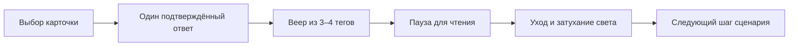

# Стелла: анимация ответов, тегов и переходов

**Уточнение после отзыва пользователя, 02.10.2026:** реализованный GSAP-формат отклонён. Предыдущая рекомендация для вылета заменена переносом готовой авторской WAAPI-хореографии из demo/scene LumiCells. Исследование ниже не учло этот готовый слой; сведения о библиотеках остаются справочными. [Разбор исходных плашек и полётов](stella-lumicells-native-motion-20261002.md). Код ещё не заменён.

**Статус реализации, 02.10.2026:** первый этап внедрён на localhost:5175/stella/ для всех четырёх ответов первого вопроса VK Видео: GSAP3.15.0 + MotionPath + @gsap/react2.1.2, прежний LumiCells, 2300ms, пауза/отмена и reduced motion. [Проверка реализации](../../artifacts/reports/stella-tag-flight-20261002.md). Остальная карта ниже остаётся исследовательским предложением; визуальное утверждение ещё не получено.

Дата: 02.10.2026. Статус: исследование и предложение следующей итерации. База сценария — upstream `3e02630`, локальная версия на `http://localhost:5175/stella/` с LumiCells. Библиотеки не установлены, приложение этим исследованием не изменено.

## Рекомендация

Для Стеллы рекомендую **GSAP 3 + MotionPathPlugin**, с React-обёрткой `@gsap/react`. Это подходящий набор для конкретной задачи: несколько читаемых тегов вылетают из выбранной карточки по согласованным дугам, ненадолго фиксируются и уходят в общий поток. **Flip добавлять только при появлении реального перемещения карточки между раскладками.** Для первого вылета он не обязателен. Возможности траекторий, последовательностей и React lifecycle подтверждены [MotionPath](https://gsap.com/docs/v3/Plugins/MotionPathPlugin/), [Timeline](https://gsap.com/docs/v3/GSAP/Timeline/), [React guide](https://gsap.com/resources/React/).

Главное художественное решение: **ответ становится источником движения**. Посетитель видит причинную связь между своим нажатием, словами предпочтений и формированием подборки. Увеличение количества частиц, свечения или пружин само по себе этой связи не создаёт.

**Motion for React — сильная альтернатива**, если приоритетом станут многочисленные перестроения React-интерфейса и переходы между компонентами. **Anime.js — близкая альтернатива GSAP**, если важны MIT и явное подключение к существующему циклу кадров. Одновременно внедрять три библиотеки не предлагается. Выбор GSAP — инженерная оценка под этот сценарий, не результат сравнительного FPS-теста.

## Что установлено в текущем проекте

Полные доказательства и привязки к исходникам вынесены в [технический аудит](../../artifacts/reports/stella-motion-audit-20261002.md). Здесь только выводы, влияющие на выбор решения.

| Сейчас | Следствие для новой анимации |
|---|---|
| Один постоянный `RingScene` и оригинальный LumiCells | Анимировать DOM переднего плана; фон и его жизненный цикл уже есть |
| `RingCue` подтверждает выбор через 260 ms, блокирует повтор и умеет отмену/паузу | Сохранить его единственным входом действия; не создавать второй обработчик ответа |
| `VkProgressScreen` показывает уникальные метаданные, максимум 10 | Есть реальные слова сценария, из которых можно собирать композицию |
| Все теги получают один `screen-arrive`: 260 ms, opacity и translateY 14 px | Сейчас нет поочерёдного вылета, разных дуг, фазы чтения и ухода |
| `questionIndex`/`optionIndex` сохраняются в reveal-state, но не передаются визуальному компоненту | Источник вылета можно восстановить; сейчас он визуально теряется |
| `RingActions` перемонтируется по `phaseKey`, прежний экран удаляется | Долгоживущий слой перехода должен находиться выше этого ключа |
| В MAX есть по 8 метаданных на ответ, но отдельного reveal-экрана нет | Распространение эффекта на MAX — дополнительная будущая итерация |
| Интерфейс занимает y=0…1280 холста 1080×1920 | Значимые слова и действия остаются в верхних двух третях |

Это аудит кода. Плавность на экране, читаемость в движении и реакция зрителей здесь не измерены. Самостоятельный браузерный просмотр запрещён действующим указанием пользователя; приёмка следующей реализации выполняется по его просмотру и кадрам.

## Каким должен быть характер движения

Для VK Видео предлагается живая, направленная анимация: синие плашки и отдельные красные акценты, небольшое различие траекторий, чёткая остановка для чтения. Для MAX — тот же принцип движения в своей фиолетово-синей палитре. Цвета между продуктовыми ветками не смешиваются.

Сетка остаётся спокойной, основное движение принадлежит ответу. Свет от тега локально касается клеток и затухает вместе с ним. Видимое кольцо не возвращается: последний принятый пользователем образ — мелкое поле без сферы. Иллюстрации можно слегка перемещать и масштабировать целиком; растровые персонажи не становятся анимированными 3D-ригами. Логотипы сохраняют исходные пропорции и графику. Основание: [контракт Стеллы](../../apps/stella-prototype/docs/RING_INTERFACE.md), [пакет VK Видео](../../artifacts/DESIGN/BRANDS/vk-video/brand.json), [пакет MAX](../../artifacts/DESIGN/BRANDS/MAX/brand.json).

### Три варианта постановки

| Вариант | Как выглядит | Где применять | Оценка |
|---|---|---|---|
| **Веер из ответа** | 3–4 слова выходят из выбранной карточки по коротким разным дугам, занимают свободные места и затем уходят вверх | Обычный ответ VK Видео | **Начать с него:** понятный источник, хорошо проверяется на одном экране |
| **Сборка подборки** | Слова предыдущих ответов приходят небольшими группами и образуют компактную композицию вокруг смыслового заголовка | Discovery activation | Второй этап; создаёт ощущение накопления без буквального кольца |
| **Передача импульса** | Карточка отвечает коротким нажатием, поле подхватывает импульс, теги направляются к краю композиции | Переход к результату | Использовать сдержанно; нельзя изображать подтверждённую передачу на стену, пока такого API нет |

Общий принцип — крупные устойчивые слова, контролируемое ускорение и спокойное чтение. Не вращать надписи вслед за касательной пути; не использовать конфетти, постоянную тряску, интенсивное размытие текста или посимвольную «печать» каждого ответа. Это художественные рекомендации для нашей композиции, а не ограничения библиотек.

## Хореография одного ответа

Предложенный первый вариант укладывается в существующие **2300 ms reveal**, без дополнительной паузы поверх этого окна. Отсчёт таблицы начинается после текущего подтверждения `RingCue` — через 260 ms от принятого нажатия. Значения ниже — стартовые параметры для пользовательской оценки.

| Время reveal | Видимое действие | Стартовые параметры |
|---|---|---|
| 0–120 ms | Сохраняется визуальное положение выбранного ответа, остальные карточки уходят | Декоративная копия выбранной карточки; без второго hit-target |
| 80–780 ms | 3–4 тега последовательно раскрываются из области ответа | Интервал 70–90 ms, полёт 450–520 ms, scale примерно 0.9→1, путь с мягким торможением |
| 780–1640 ms | Теги стоят и читаются | Без постоянного покачивания; длинным словам больше места |
| 1640–2080 ms | Теги уходят в одном согласованном направлении, локальный свет затухает | Уход 320–440 ms; текст остаётся горизонтальным |
| 2080–2300 ms | Завершение перехода и подготовка следующего вопроса | Новый вопрос получает активный ввод после смены состояния |

Для четырёх тегов крайний прилёт по этой схеме: 80 + 3×80 + 460 = **780 ms**. Значит, последнему слову остаётся около 860 ms неподвижного чтения. Это гипотеза достаточности, а не результат исследования читабельности. Если пользователь не успевает читать, сначала сокращать число одновременно показанных слов или длину пути; увеличение общего ожидания рассматривать отдельно.

Точки назначения заранее выбирать в безопасной зоне, например y=550…1050, с учётом фактической ширины слов. Проверять весь прямоугольник тега по пути, а не только его центр. Верхний логотип, вопрос, «Назад» и нижняя треть не становятся зоной пролёта текста. Для каждой из четырёх карточек нужна своя ориентация веера.



### Применение по сценарию

| Шаг | Предлагаемое движение | Условие |
|---|---|---|
| Выбор вселенной | Существующая заставка логотипа и смена тона | Сохранить 1200 ms; не добавлять параллельно поток слов |
| Вступление | Заголовок, затем 2–3 смысловых шага с коротким разносом старта | Кнопка быстро доступна; не заставлять ждать декоративную очередь |
| Вопросы VK Видео | «Веер из ответа» | Использовать реальные `metadata`, сохранять веса и answer id |
| Discovery activation | Сборка 6–8 видимых тегов из уже собранных данных | Полный набор метаданных хранить отдельно; текущий лимит отображения 10 не равен лимиту данных |
| Согласие на фото | Четыре слова про ракурс, свет, композицию, обработку | Тот же reveal 2300 ms, затем выбор пола |
| Пропуск фото | Короткое подтверждение выбора | Метаданных нет; не придумывать теги ради эффекта, сохранить короткий переход 650 ms |
| Подготовка / сканирование | Спокойный фокус внимания и завершение | Существуют окна 1800/2400 ms; камера пока имитируется |
| Финал и QR | Однократное появление и неподвижная композиция | QR не вращается, не пульсирует и не перекрывается тегами |
| Ответы MAX | Позже — 3–4 отобранных слова из 8, фиолетово-синяя палитра | Сейчас reveal в MAX отсутствует; добавление меняет длительность ветки и проверяется отдельно |

## Сравнение готовых решений

Оценка ниже относится к нашей Стелле. Не проводились установка кандидатов, измерение итогового bundle и сравнительный GPU-тест. Версии следует закрепить в lock-файле после отдельной проверки сборки с текущим React/TypeScript; совместимость конкретной версии не следует из наличия React-примера.

| Решение | Что уже даёт | Что потребуется у нас | Вывод |
|---|---|---|---|
| **GSAP 3 + MotionPath** | Timeline с перекрывающимися фазами, пути по SVG/точкам, управление воспроизведением; `@gsap/react` для lifecycle | Данные траекторий, слой перехода, единые часы, привязка света | **Основной кандидат** для поставленного вылета |
| **Motion for React** | `AnimatePresence`, layout/shared-element, `useAnimate`, stagger; в текущей документации также `arc()` | Правильная граница presence, владение transform, отдельное управление паузой сложной сцены | Лучший альтернативный вариант для React-переходов |
| **Anime.js** | Timeline, stagger, SVG motion path, React scope; ручное обновление engine | React mount/unmount, наш план фаз и адаптер LumiCells | Сильный резерв с MIT и удобным внешним циклом |
| **React Spring** | Пружинное движение, `useTransition`, цепочки и контроллеры | Явные траектории/сборка фаз; согласование времени успокоения с dwell | Полезен для пластики, но менее прямой путь к постановке по таймлайну |
| **AutoAnimate** | Автоматическое появление, удаление и перестановка дочерних DOM-узлов | Почти весь авторский вылет всё равно придётся описывать отдельно | Подходит вспомогательному списку, не выбран главным инструментом |
| **Web Animations API** | Браузерные keyframes, currentTime, pause/play/cancel, завершение | Самостоятельная оркестрация группы, пути, cleanup, React lifecycle | Хорошая контрольная реализация без зависимости для простого веера |

### GSAP: почему первый

`MotionPathPlugin` работает с SVG-путями и координатами; для текста можно оставить `autoRotate: false`. Это закрывает управляемые дуги от ответа до свободной позиции. Выравнивание пути рассчитывается в начале: resize требует пересчёта или работы в фиксированных логических координатах. [Документация MotionPath](https://gsap.com/docs/v3/Plugins/MotionPathPlugin/).

Timeline позволяет совместить вылет, чтение и уход и управлять ими как целым. Для Стеллы важна возможность задавать время воспроизведения извне, чтобы поле и теги использовали одну временную шкалу. [Timeline](https://gsap.com/docs/v3/GSAP/Timeline/), [time()](https://gsap.com/docs/v3/GSAP/Timeline/time()/).

`useGSAP` обеспечивает scoped cleanup; анимации из отложенных обработчиков должны попадать в `contextSafe` либо явно очищаться. Это особенно важно при смене вопроса и возврате домой. [React guide](https://gsap.com/resources/React/).

`Flip` имеет смысл позднее, когда выбранная карточка действительно становится компактной карточкой результата. Он сопоставляет прежнее и новое положение; сам по себе не сохраняет React-элемент, который уже размонтирован. [Flip](https://gsap.com/docs/v3/Plugins/Flip/).

### Motion: реальная альтернатива, а не только fade

`AnimatePresence` удерживает выходящий узел до конца exit-анимации, а layout-анимации связывают изменение раскладки. Родитель presence должен переживать смену дочернего ключа; установка его внутрь текущего перемонтируемого `RingActions` не решит исчезновение всей сцены. [Presence](https://motion.dev/docs/react-animate-presence), [layout](https://motion.dev/docs/react-layout-animations).

Для ручной последовательности есть `useAnimate` со scope и очисткой, для очереди — `stagger`. [useAnimate](https://motion.dev/docs/react-use-animate), [stagger](https://motion.dev/docs/stagger). Текущая документация описывает `arc()` для дуги между точками; mini-версия его не поддерживает. Поэтому считать Motion неспособным к криволинейному вылету неверно. Наличие API нужно проверить в выбранном npm-релизе. [arc](https://motion.dev/docs/arc).

Для общей остановки сцены недостаточно CSS `animation-play-state`; программным анимациям нужны их controls. [animate controls](https://motion.dev/docs/animate). Политика reduced motion задаётся отдельно; трансформации и смена opacity могут вести себя по-разному. [Accessibility](https://motion.dev/docs/react-accessibility).

### Anime.js, React Spring и простые варианты

Anime.js закрывает групповые задержки, таймлайн и движение вдоль SVG. React-интеграция использует scope с `revert()` при cleanup. Особенно полезен официальный режим `engine.useDefaultMainLoop = false` с `engine.update()` для внешнего цикла. Это делает библиотеку сильной альтернативой в связке с `onBeforeFrame` LumiCells. [stagger](https://animejs.com/documentation/utilities/stagger/), [timeline](https://animejs.com/documentation/timeline/), [path](https://animejs.com/documentation/svg/createmotionpath/), [React](https://animejs.com/documentation/getting-started/using-with-react/), [external loop](https://animejs.com/documentation/engine/engine-methods/update/).

React Spring удобен для живого появления и исчезновения наборов элементов; его API позволяет ставить анимации на паузу. Для нашей сцены сложнее будет согласовать физическое успокоение и фиксированное окно чтения. Это оценка интеграции, не недостаток качества библиотеки. [useTransition](https://www.react-spring.dev/docs/components/use-transition), [SpringRef](https://www.react-spring.dev/docs/advanced/spring-ref).

AutoAnimate реагирует на добавление, удаление и перемещение непосредственных детей. Это полезно для автоматически меняющегося списка тегов, но не описывает источник вылета и индивидуальную драматургию. [Официальные примеры](https://auto-animate.formkit.com/).

WAAPI достаточно для коротких keyframes с ручными задержками. Групповой переход, отмену и жизненный цикл придётся организовать в проекте. [Web Animations API](https://developer.mozilla.org/en-US/docs/Web/API/Web_Animations_API). Отдельный Rive-сценарий пока не предлагается: динамические слова уже живут в DOM и связаны с LumiCells; создание дополнительного графического слоя увеличит объём интеграции. Это не утверждение, что Rive не умеет динамические данные.

### Лицензии и доставка

| Решение | Проверенный статус | Что учесть |
|---|---|---|
| GSAP | Собственная Standard No Charge License; официальный FAQ разрешает коммерческое использование без оплаты | Это не MIT. Есть ограничение для определённых конкурирующих визуальных конструкторов анимации; при расширении проекта в такой редактор заново проверить scope |
| Motion | MIT для основного репозитория | Платные примеры/дополнения Motion+ не считать включёнными в лицензию core |
| Anime.js | MIT | Сохранить уведомление лицензии при поставке |
| React Spring | MIT | Сохранить уведомление лицензии при поставке |
| AutoAnimate | MIT | Сохранить уведомление лицензии при поставке |
| WAAPI | API браузера | Нет дополнительного npm-runtime для самого API |

Источники: [GSAP license](https://gsap.com/community/standard-license/), [Motion license](https://github.com/motiondivision/motion/blob/main/LICENSE.md), [Anime.js license](https://github.com/juliangarnier/anime/blob/master/LICENSE.md), [React Spring license](https://github.com/pmndrs/react-spring/blob/main/LICENSE), [AutoAnimate](https://auto-animate.formkit.com/). Проверено 02.10.2026. Это фиксация опубликованных условий, а не обещание пригодности для любого будущего способа распространения.

Для стенда выбранный пакет собирать локально вместе с приложением; внешние CDN и облачные запросы в процессе показа не нужны. Сравнивать итоговые размеры после реальной сборки одинакового эффекта, а не рекламные размеры разных entry points.

## Как соединить анимацию с LumiCells

Ниже предлагается архитектура, ещё не реализованная в Стелле.

### 1. Сохранить источник и слой перехода

До удаления вопроса сохранить геометрию выбранной карточки. В текущей реализации координаты можно измерить через ref или передать вместе с `optionIndex`; первый вариант лучше переносит изменение раскладки. Слой вылета должен быть внутри постоянного `RingScene` и вне поддерева `RingActions key={phaseKey}`.

План перехода содержит `sessionId`, `transitionId`, `questionId`, `answerId`, исходный прямоугольник, тексты тегов и целевые позиции. Идентификатор визуального тега строится из ответа и порядкового номера, а не только из текста: одинаковое слово может встречаться в нескольких вопросах. Дедупликация для Discovery остаётся правилом представления и не меняет данные сценария.

Техническая структура:

```text
RingScene — постоянный LumiCells
  StellaScreenHost — текущий вопрос / результат
    RingActions — единственный приём выбора
  StellaTransitionLayer — копия ответа и летящие теги
    MotionPlayer — один контроллер времени для этой сцены
```

Декоративные копии получают `pointer-events:none`, не имеют повторного `id`, кнопочного поведения и второго объявления для screen reader. Смысловое сообщение о принятом ответе остаётся одно. Новый вопрос не должен принимать нажатие до завершения перехода.

### 2. Разделить владельцев transform

Сегодня CSS и native-hover уже управляют внешним видом `RingTag`. Новая библиотека не должна одновременно писать `transform` в этот же интерактивный элемент. Для полёта используется отдельная обёртка/декоративная копия: путь принадлежит motion-слою, внутренний текст остаётся горизонтальным. На новом слое убрать конкурирующий `screen-arrive`, чтобы родительский сдвиг не складывался с траекторией.

Координаты проекта — 1080×1920. При нынешнем равномерном `scale` клиентские координаты переводятся в логические после вычитания origin и деления на scale. `getBoundingClientRect()` уже содержит масштаб: применять его дважды нельзя. При будущих сложных transforms нужен обратный DOMMatrix. Геометрию измерять после готовности шрифтов, пакетно; не читать layout после каждого изменения style.

### 3. Движущийся свет требует явного контракта

В закреплённом LumiCells `auto` отслеживает CSS/WAAPI-анимации и события layout. Обычная JS-запись style сама по себе не входит в фильтр MutationObserver. Для JS-полёта использовать **`data-lc-track="frame"`** на движущемся связанном элементе либо ручной influence handle. Это вывод из [аудита реализации](../../artifacts/reports/stella-motion-audit-20261002.md), а не предположение о поведении любой библиотеки.

`opacity:0` не выключает influence автоматически: tracker проверяет наличие layout-box, но не opacity. Поэтому видимость тега и сила его света должны задаваться одной огибающей. Для плавного fade предпочтителен handle с `update({strength})`; нельзя одновременно оставить декларативное и ручное влияние одного тега. При выходе dispose, при новой сцене очистить все оставшиеся handles. Простое снятие атрибута в конце допустимо для первого опыта, но не заменяет синхронного затухания.

Движок использует осевой bounding box. Сильный поворот прямоугольной надписи увеличивает область её света; для первой версии rotation=0. Порядок выполнения JS и измерения также важен: `track="frame"` гарантирует частые измерения, но не порядок независимых RAF.

### 4. Один источник времени для перехода

LumiCells уже экспортирует `onBeforeFrame`: аниматоры → пакетное измерение DOM → GPU. Рекомендуемый вариант GSAP — paused timeline, положение которого выставляется из этого callback через `time(activeElapsedSeconds, true)`. Контроллер учитывает `playing`, паузу, session/transition token и однократно сообщает родителю об окончании окна. Родитель остаётся владельцем перехода сценария. API установки времени описан в [GSAP time()](https://gsap.com/docs/v3/GSAP/Timeline/time()/).

Для подключённого reveal-состояния его прежний `setTimeout` должен быть заменён этим одним завершением. Нельзя оставить одновременно старый таймер и `onComplete(setScreen)`. Длительности 2300/650/3200 ms сохраняются как данные сценария. Отмена завершает только визуальный переход, не публикует новый ответ и не вызывает устаревший callback.

Пауза должна останавливать вместе timeline, локальное свечение и время ожидания. CSS `animation-play-state` не управляет GSAP/WAAPI. Не вызывать глобальный `gsap.globalTimeline.pause()` ради одного экрана. У GSAP есть собственный ticker; интеграция должна проверить, какие callbacks остаются активны, а не обещать отсутствие дополнительного RAF по названию библиотеки. [GSAP ticker](https://gsap.com/docs/v3/GSAP/gsap.ticker/).

Для Anime.js альтернативный адаптер использует официальный внешний update-loop. Для Motion сначала проще проверить scoped controls; связь с измерением LumiCells и выбор JS/WAAPI-пути нуждаются в отдельной технической проверке.

При reduced motion сохранять слова и порядок сценария, убирать пространственный пролёт; короткая смена opacity допустима. Время для чтения не обязано исчезать вместе с декоративным движением. Возврат домой, unmount, resize и повторный выбор должны иметь определённую политику отмены. Ручной seek для отладки не запускает события сценария.

## Готовые примеры для следующей постановки

Это ссылки на официальные страницы с примерами и исходным кодом. Интерактивные демонстрации агентом не проигрывались; пригодность механики установлена по документации, художественное качество для Стеллы предстоит оценить.

| Пример | Что взять | Как перенести на Стеллу |
|---|---|---|
| [GSAP MotionPath — Demo](https://gsap.com/docs/v3/Plugins/MotionPathPlugin/#demo) | Движение элемента по управляемому пути | Короткие открытые дуги для слов, `autoRotate:false` |
| [GSAP Flip — Simple/Flex examples](https://gsap.com/docs/v3/Plugins/Flip/) | Непрерывность элемента при смене раскладки | Только для будущего превращения ответа в компактный результат |
| [Motion arc — Add to basket](https://motion.dev/docs/arc) | Дуга от источника к месту накопления | Ответ → читаемая группа предпочтений |
| [Motion stagger](https://motion.dev/docs/stagger) | Очередность появления группы | Четыре тега с интервалом, без общей одновременной вспышки |
| [Anime.js createMotionPath](https://animejs.com/documentation/svg/createmotionpath/) | Следование SVG-пути | Параметризованные пути для четырёх позиций ответа |
| [React Spring useTransition](https://www.react-spring.dev/docs/components/use-transition) | Появление/удаление элементов данных | Более мягкая альтернативная подача группы предпочтений |

## План короткой проверяемой итерации

Первая реализация: **один ответ первого вопроса VK Видео**, четыре исходных тега, три фазы «вылет → чтение → уход», прежние 2300 ms, прежние события. Для начала достаточно GSAP core, MotionPath и React lifecycle; Flip, новые шейдеры, частицы и переписывание всех экранов не требуются.

| Проверка | Критерий |
|---|---|
| Причина движения | Все теги начинают путь у выбранной карточки; другие ответы не выглядят выбранными |
| Читаемость | Текст не крутится и не перекрывается; есть неподвижная фаза чтения |
| Границы | Весь значимый текст до y1280; нижняя треть остаётся декоративной |
| Движущийся свет | Свет следует тегу, исчезает вместе с ним, не остаётся в прежней позиции |
| Повторный ввод | Двойной тап даёт один ответ; «Назад» до commit отменяет его по существующему правилу |
| Отмена | Reset/unmount не оставляют таймер, DOM-копию или influence; старый callback не меняет новый экран |
| Пауза | После паузы фаза и остаток времени продолжаются с прежней точки |
| Масштаб | Все четыре позиции карточек проверены при двух размерах окна, без двойного scale |
| Данные | Веса, answer id, маршруты MAX и recommendation payload не меняются |

Сначала малые CPU-проверки контроллера, typecheck/lint/build, затем пользователь открывает отдельную страницу. Отдельно оценивать красоту движения и его производительность. Целевые 60 FPS / бюджет 16,7 ms — ориентир будущего измерения, а не доказанный результат. Проверять обычные четыре тега и предельные десять, не сотни искусственных объектов. Тяжёлые GPU-прогоны и запись видео требуют отдельного согласия по AGENTS.

Для движения преимущественно использовать transform/opacity; постоянный filter blur и перерисовку больших теней не добавлять без необходимости. DOM, связанный с LumiCells, всё равно измеряется движком: «compositor animation» не означает нулевую стоимость всей сцены. Общие основания — [руководство web.dev](https://web.dev/articles/animations-guide).

После пользовательского отзыва распространять принятую хореографию на остальные ответы, затем отдельно на Discovery и MAX. Окончательное решение по библиотеке принимать после этого малого примера; текущая рекомендация достаточна, чтобы выбрать первый инструмент и не менять движок графики.

## Границы достоверности

Подтверждены исходники текущей Стеллы, механика закреплённого LumiCells и перечисленные официальные API/лицензии на дату исследования. Не подтверждены визуальная плавность новой постановки, совместимость ещё не установленных npm-версий, размер новой сборки и производительность на целевом LED/Spout. Работающий прототип, runtime, package-lock и сценарные данные этим документом не изменены.
