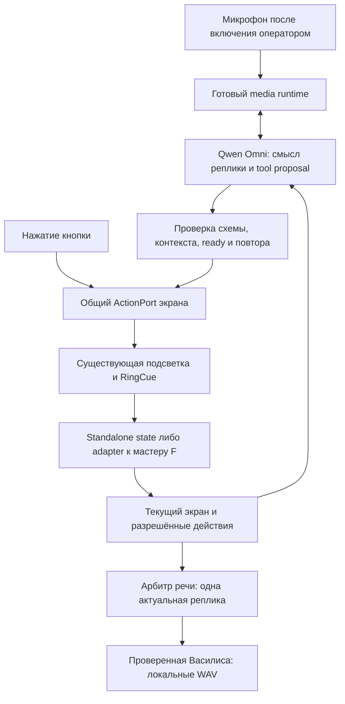

# Стелла: свободная речь и управляемый сценарий на Qwen Omni

Дата: 04.10.2026. Статус: архитектурное предложение, не внедрение. Владелец: агент Стеллы; независимые исследования — API, готовые voice frameworks, фактический UI/master-контракт. Исходники и F не изменены. Новых платных запросов, записи микрофона и установки пакетов в ходе этого исследования не было.

**Последующая реализация 04.10:** подготовлен отдельный кандидат главного экрана на5196: native WebRTC, ограниченные tools, blur/Discovery overlay и input lock. Живые WS tools и WebRTC session.updated проверены; реальный микрофон и полный сценарий ещё не подтверждены. Бесшовный barge-in остаётся открытым. Точный объём и результаты — [STELLA-VOICE-V1](../../artifacts/reports/stella-voice-v1-20261004.md). Ниже описана целевая архитектура, её нельзя целиком считать реализованной.

## Решение

Нужен постоянный голосовой слой над существующим интерфейсом. Qwen понимает свободную речь и предлагает действие из каталога текущего экрана. Стелла проверяет предложение и выполняет **то же действие, с той же подсветкой и ограничениями, что нажатие кнопки**. Переходы, рекомендации, камера и завершение анимаций остаются под управлением приложения/мастера.

Чтобы посетитель мог говорить что угодно, а диалог всё равно возвращался к задаче, отделяем понимание от ответа. Для первого варианта рекомендован управляемый диалог: Omni выбирает действие либо смысл ответа, а Василиса произносит утверждённую реплику. Это позволяет понимать «ВКонтакте», «VK», «видео», «хочу посмотреть что-нибудь смешное», уточнять неоднозначность и возвращать к выбору без произвольного ухода в другую тему.

Полностью свободный речевой ответ Omni — отдельный режим этой же архитектуры. Он разговорнее, но один системный промпт не гарантирует обязательного возврата к сценарию. Нельзя сначала воспроизвести потоковый ответ, а потом надёжно отфильтровать уже сказанное. Поэтому требование строгого поведения и свободу формулировок выходной речи нужно принимать отдельно.

Для транспорта исследованы готовые реализации. Первый кандидат на короткую проверку — существующий browser/WSS loop **qwen-audio-agent**; альтернативный официальный путь — **native WebRTC reference Alibaba**. Ни один пока не объявляется готовой интеграцией нашей модели, Василисы и Стеллы. Самописные захват, ресемплер, VAD и проигрыватель не планируются. Совместимость выбранного готового пути должна быть подтверждена до разработки прикладного адаптера.

## Как это выглядит для посетителя

| Реплика и текущая ситуация | Ответ и действие |
|---|---|
| Главный экран: «Давай начнём» | «Выбери бренд: VK Видео или MAX». Остаёмся на выборе |
| Главный экран: вопрос о погоде | Короткое возвращение: «Я помогу выбрать продукт. VK Видео или MAX?» |
| «VK», «ВКонтакте», «VK Видео» | Выделяется кнопка VK Видео, выполняется её обычный переход, показывается брендовый splash, затем инструкция |
| «Макс» | Выбирается MAX через тот же механизм кнопки |
| «Не VK, давай MAX» | Учитывается вся завершённая реплика: выбирается MAX, без промежуточного перехода в VK |
| «VK или MAX?» / «Что здесь есть?» | Объяснение вариантов и уточнение; оба бренда не выбираются |
| «Не MAX» | Уточнение положительного выбора; отрицание не превращается автоматически в нажатие |
| «Мне бы посмеяться» на соответствующем вопросе | Семантический выбор видимого ответа «Чтобы смеяться» |
| «Первый вариант» | Первый вариант только того экрана, к которому относится начало этой реплики |
| «Повтори», «Назад», «Что нужно сделать?» | Повтор, доступный переход назад, объяснение текущего шага |
| «Стоп» во время озвучки | Остановка речи; не автоматическая отмена визита или сброс результатов |
| Неуверенный ответ про фото | Уточнение; не считать его согласием |

Это проектируемое поведение. Точность русской речи, отрицаний и синонимов ещё не проверена на микрофоне. Алиасы — контекст модели и тестовые примеры, а не независимый обработчик ключевых слов, который может сработать раньше окончания фразы.

## Подтверждённая исходная точка

- В D работает самостоятельная React-Стелла с локальной анкетой и анимациями. Есть 19 подготовленных WAV Василисы и Howler 2.2.4. Сейчас экранные подсказки не вызывают AI API.
- Живого микрофона, диалога Omni, общего каталога голосовых действий и внешнего управления остановкой озвучки пока нет.
- 04.10 в 09:16 МСК `qwen3.5-omni-flash-realtime` успешно выполнила **текст → аудио**: 53 760 байт, `response.done: completed`, 481 input / 20 output tokens. Первый аудиопакет — 1829 мс от начала соединения, **не от конца речи пользователя**. [Результат проверки](../../artifacts/reports/ai-api-probe-20261004-modern-1791094568024.json).
- Этот результат не проверяет микрофон, VAD, инструменты, WebRTC, перебивание или пригодность голоса Василисы для Omni. `manualTurns=false` в диагностике требует разбора возвращаемой схемы. `responseErrorCode: unclassified` — значение пробника при отсутствии error, не полученная ошибка API.
- В F есть серверный VK-квиз, revision/ACK и admission. Художественная D-страница ещё не становится его клиентом автоматически. MAX assignment для игры не заменяет отсутствующий серверный контракт MAX-квиза Стеллы.

Подробности, хеши и ограничения: [фактический аудит](../../artifacts/reports/stella-voice-control-code-audit-20261004.md), [проверка API](stella-ai-api-20261004.md), [нынешняя Василиса](stella-vasilisa-voice-20261004.md).

## Что действительно умеет Qwen Omni

Официальная документация подтверждает Function Calling для Qwen3.5 Omni Flash/Plus Realtime. Схема tools содержит вложенный `function`; это не повод копировать плоскую схему OpenAI Realtime. Событие `response.function_call_arguments.done` несёт имя, JSON-аргументы и `call_id`. После исполнения приложение отправляет `conversation.item.create` с `function_call_output`; для продолжения ответа служит `response.create`. При вызове инструмента аудио не генерируется. `tool_choice` и `parallel_tool_calls` для этого протокола не поддержаны: обязательный вызов инструмента одним параметром не гарантируется. [Официальный Function Calling, раздел Omni Realtime](https://www.alibabacloud.com/help/en/model-studio/qwen-function-calling).

Есть `server_vad` и `semantic_vad`, позволяющие определять конец пользовательской реплики; параметры и режим проверяются по `session.updated`. В WebSocket ручной режим использует append/commit/response.create; WebRTC manual mode не поддержан. Не смешивать эти тракты. Semantic VAD не определяет, какой из нескольких посетителей обращается к Стелле. [Процесс взаимодействия](https://www.alibabacloud.com/help/en/model-studio/omni-realtime-interaction-process), [Realtime](https://www.alibabacloud.com/help/en/model-studio/realtime).

Частичный ASR полезен для обратной связи, но не для исполнения команды. Провайдер предупреждает, что транскрипт может отличаться от понимания Omni. Нельзя одновременно выбирать кнопку по ASR и по tool call. Проверять нужно также итоговый status ответа, а не наличие любого пакета. [Server events](https://www.alibabacloud.com/help/en/model-studio/server-events).

`response.cancel` поддержан; вызов без активного ответа может вернуть ошибку. Совместимость с `conversation.item.truncate` по прочитанной документации не установлена: не переносить такой вызов из другого Realtime SDK без проверки. Отмена генерации должна сопровождаться остановкой местной очереди звука и игнорированием поздних пакетов отменённого ответа. [Client events](https://www.alibabacloud.com/help/en/model-studio/client-events).

Существующий клон Василисы создан для `qwen3-tts-vc-2026-01-22`. Его ID нельзя считать голосом Omni. Для прямой речи Omni требуется отдельный enrollment с совместимой точной target model и отдельная проверка русского тембра. Готовые WAV продолжат работать независимо от этого. [Omni voice cloning](https://www.alibabacloud.com/help/en/model-studio/qwen-omni-voice-cloning).

Есть расхождение старых обзорных страниц с актуальной специализированной документацией о tools. Приоритет — документация конкретного протокола и реальный тест закреплённой модели. Новые модели на главной странице документации не основание автоматически заменить уже проверенную 3.5.

## Готовые решения и выбор основы

| Решение | Версия / лицензия | Что реализовано | Пригодность |
|---|---|---|---|
| [QwenAudio/qwen-audio-agent](https://github.com/QwenAudio/qwen-audio-agent) | 2.0.1, Apache-2.0 | Browser mic/playback, Qwen provider, tools, interruption, reconnect | Первый кандидат для WSS-пробы; не переносить coding agents и персональную память |
| [Alibaba speech examples](https://github.com/aliyun/alibabacloud-bailian-speech-demo/tree/master/samples/conversation/omni) | MIT, закрепить commit при переносе | Официальные примеры Omni и tool-loop | Эталон протокола, не готовый сценарий киоска |
| [DashScope Python SDK](https://github.com/dashscope/dashscope-sdk-python/releases/tag/v1.27.7) | 1.27.7, Apache-2.0; документация требует ≥1.26.5 | `OmniRealtimeConversation`, аудио events/tools | Подходит серверному WS-тракту, не решает browser capture самостоятельно |
| [Официальный native WebRTC](https://www.alibabacloud.com/help/en/model-studio/realtime-webrtc-access) | Browser API + reference, отдельного SDK нет | RTP/media и DataChannel без собственного PCM-плеера | Второй кандидат; точный text-only режим с Flash ещё проверить |
| [Pipecat](https://github.com/pipecat-ai/pipecat) | 1.12.0, BSD-2-Clause | Voice pipeline, транспорт, interruptions | Найденный QwenLLMService — текстовый LLM, не доказанная поддержка Omni realtime |
| [LiveKit Agents](https://github.com/livekit/agents) | 1.8.4, Apache-2.0 | Готовый media/session runtime | Qwen не найден в официальной realtime матрице; дополнительный adapter нельзя объявить готовым |
| [AOQ](https://www.alibabacloud.com/help/en/model-studio/realtime) | 1.3.0; условия SDK отдельно уточнить | Native/Electron capture/playback | Обычного browser SDK не найдено; смена среды Стеллы не оправдана первым шагом |
| [Qwen Live Harness](https://github.com/QwenLM/Qwen-Live-Harness) | Версию/лицензию не фиксировали для внедрения | Широкий desktop-agent runtime | Другой масштаб и среда, не выбран для киоска |

### Почему qwen-audio-agent — кандидат, а не уже принятое решение

Release [v2.0.1](https://github.com/QwenAudio/qwen-audio-agent/releases/tag/v2.0.1), commit `a73bcbc2e1278bf664df38bdd169ffba1fb2451f`. Исследованные файлы `main` ещё не сверены побайтно с tag. Требования package: Node `^22.22.2 || ^24.15.0 || >=26`, npm ≥10; использованный локальным пробником Node 25.9 в этот диапазон не входит. Нужна изолированная поддерживаемая среда, без замены общего Node проекта. [Package](https://github.com/QwenAudio/qwen-audio-agent/blob/main/package.json).

В [DashScope provider](https://github.com/QwenAudio/qwen-audio-agent/blob/main/server/src/voice/providers/dashscope.mjs), [protocol adapter](https://github.com/QwenAudio/qwen-audio-agent/blob/main/server/src/voice/providers/openai-compatible-protocol.mjs), [session runtime](https://github.com/QwenAudio/qwen-audio-agent/blob/main/server/src/voice/realtime-provider-session.mjs) и [browser hook](https://github.com/QwenAudio/qwen-audio-agent/blob/main/web/src/useRealtimeVoice.js) действительно реализованы нужные механизмы. Но некоторые provider paths отправляют `tool_choice`, что расходится с текущим контрактом Omni. Проверить именно нашу Flash, включая tool result и следующий ход; README не заменяет эту проверку.

Его [WebRTC extension](https://github.com/QwenAudio/qwen-audio-agent/blob/main/docs/gateway-webrtc-client.md) experimental, ещё не опубликован, использует Node worker и `@roamhq/wrtc`/`sharp`. Это не прямой SDP proxy Alibaba. Он требует text+audio, ограничивает client tools/instructions, не поддерживает ICE restart/renegotiation; browser tests используют mock provider. Поэтому этот extension **не выбран** для строгого text+tools → WAV режима. WSS browser loop и native WebRTC Alibaba — разные варианты, не смешивать их ограничения.

Реальный [issue #334](https://github.com/QwenAudio/qwen-audio-agent/issues/334) относится к Flash international: session.update принимал Cherry, но речь приводила к обрыву; автор получил 23/23 ответов с Ethan/Serena. Это опыт конкретной конфигурации, не универсальная гарантия голосов. [Issue #530](https://github.com/QwenAudio/qwen-audio-agent/issues/530) про cloned voice на Windows относится к Qwen Audio, не доказывает неисправность Omni. Оба подтверждают необходимость тестировать точную пару model/voice.

В [Pipecat #2791](https://github.com/pipecat-ai/pipecat/issues/2791) описана потеря произнесённого контекста при перебивании в каскаде Qwen text + STT/TTS; это смежный опыт, не проверка native Omni. Официальные speech examples также меняли browser player из-за wavtools noise на Safari/mobile; [issue #31](https://github.com/aliyun/alibabacloud-bailian-speech-demo/issues/31) сообщает WS-разрыв Windows streaming TTS. Учитываем как риски транспорта, не переносим диагноз на нашу сборку.

### Официальный WebRTC как альтернативный готовый тракт

Browser `RTCPeerConnection` передаёт аудио через RTP; сервер приложения хранит ключ и обменивает SDP offer на answer провайдера. Endpoint: `POST /api/v1/webrtc/realtime?model=...`, SDP body. DataChannel используется для событий; нужен обработчик создаваемого сервером канала `txt`. Треки резервируются до offer, микрофон присоединяется после подтверждённого `session.updated`. Нельзя слать `input_audio_buffer.append` поверх этого RTP-тракта. [Connection guide](https://www.alibabacloud.com/help/en/model-studio/realtime-webrtc-access).

Готовый [demo](https://www.alibabacloud.com/help/en/model-studio/best-practice-webrtc-omni-realtime) полезен как reference, но включает автоматическую запись звука и открывает media gate уже на session.created. Переносить следует актуальное правило readiness из общего guide; запись не включать. Лицензию конкретного копируемого примера уточнить при фиксации исходника, не приравнивать документацию к MIT-лицензии репозитория. Text-only output/sendonly negotiation с нашей Flash — открытый live gate.

## Прикладная архитектура

Это новая прикладная граница, а не второй самостоятельно написанный разговорный движок. Готовое решение отвечает за media/VAD/provider lifecycle; ActionPort связывает его с уникальными действиями нашего UI. Общий серверный state machine F не заменяется агентом или новым LLM workflow.

### Постоянная оболочка

`VoiceSession` живёт выше сменяющихся экранов. Микрофон, provider connection, header, RingScene и background не перемонтируются при каждом вопросе. При переходе публикуется новый контекст; изображение продолжает прежнюю хореографию.

Активная UI-область публикует в ActionPort свои semantic IDs, видимые подписи, порядок вариантов, aliases, готовность и текущий `run`. Это необходимо, поскольку вопросы имеют собственный RingActions provider и readiness. Прямой вызов `selectQuestion()` из корня обойдёт эти ограничения. Поиск кнопки через DOM и искусственный click не нужен.

### Белая сущность во время речи и ожидания AI

**Уточнение пользователя 04.10.2026:** пока посетитель говорит и AI принимает решение, весь интерфейс плавно размывается, поверх него через радиальную рампу из центра проявляется белая сущность Discovery. В это время нажимать кнопки нельзя. Это обязательная часть проектируемого voice flow, пока не реализованная в коде.

Композиция: существующий экран вместе с фоном и логотипом остаётся смонтированным в отдельном размываемом слое; над ним — чёткая белая сущность, не попадающая под blur. Используется нынешний LumiCells renderer с кругами разного размера и его envelope reveal/erase, как при сканировании. Новый фон или второй собственный движок частиц не нужны. Человеческий силуэт на разговорном overlay не добавляется. Сущность сохраняет заданный контур и не становится равномерным полем на весь экран.

| Состояние | Изображение | Допуск действий |
|---|---|---|
| Ожидание посетителя, микрофон подготовлен | Обычный экран, сущность скрыта | Touch/клавиатура доступны при штатной готовности |
| Подтверждённое начало речи | Blur плавно нарастает, сущность проявляется расширяющейся рампой из центра | Ручной ввод закрывается сразу, не после окончания анимации |
| Посетитель говорит | Экран размыт, сущность живёт в своём контуре | Нет нажатий и исполнения partial ASR |
| AI обрабатывает завершённую реплику | Тот же слой непрерывно остаётся видимым | Блокировка сохраняется; пауза между словами её не снимает |
| Решение получено и проверено | Сущность стирается расширяющейся рампой из центра, blur плавно уходит | Ручной ввод ещё закрыт; принятое voice-действие зарезервировано |
| Принятый выбор | После ухода overlay видна штатная подсветка выбранной кнопки и её переход | Только зарезервированное действие проходит общий ready/cue gate; второй выбор запрещён |
| Новый/прежний экран готов | Чёткий экран, сущность скрыта | Ввод открывается после завершения ухода overlay, готовности UI и разрешения pending-команды |

Стирание из центра — рост прозрачной центральной области наружу, а не сжатие всей сущности к центру. Между «слушаю» и «думаю» не перезапускаются canvas, ramp и blur. Hold определяется длительностью текущего голосового хода, а не существующим фиксированным таймером scan. У нынешнего WhiteEntity есть собственная презентационная timeline: для overlay необходим управляемый lifecycle reveal → hold → erase поверх уже готового renderer/envelope. Его completion закрывает только overlay и никогда не посылает `presentation_complete` мастерскому scanning.

Input lock принадлежит текущим connection generation + voice turn, а не видимости canvas. Нужны оба уровня: недоступность нижнего DOM для pointer/touch/keyboard и проверка источника/владельца в ActionPort. Одного прозрачного перекрытия или pointer-events недостаточно. Нельзя выключать общий playing ради блокировки: это остановит и разрешённое AI-действие, и нужные анимации. Пока голос владеет вводом, включая Back и обычные горячие клавиши, ручные команды отклоняются, не накапливаются для исполнения после разблокировки. Голосовые «назад», уточнение и исправление проходят ту же проверку контекста. Операторская аварийная остановка остаётся отдельным каналом вне посетительского UI.

Проверенное AI-действие не требует временно включать все кнопки. Оно получает одноразовое разрешение владельца voice turn; остальные проверки ready, epoch, current action, cue и master ACK сохраняются. Последовательность: проверить/зарезервировать → убрать overlay → показать существующий cue и выполнить выбор → дождаться готового состояния → вернуть ручной ввод. Начало нового голосового хода до commit отменяет прежнюю резервацию; после отправки master-команды действует процедура receipt/reconciliation, а не обещание её отмены.

Повторная речь во время обработки отменяет прежний незавершённый AI-ответ и создаёт новый turn binding без мигания overlay. Если erase уже начался, движение мягко возвращается к hold с текущего визуального состояния; старый callback не имеет права разблокировать новый turn. Анимация и блокировка не меняют uiEpoch сами по себе — иначе собственный результат стал бы stale. При совпадении touch и speech-start побеждает только первый атомарно принятый владелец: уже начатый touch-переход нельзя повторно выбирать голосом, остальные нажатия после захвата voice отклоняются.

При неоднозначности/off-topic: выбор не исполняется, overlay уходит, звучит актуальное уточнение и открывается готовый прежний экран. Во время одной только ответной речи Василисы blur не требуется; новое начало речи посетителя снова закрывает ввод. При ложном VAD, отмене, отказе AI, потере сети или пределе ожидания незавершённый ход инвалидируется, позднее решение игнорируется, запускается erase и возвращается touch. Но неизвестный ACK уже отправленной F-команды сохраняет отдельную pending-блокировку до сверки — ошибка голоса не снимает защиту мастера. Ожидание AI должно иметь конечный настраиваемый предел, не бесконечный hold.

Ошибка/неготовность GPU не должна отключать input lock или навсегда запирать экран: доступен простой статус ожидания, а при завершении/ошибке хода — гарантированный cleanup визуальной анимации. Reduced motion сокращает движение, сохраняя обозначение занятости и те же правила ввода. Скрытие/host pause не завершает ход как успешный; возвращение сверяет его актуальность перед продолжением.

Проверка отдельной короткой итерации: speech-start → немедленный lock; listening → thinking без просвета; pointer и Enter/Space не действуют; overlay остаётся чётким; AI выбирает одну кнопку; новая речь прерывает erase без вспышки и раннего unlock; timeout возвращает управление; unknown ACK не разблокируется; renderer не перемонтирует основную страницу. Визуальные величины blur и длительности рампы согласуются на реальном экране, а не фиксируются здесь без просмотра.

### Предлагаемый контракт модели

Два ограниченных инструмента: `choose_action(action_id)` и `respond_here(reply_id)`. На каждом экране параметры enum формируются из его актуального каталога. Это **новый предлагаемый контракт Стеллы**, не существующие API Qwen/F.

Пример home: action IDs `choose_vk_video`, `choose_max`; reply IDs `ask_brand`, `explain_brands`, `repeat`. Для вопроса — только его ответы и доступный Back; для анимации — пояснение/повтор, без выбора следующего ответа. UI/source/server binding хранится вне аргументов модели. Модель не назначает commandId, revision, sessionId, URL, JS, результат квиза или время завершения анимации.

Аргументы tools собираются до завершения всего response; только после успешного итогового status проверяется полный набор предложений. Первый `function_call_arguments.done` не запускает кнопку немедленно: иначе второй противоречивый tool может прийти уже после перехода. Отменённый/неуспешный response не исполняется. Допускается максимум одно принятое сценарное действие на финальную реплику. Несколько противоречивых tools → уточнение, не последовательный проход нескольких экранов. Отсутствие инструмента, неподходящий ответ или ошибка → утверждённая подсказка текущего экрана; произвольный текст не разбирается как команда. Синтаксическая схема сама по себе не проверяет актуальность и доступность действия.

### Защита от запоздавшего выбора

На начале речи приложение связывает utterance с монотонным `uiEpoch`, локальной session и экраном/вопросом/overlay. На master-mode добавляются instanceKey, admission generation, sessionId и server revision. Эти значения берутся из приложения и событий provider, не доверяются JSON модели.

Epoch меняется при входе, Back, новой сессии, открытии условий и инвалидировании ввода; обычный React rerender его не меняет. Во время voice lock touch не принимается. Если touch успел атомарно получить ввод перед speech-start, его переход делает связанную со старым экраном реплику неактуальной. После Back одинаковое имя экрана не означает тот же epoch. Фраза «первое», начатая на прошлом вопросе, не применяется к новому.

Нужна проверяемая связь speech/item/response/tool: если выбранный runtime не позволяет доказать, к какому пользовательскому ходу относится инструмент, такой proposal не исполняется. Нельзя подставлять ему просто «последний» utterance. Во время перехода слушание возможно, но сценарный ввод закрыт; старую фразу не ставим в очередь на следующий экран.

### Master-mode

Для сценарных выборов ActionPort использует только текущие `view.options/actions.command` F. Lifecycle pause/resume/cancel формируется отдельно из явных `canPause/canResume/canCancel` существующего клиента; view эти команды не публикует. Их включение в голосовой каталог требует отдельной политики: «стоп говорить» не означает cancel. Перед `act()` проверяется utterance binding, затем работают существующие pending/ACK/revision правила. Одной CAS недостаточно: поздний голосовой результат иначе получит новую revision в момент вызова и станет формально корректным ответом не на тот вопрос.

Технический `presentation_complete` не выдаётся модели: его сообщает renderer после фактической презентации. `capture_unavailable` не означает успешное фото. Отмена ожидания HTTP не отменяет принятую сервером команду: сначала сверка исходного receipt, затем доступное следующее действие. Нельзя обещать голосовой reset уже зафиксированного плана или освобождение завершённой станции.

Полный MAX-путь в D можно проверить локально. Production MAX требует отдельного согласованного серверного квиз-контракта. Перенос в F выполняет интегратор; этот документ не меняет мастер.

## Речь, перебивание и Василиса

Один SpeechCoordinator владеет звуком. Он получает события актуального экрана и команды repeat/stop/suspend. Нынешний hook озвучки должен предоставить эти операции и speaking state; сейчас он ничего не возвращает вызывающему компоненту.

Управляемый режим: модель работает с audio input и text/tools output, а воспроизводятся только утверждённые WAV по reply ID. Для диалога добавить короткие записи выбора бренда, уточнения, возврата, повтора, ожидания и недоступности связи. 19 экранных файлов недостаточно для всех разговорных ситуаций. Не генерировать идентичную подсказку заново на каждом переходе.

После accepted action сначала наступает соответствующий видимый шаг (и ACK в master-mode), затем звучит его подсказка один раз на epoch. Не одновременно «вы выбрали…» от Omni и новый вопрос из Howler. Локальный splash не обрезать речью будущего экрана.

Перебивание: подтверждённое начало речи останавливает текущий WAV/плеер, отменяет активный ответ при необходимости. Поздние chunks не возобновляют отменённый звук. Не считать любой шум готовым пользовательским ответом. При прерывании вопроса и отсутствии понятной команды можно предложить повтор; не переходить дальше только из-за конца аудио.

Свободный режим: Omni непосредственно отвечает аудио, локальный экранный narrator подавлен. Для строгой проверки произвольного текста до озвучки потребуется раздельная генерация текста и TTS; это другой компромисс задержки, цены и перебивания, не «бесплатная настройка» native S2S. В первую итерацию его не включать.

## Подход к Стелле, акустика и расходы

Браузер должен получить разрешение на микрофон и разблокировать аудио. На HTTPS/localhost оператор может сделать это один раз при запуске; посетитель затем проходит сценарий голосом без нажатий. Свежая страница без разрешений не гарантирует полностью бесконтактный старт. [MDN getUserMedia](https://developer.mozilla.org/en-US/docs/Web/API/MediaDevices/getUserMedia).

Первый вариант — подготовленная оператором сессия, ограниченная временем простоя/визита. Для работы весь день нужен отдельный механизм пробуждения/присутствия. Постоянно отправлять весь звук в облако ради ожидания «начнём» не принимается как бесплатное решение. При speech activation важно сохранить начало фразы, пока соединение поднимается.

Готовый кандидат локального VAD — [@ricky0123/vad-web 0.0.31](https://github.com/ricky0123/vad/blob/master/packages/web/package.json), ISC; Silero и ONNX Runtime — MIT. Есть callbacks начала/конца речи и PCM frame, custom stream, pause/resume; буфер перед речью по умолчанию 800 мс. Это детектор речи, не wakeword и не распознавание обращения к киоску. [API](https://docs.vad.ricky0123.com/user-guide/api/), [frame processor](https://github.com/ricky0123/vad/blob/master/packages/web/src/frame-processor.ts). [Issue #261](https://github.com/ricky0123/vad/issues/261) о контексте Silero v5 требует проверки закреплённых model/ORT assets. VAD buffer сам не воспроизводит сохранённый звук в новом RTP track; cold WebRTC start без проверенного replay может потерять первое слово.

Для колонок нужны направленный микрофон, проверка echoCancellation/noiseSuppression и реального расположения. Наличие browser constraints не доказывает отсутствие эха. Официальный SDK рекомендует наушники для уменьшения самопрерывания — для выставочной Стеллы необходим отдельный акустический тест. [SDK reference](https://www.alibabacloud.com/help/en/model-studio/omni-realtime-python-sdk).

Считать длительность переданного аудио, usage, число ходов, прерывания и итоговые расходы по действующему тарифу/биллингу региона. Локальные WAV не вызывают API; живое понимание и генерация расходуют ресурсы провайдера. Отмена ответа не обещает нулевую стоимость. Установить пределы визита, простоя, reconnect и разговорных повторов. Числовую цену визита без реального аудиопрогона не утверждаем.

## Отказы и границы доступа

- Ошибки обрабатывать и по `type:error`, и по наличию `code/message` без type. Ранее BMF пропускал именно второй формат и показывал только обрыв. Готовность — после session.updated, не после открытия сокета.
- При reconnect новая connection generation, восстановление контекста из актуального UI/master. Не повторять автоматически прежний звук или неизвестно принятые команды.
- Ключ только серверу; browser gateway не должен становиться открытым прокси произвольных моделей/инструментов. Использовать текущий регион и разрешённый model ID, ограниченный срок сессии.
- Скрытая вкладка, host pause, потеря микрофона и закрытие останавливают захват/речь по явной политике. В каждый момент один владелец микрофона; вторую вкладку не подключать незаметно.
- Статусы «слушаю / обрабатываю / говорю / нет связи» должны отражать реальные события. При отказе облака touch остаётся рабочим; локальная подсказка не изображает успешное распознавание.
- По умолчанию не записывать микрофон и не хранить свободные транскрипты. Диагностика — epoch/action/result/timing/error code без credentials; сохранение аудио для исследования требует отдельного поручения.

## План коротких проверяемых итераций

| Шаг | Результат | Условие перехода |
|---|---|---|
| 1. Совместимость готового voice runtime | Изолированная проверка exact Flash: mic → tools, result → следующий ход, cancel, text-only, untyped error | Выбран действительно работающий готовый механизм; если оба кандидата не подходят — пересмотр, не скрытая собственная замена |
| 2. Главный экран | «Начнём» → выбор бренда; синонимы VK/MAX; unrelated → возврат; blur + Discovery overlay на listening/thinking, lock ручного ввода | Видимая приёмка рампы, возврата управления и штатного cue/splash без перемонтирования экрана |
| 3. Вопросы | Свободные ответы, номера, repeat/back, одна команда на ход | Нет двойных и запоздавших действий, сохранены ready/cue |
| 4. Остальной standalone | MAX, фото/условия, scan/final narration | Весь доступный локальный путь проходится голосом после операторского запуска; симуляция камеры явно отделена |
| 5. Кандидат adapter для F | Проверка ACK/revision/recovery на изолированных данных; отдельный MAX contract | Решение интегратора и совместная проверка; D не объявляет себя мастером |
| 6. Работа посетителя без оператора рядом | Пробуждение, первый слог, шум/эхо, таймауты и стоимость | Реальный стенд; длительные нагрузочные тесты и запись только по отдельному разрешению |

Не запускать все шаги одним большим изменением. Сначала шаг 1, затем маленький пользовательский сценарий шага 2. Для реализации заранее назначить владельцев файлов, отдельную ветку/worktree с сохранением нынешних незакоммиченных изменений, изолированные данные и порт. В этом исследовании код не менялся.

## Приёмка и нерешённые вопросы

Минимальный набор: русские алиасы обоих брендов; отрицания и исправление внутри фразы; off-topic; неоднозначность; «первое» на старом вопросе; voice+touch одновременно; Back на тот же screen type; условия; речь во время reveal; echo; остановка речи; потеря соединения после отправки команды; повторный tool; скрытая вкладка; denied mic; новый посетитель без старого контекста.

Требование детерминированной части — ноль повторных/неразрешённых/stale действий в этих проверках. Распознавание измеряется отдельно на заранее согласованном наборе реплик; точность не выдаётся за гарантированную. Задержки: конец речи → tool → принятый выбор → визуальная реакция → начало ответа, p50/p95. Прежние 1829 мс измерены иначе и не являются целевой задержкой диалога.

Открыто: точный text-only/tools режим кандидатов; соответствие release коду main; protocol tool_choice у qwen-audio-agent; пригодность отдельного Omni-клона Василисы; шум реального стенда; пробуждение без обрезки первой фразы; production MAX/photo contracts. Технический аудит кода завершён, голосовая интеграция и пользовательская приёмка ещё не выполнены.
