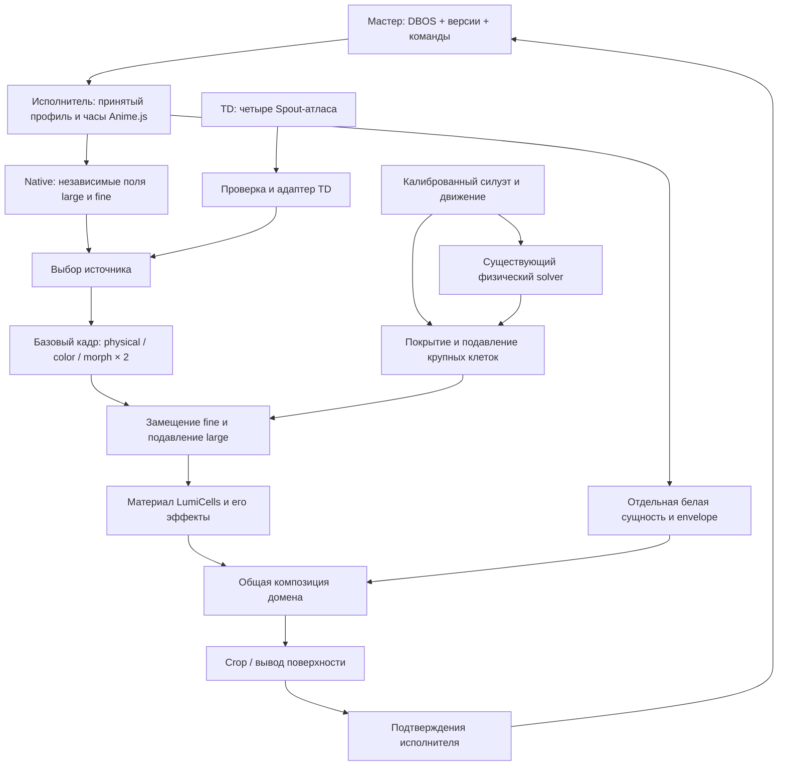

# Интеграция TD / Native, белой сущности и интерактивных масок

04.10.2026 — **SYS-06A, ранний plan/result VK-04 и технический Discovery применены в local8782**. Проверены isolated HTTP/DBOS/Anime, IAB skip/photo, reload и backendrestart; legacy v1–v5 и BE-12 сохранены. Один v6 execution связывает presented→выпуск→ribbon_items_visible→erase→центр→стена. Художественный D-визуал/TD, реальные media/jobs и поэлементная стена ещё открыты. [Результат](../artifacts/reports/sys06-discovery-integration-20261004.md), [контракт](../artifacts/contracts/discovery-cycle-v1.md). Следующий сценарный срез: item-arrival на стену и второй посетитель; owner/BFCache — отдельные риски BE-09/13. Эта запись обновляет исторические статусы ниже.

Дата: 03.10.2026. Проект: VK_DigitalProducts_Stand на F:. **Архитектура для реализации, не описание уже работающей интеграции.** Текущие задания и статусы — только [TODO](../TODO.md). Основания: [сценарий VK](VK_ARCH_RIBBON_SCENARIO.md), [разделение сценария и визуала](research/scenario-visual-decoupling-20261003.md), [исследование готовых механизмов](research/native-mask-integration-mechanisms-20261003.md), [статическая проверка](../artifacts/reports/mask-integration-architecture-review-20261003.md).

## 1. Принятое разделение ответственности

Мастер хранит настройки, выбранные источники, версии профилей, сценарные команды и подтверждённые состояния. Исполнитель поверхности рассчитывает кадры масок и визуала локально. DBOS не передаёт текстуры и не выполняет покадровую анимацию.

Три независимые системы работают совместно:

1. **Базовые маски TD / Native:** по три сигнала для крупной и мелкой решёток — physical, color, morph. Обе реализации обеспечивают один контракт. Native работает без входящих TD-текстур.
2. **Белая сущность LumiCells:** отдельный слой по принципу Стеллы, со своим шумом и маской проявления. Её нельзя заменять отбеливанием фоновых клеток. Маска разрешает отдельные области, выключает их либо выполняет reveal / hold / erase.
3. **Силуэт и физические флюиды:** собственный рисунок мелкой маски замещает фон внутри отдельной области покрытия; крупные клетки там подавляются. Этот этап одинаков после TD и Native.

`local / production` определяет размещение и оборудование, `TD / Native` — источник базовых масок. Это независимые настройки. TD остаётся ручным внешним источником; управление его генераторами и экспорт отдельных TOX сюда не входят.

## 2. Что есть сейчас и что предстоит соединить

| Область | Подтверждено в исходниках | Недостающая часть |
|---|---|---|
| Новый мастер F: | DBOS 3.2.0, SQLAlchemyDatasource, Pydantic; registry schema5, execution protocol5 / snapshot2 | Состояние источников масок, профиль масок, адаптеры реальных поверхностей |
| Исполнитель F: | Anime.js 4.5.0, ready/markers/checkpoints, явная передача owner | Только fixture; один execution slot, нет production lease и физического подтверждения вывода |
| TD → D WebRender | Четыре атласа с физикой, цветом и morph, проверка заголовка и свежести | Перенос адаптера в F, явный выбор источника, согласование задней стены |
| Native в D | Встроенный процедурный fallback | Fine частично является дополнением large; независимых Native color/morph ×2 нет |
| Белая сущность D | Стелла и отдельный MVP арки используют LumiCells Engine с proceduralEnvelope | MVP арки зациклен по длительностям; нет сценарного API и переноса на все домены |
| Силуэт / флюиды D | Существующие ввод глубины и физический solver | Замещение fine с чёрными участками и подавление large ещё не реализованы по новому контракту |

Рабочие механизмы на D — доноры, не уже установленные компоненты F. При переносе фиксировать исходные файлы, SHA и права использования; рабочий комплект F не должен зависеть от абсолютных путей D.

Свежий [аудит нескольких окон](../artifacts/reports/multiwindow-audit-20261003.md) выявил блокировку управления после конфликта, backend running без движения скрытого/потерянного renderer и lifecycle gap. Эти дефекты текущего клиента не переносить в новый контроллер: отдельная доступность исполнителя, восстановление после409 и page lifecycle входят в проверки среза A; существующая работа BE-12 остаётся отдельным исправлением.

Кандидат раннего video-плана/result хранится в `artifacts/workspace/early-plan-candidate`; согласно текущему отчёту он ещё не применён на8782 из-за блокера Windows CIM при штатной остановке. Это отдельная зависимость сценарной интеграции, а не готовая функция активного мастера. Данная архитектурная работа не перезапускает сервис.

## 3. Логические поверхности и координаты

| Домен | Логическое полотно | Крупная решётка | Мелкая решётка |
|---|---:|---:|---:|
| `arch` | 5120×512 | 80×8 | 160×16 |
| `ribbon` | 10240×512 | 160×8 | 320×16 |
| `rear` | 7168×1280 | 106×19 | 212×38 |

Это зафиксированная исходная топология D, которую адаптер обязан сверить с переносимым manifest. Центры, pitch, origin и padding берутся из определения решётки, а не выводятся повторно независимым округлением размеров. Все маски одного домена используют одну топологию и одну ориентацию UV.

Задняя стена — один домен. Разделение X=3072 на3072×1280 и4096×1280 применяется к готовой композиции. Шум, время, цвет, сущности, флюиды и маски вычисляются в общих координатах. Нельзя переключить только половину стены или назначить ей иной seed по имени технического выхода.

Для арки определение поверхности дополнительно хранит начало обхода и направление отображения развёртки. Положительное направление сценарной рампы должно фактически соответствовать движению по часовой стрелке. Переход через шов проверяется отдельно: общие координаты сами по себе не делают произвольный шум периодическим.

## 4. Контракт базового кадра масок

Предлагаемый контракт `MaskFrame/v1` — внутренняя типизированная структура, а не новый сетевой поток текстур через мастер:

| Поле | Смысл |
|---|---|
| `domainId`, `topologyVersion` | Логическое полотно и точное определение двух решёток |
| `sourceKind`, `sourceEpoch`, `frameSequence` | Native/TD, поколение переключения, последовательность кадра |
| `profileId`, `profileVersion`, `configHash` | Неизменяемая принятая конфигурация |
| `sceneTimeMs`, `receivedAtMonotonic`, `capabilities` | Время вычисления/приёма и доступные каналы; это разные часы |
| `large.physical`, `fine.physical` | Поля0…1, управляющие присутствием/размером через существующий материал |
| `large.color`, `fine.color` | Независимые RGB-поля с объявленным пространством цвета |
| `large.morph`, `fine.morph` |0 — исходный материал;1 — белый округлый вариант |

Physical — не готовая экранная alpha. Значение0 обязано выключать присутствие; промежуточные значения проходят существующую логику размера/порогов. Цвет и morph не могут воскресить клетку с нулевым присутствием. Scalar-поля — данные без sRGB-преобразования. Цвет декодируется в linear ровно один раз.

Адаптер TD сохраняет существующий wire-контракт: MSK schema1, четыре страницы physical/RGB ×large/fine, physical RGBA=`physical,morph,physical,1`, morph разрешён capability bit0. Входной RGB сейчас premultiplied из RouteAdapter; нельзя молча делать unpremultiply или повторно применять исходную alpha. Для старого источника без morph допустим morph=0 с явной диагностикой capability.

Атласы исходной системы: MainLeft188×65, MainRight250×65, Ribbon644×32, Arch324×32;4 служебные строки и guard-области. Входной адаптер скрывает упаковку от потребителя. Native не обязан создавать MSK-заголовок/Spout для собственной внутренней работы.

Native должен предоставить все шесть независимых полей, используя готовые механизмы, прошедшие отдельную проверку. Разрешены constant, ramp и существующий noise при подтверждённой интеграции; параметры: transform, seed, scale, speed, levels, contrast и независимые включения. Наличие одного шума с fine=`1-large` не считается паритетом.

Потребитель принимает целый согласованный кадр, не смесь физических каналов одной ревизии с цветом другой. Отсутствующий обязательный канал — причина неготовности, а не случайного использования предыдущей текстуры.

## 5. Выбор TD / Native и переходы

В сохраняемых настройках отдельно существуют `preferredSource` и фактически подтверждённый `appliedSource`. Панель показывает оба, причину fallback, profile revision, source epoch и свежесть источника.

| Событие | Требуемое поведение |
|---|---|
| Оператор выбирает Native | Использовать Native независимо от наличия TD |
| Оператор выбирает TD | Подготовить и проверить полный комплект домена; переключить после ready, зафиксировать applied ACK |
| TD устарел или повреждён | Перейти в Native по принятой политике; выбранный TD сохранить; показать деградацию |
| TD снова появился | В первом срезе только показать готовность возврата; возврат явной командой, без дребезга |
| Повтор команды после потери ответа | Тот же requestId/payload возвращает прежний результат, не создаёт новый переход |

Текущие1500мс без свежего атласа — исходное значение для настройки stale timeout, а не доказанная production-норма. Изменение картинки не является heartbeat: статическая маска может быть исправной. Проверять sequence/приём валидных кадров; пауза или остановка TD-потока должна отражаться в статусе.

Переход смешивает базовые physical/color/morph в согласованном пространстве до интерактивного замещения. Смена источника не пересоздаёт quiz/session/package/execution, не обнуляет фазу Native и не повторяет смысловые события. Если возврат TD требует ручной синхронизации его внутренних генераторов, это показывается оператору; мастер не восстанавливает их скрыто.

Для `rear` нужен единый source epoch обеих половин. Предпочтительная первая проверка — один логический производитель до crop. При нескольких процессах/машинах требуются prepare-ready-apply и подтверждения участников; **это не гарантирует синхронный физический кадр при сетевом разрыве**. Текущие независимые TD-атласы не имеют общего frame barrier. До выбора и проверки готового механизма синхронизации распределённый бесшовный failover не объявляется готовым. Поведение потери одного участника, включая возможность удержать/погасить общий выход, зависит от реального output-adapter и проверяется отдельно.

## 6. Белая сущность: отдельная маска и сценарий

Переиспользовать существующий Engine сущности Стеллы, её noise/размер/сглаживание и подключённый `proceduralEnvelope`. Пространственная маска E управляет присутствием собственных белых круглых клеток; фоновые шесть каналов остаются независимыми. Для этого адаптера сохранить `maskPair=[0,0,0,0]`: иной maskPair может перекрыть envelope. Белый morph G=1 относится к сущности, не ко всему фону.

Профиль сущности задаёт enabled, разрешённые области, направление/ширину/мягкость фронта, reveal/erase длительности, seed, pitch, параметры шума и яркости. Итоговый envelope = spatial allowance × сценарная фаза. Оператор может выключить область или весь слой, не удаляя экземпляр сценария. Локальное пространственное управление и команды мастера работают без TD. Новый внешний TD-канал envelope — возможное последующее расширение, не часть нынешнего существующего MSK-контракта.

Фазы: hidden → reveal → hold → erase → hidden. Переход при повторной команде начинается с текущего состояния, без скачка/сброса seed. Для ручного теста доступны reveal/hold/erase; в сценарии момент erase задаётся событием, не фиксированным двухсекундным ожиданием MVP.

Интеграция VK:

1. На отказе от фото или фактическом начале scanning принят неизменяемый план пакета; исполнители арки/ленты готовы до запуска сцены. Готовность позиции карточки и готовность её медиа — разные условия согласно сценарию позднего заполнения.
2. Принята команда ухода тегов и reveal. **Первый реально отрисованный кадр начавшегося reveal** подтверждается `entity_reveal_presented`; только при таком подтверждении мастер разрешает выпуск пакета. В local общий renderer может подтвердить этот рубеж без сетевой задержки между поверхностями; в распределённом режиме допустимая задержка требует отдельной проверки.
3. Последняя карточка полностью завершила появление → новый маркер `ribbon_items_visible` → erase. Если рубеж пришёл до завершения reveal, намерение erase сохраняется и применяется плавно из текущей фазы по профилю; не отбрасывать событие и не включать произвольный hold.
4. `entity_hidden` закрывает только сопровождение арки. `ribbon_center_crossed` освобождает связанную Стеллу, `all_arrived` завершает доставку — прежняя независимая семантика.

В действующем fixture `emission_complete` привязан к **началу** последнего элемента (`item_*_start`). Его нельзя переименовать в «всё полностью появилось» или переиспользовать прежние durable receipts с новым смыслом. Новый маркер и `revealEndMs` элементов вводятся новой версией timing/протокола. Уже подтверждённые legacy события сохраняют значение.

Не создавать второй обычный execution на сущность при нынешнем единственном execution slot: он заблокирует показ пакета. Первый срез — согласованные tracks одной новой версии исполнения. Production с несколькими участниками/сессиями требует следующего контракта владения поверхностями. У каждого cue есть session/visit/sceneEpoch; позднее стирание предыдущего посетителя не должно убирать слой нового.

## 7. Силуэт, флюиды и замещение решёток

Калиброванная глубина даёт геометрическую область человека и измеренное движение. Неподвижный человек остаётся в маске; импульсы физического solver создаются движением, а не постоянным наличием человека. Pointer — отдельный явный источник. Автошум фона не поступает в физический слой.

Нужны три независимых поля: `I` — рисунок интерактивной мелкой маски (включая белый силуэт, значения физического флюида и чёрные промежутки), `C` — её область покрытия, `L` — область подавления крупных клеток. Нельзя определять C как `I > 0`: так пропадут чёрные отверстия.

Для присутствия:

`fineEffective = (1 − C) × fineBase + C × I`

`largeEffective = largeBase × (1 − L)`

Это семантика замещения/source-over с рисунком в RGB и независимым coverage в alpha. При C=1 и I=0 фон обязан стать0, даже если он был белым. `max(base,I)`, addition и простое `base×I` не выполняют требование замещения.

Мелкая интерактивная решётка совпадает с фоновой по центрам и pitch. Крупное подавление рассчитывается с учётом footprint всей клетки, с мягкой границей порядка шага клетки. Маска меняет присутствие/размер **до** отрисовки тела, halo/bloom; экранный stencil не должен резать клетку пополам. В Vanilla допустимо плавное потемнение, но без прямоугольного отсечения материала. Хвост флюида и тело имеют раздельные параметры расширения/затухания.

Исходные маски провайдера неизменны. При уходе человека C/L плавно возвращаются к0 и открывают актуальный фон. Потеря датчика — явный статус, без замороженного вечного силуэта и без автоматической имитации человека; политика fade-out задаётся профилем. Источник Native не подменяет физический ввод.

Color/morph интерактивной области должны иметь явную политику: предлагаемый начальный профиль наследует базовый цвет, а белизна силуэта задаётся отдельным локальным morph; профиль флюида сохраняет утверждённый вид. Это **предложение для визуальной проверки**, а не уже согласованный новый look. Подавление large применяется независимо от цвета/morph. Приоритет между отдельной белой сущностью и человеком тоже задаётся явно; исходно сущность не маскирует физический ввод без отдельного решения.

Готового проверенного компонента, объединяющего текущие Engine/DepthFluid/SharedFluid без лишнего readback, пока не найдено. Canvas source-over и OpenCV dilate — кандидаты узкого прототипа, не разрешение писать новый solver/compositor под видом использования библиотек. Если копирование данных не проходит бюджет, исследовать готовый GPU-путь и пересмотреть границу интеграции до реализации production.

## 8. Встраивание в backend F

### Сохраняемые данные и версии

Предлагаемые новые модули рядом с `artifacts/local-master`: `visual_models.py`, `visual_api.py`, `visual_store.py`; имена — план. Pydantic валидирует настройки без побочных эффектов. SQLAlchemyDatasource атомарно сохраняет state + receipt. Миграция `registry.py` аддитивная от фактически установленной схемы; проверенный baseline5 не означает, что номер следующей миграции можно занять без сверки параллельных изменений.

Отдельные сущности хранения:

- неизменяемые `visual_profile_versions` с schemaVersion, id/version, hash и JSON;
- `visual_controls` по логическому домену: preferred source, profile reference, revision и операторские overrides;
- `visual_operations` / receipts: requestId, hash payload, ожидаемая revision, результат;
- renderer observations: применённые revision/epoch, owner, состояние готовности и последний meaningful ACK; скоростная телеметрия ограничена и не пишет каждый frame в durable историю;
- независимый `domain_clock_state` постоянного Native-фона: domainId, clock epoch, профиль/seed, paused/running и подтверждённая позиция. Он существует без content package и продолжается после terminal; фон не занимает package-bound execution slot;
- snapshot фазы сцены: её владелец, profile snapshot, seed, checkpoint, clock state и подтверждённые маркеры — как часть новой версии исполнения.

JSON в `artifacts/local-master/configs/` — defaults/import/export профилей по существующему устройству F. Принятое состояние и revision принадлежат БД. Не иметь два одновременно авторитетных источника JSON/БД; импорт — валидируемая команда с CAS, экспорт — снимок принятой версии. Настройки не хранить в localStorage/sessionStorage. Эфемерный pending requestId по образцу текущего клиента не является конфигурацией.

Редакция профиля, schema данных, версия durable workflow и runtime capability — разные номера. Нельзя редактировать содержимое уже опубликованной пары profileId/version. Активная сцена сохраняет snapshot; смена профиля влияет на новые сцены, а явно разрешённые live overrides применяются с отдельной revision и ACK.

### Предлагаемый API

| Операция | Контракт |
|---|---|
| `GET /visual-options` | Capabilities, определения доменов, схемы профилей, поддерживаемые источники |
| `GET /visual-controls/{domain}` | Desired + observed, revision, источник/fallback и диагностика |
| `POST /visual-controls/{domain}/commands` | requestId, expectedRevision, команда выбора источника/профиля/области; durable receipt |
| `POST /visual-scenes/{sceneId}/commands` | Reveal/erase/pause/resume с владением сцены; сценарный coordinator и ручной тест используют одинаковую семантику |
| Renderer events новой версии | Ready / applied / presented / paused / error с идентичностью owner и сцены |

Названия ещё не реализованы. Транспорт брать из действующего HTTP + DBOS finite-operation механизма (`wall_api/store`, `execution_api/store`). Не вводить второй message bus ради масок; DBOS send/recv использовать только при доказанной необходимости, а не заменять работающие receipts. Ответ accepted/202 не значит applied или displayed; несовпадение CAS — явный конфликт, без молчаливого last-write-wins.

Каждый ACK связан с commandId, scene/executionId, domainId, sourceEpoch, profileVersion, controlRevision, ownerId и ownerGeneration. Проверять действующего владельца и прежние ACK; дубликаты безопасны. Для управления нужен оператор, для событий — зарегистрированный renderer. Существующая fixture-панель ещё не доказывает production-аутентификацию этих ролей.

Сохранять именованные durable обработчики v1…v5. Новые операции/сценарии получают новые функции/протокол, а не меняют порядок шагов уже начатых workflow. Добавить capability в health/options и явную ошибку несовместимого renderer. Новая схема не должна заставлять старые сессии проходить новую ветку Discovery.

### Часы, pause и recovery

Anime.js ведёт локальную фазу. Использовать библиотечные timeline/seek с подавлением callbacks и существующую дедупликацию markerId; master управляет смысловыми рубежами. Уже имеющиеся асинхронные checkpoints и смысловые барьеры переиспользовать, не создавать собственный scheduler/replay.

Постоянный доменный clock и конечный scene clock имеют разное время жизни. Оба исполняются готовым механизмом времени, но завершение/отмена пакета не сбрасывает доменный clock. Пауза сцены не останавливает фон неявно; глобальная операторская пауза явно адресует нужные домены и сцены и ждёт их подтверждений. Начальная политика восстановления — продолжить от последней подтверждённой фазы, без ускоренного догоняющего проигрывания времени простоя.

Pause считается применённой после ACK удерживаемой позиции/кадра. Reload восстанавливает snapshot и подтверждённую позицию; не повторяет старт, создание пакета или release. При смене владельца действует нынешний явный takeover с ownerGeneration/controlRevision; автоматического захвата, TTL и физического failover этот документ не добавляет. Старый browser физически может продолжать рисовать, даже если его ACK отклоняются — production output fencing отдельно.

Native procedural phase можно восстановить по конфигу/seed/времени, если это подтверждено выбранным генератором. **Состояние физического fluid solver, GPU framebuffer и TD-симуляции из одного timestamp не восстанавливаются.** Полное восстановление требует поддерживаемого snapshot/replay готового solver либо отдельно согласованной политики мягкого восстановления. DBOS гарантирует сохранность решений, не побитовый возврат физического изображения. Целевое восстановление до1с проверяется на интеграции, не выводится из частоты checkpoint.

## 9. Настройки и диагностика оператора

На общей карте: источник TD/Native для домена и общей стены; выбранный/активный источник; шесть превью исходных полей; профиль/ревизия; состояние доставки команды. Переключатель source не должен менять visual style LumiCells/Vanilla/CUBES.

Отдельные разделы: «Белая сущность» (области, режим manual/scenario, направление, reveal/erase, noise/seed/size), «Силуэт и флюиды» (ввод, calibration reference, coverage, expansion, fade), «Диагностика» (base/effective fine, coverage, large suppression, entity envelope). Для невозможного канала показывать unavailable, а не успешное сохранение без эффекта.

Не создавать renderer/render target на каждую клетку или пузырь. Текстуры и проходы принадлежат домену/полю; число и разрешение ресурсов описать при выборе готового compositor. Нативные рабочие выходы сохраняют разрешение; уменьшенные превью — отдельные изображения. Перенос TAG/Discovery-баблов не смешивать с отдельной полноэкранной белой сущностью.

## 10. Короткие этапы реализации и критерии

Это последовательность интеграции, не второй список статусов. Статусы/назначения — в TODO под SYS-01, UI-02, VIS-01, VIS-03 и сценарным шагом3.

| Срез | Проверяемый результат | Минимальная проверка до следующего шага |
|---|---|---|
| A. Управление | Один fixture-домен: preferred/applied, profile revision, durable receipt | Повтор requestId, конфликт CAS, reload; источник не меняет quiz/package/markers; короткая проверка панели |
| B. Паритет | Одна поверхность: реальные шесть Native полей и TD adapter | Независимо менять все6 сигналов; Native при активном TD; stale/fallback/ручной возврат; чёрный/белый/morph; кадр и отзыв пользователя |
| C. Сущность | Арка: отдельный Engine, управляемый reveal/hold/erase | Clockwise, пространственное0/1, reverse посреди перехода, pause/reload; frame ACK; визуальная приёмка |
| D. Сценарная связь | Принятый ранний план → reveal → лента → erase | Обе photo-ветки; длинный/короткий пакет, поздние ресурсы, timing нового all-visible; delayed/duplicate ACK; ранний план сначала применён и проверен |
| E. Интерактивный compositor | Одна поверхность: I/C/L после обоих источников | Чёрный I замещает белый base; неподвижный/движущийся силуэт, pointer, затухание/потеря датчика; целые клетки и собственный glow; доказательство готового механизма |
| F. Все поверхности | Лента и единая rear, реальные output adapters | Одинаковые координаты/seed/clock, стык3072, отказ одного источника, recovery; отдельная проверка Spout→TD |

Не объединять эти срезы в большое применение. После каждого визуального среза — короткая техническая/браузерная проверка, кадр и отзыв пользователя. Тяжёлые GPU/нагрузочные тесты и запись видео требуют отдельного согласия. До сборки после изменений D — duplicate checker; синтаксис/профильные CPU-тесты и штатные сборщики по затронутому проекту.

Обязательные риски для последующих срезов: готовый compositor и бюджет копирования; восстановление stateful fluid; распределённый rear/output fencing; production multi-session surface ownership; перенос профилей со всеми лицензиями; неоднозначная цветовая политика интерактивного слоя. Эти пробелы не скрываются ссылками на библиотеки или успешными unit-тестами.

**Следующая минимальная реализация: срез A на F — сохраняемый выбор источника и подтверждение его применения одним техническим исполнителем.** Он не требует TD, новых TOX, смены рабочего визуала D или перезапуска show-проекта.
